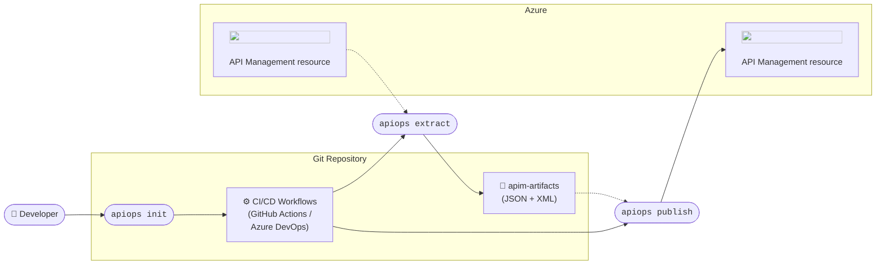
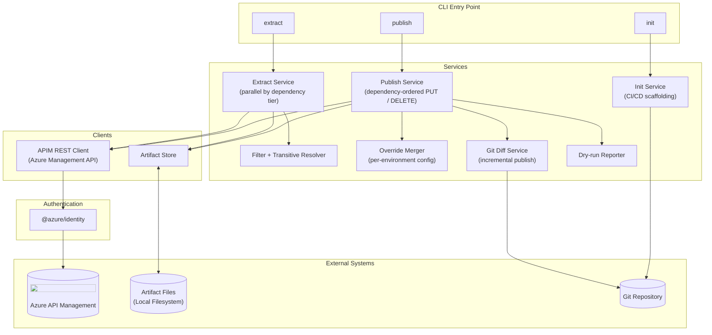

# Architecture

## Overview

`apiops` implements a **configuration-as-code** workflow for Azure API Management (APIM). Configuration is extracted from a running APIM instance into version-controlled artifact files. Those files become the source of truth for publishing to one or more environments, driven by a CI/CD pipeline.

---

## Configuration-as-Code Workflow

The diagram below shows how `apiops` fits into a typical team workflow:

| Step | Command | Description |
|------|---------|-------------|
| 1 | `apiops init` | Scaffolds the Git repository with CI/CD workflow files and an identity setup guide |
| 2 | `apiops extract` | Reads the running APIM configuration and writes it to local artifact files |
| 3 | `apiops publish` | Reads artifact files and creates/updates/deletes resources in the target APIM |

---

## Component Architecture

The diagram below shows the internal structure of the `apiops` CLI:

### Extract flow

`apiops extract` fetches every resource type from the APIM Management API and writes each resource to a corresponding artifact file on disk. Extraction is parallelized across independent resource types and can be narrowed with a filter file; transitive dependencies (e.g. backends referenced by a policy) are automatically included. Resources are stored as plain JSON (exactly as returned by the APIM Management API) so that any future APIM properties are automatically preserved during extract-publish round-trips without requiring tool updates.

### Publish flow

`apiops publish` reads artifact files from disk and applies them to the target APIM instance in topological dependency order (backends before APIs, APIs before products, etc.). Three optional modes reduce blast radius:

- **`--dry-run`** — prints the plan without making any changes
- **`--overrides <path>`** — merges per-environment values (backend URLs, named-value secrets) before publishing
- **`--commit-id <sha>`** — incremental mode; only resources whose artifact files changed in that Git commit are published

### Init flow

`apiops init` scaffolds the repository with ready-to-use GitHub Actions or Azure DevOps workflow files and generates an `identity-setup.prompt.md` guide for configuring OIDC federated credentials — no client secrets required.

---

## Authentication

`apiops` uses [`DefaultAzureCredential`](https://learn.microsoft.com/azure/developer/javascript/sdk/authentication/overview) from the `@azure/identity` SDK. Credentials are tried in this order:

| Credential | Typical use |
|---|---|
| Workload Identity (OIDC) | GitHub Actions / Azure Pipelines |
| Service Principal (env vars or flags) | Legacy CI/CD, scripts |
| Managed Identity | Azure-hosted runners, VMs, App Service |
| Azure CLI / Azure Developer CLI | Local development |

No secrets are required when running in GitHub Actions workflows generated by `apiops init` — authentication is handled entirely via OIDC federated credentials.

---
