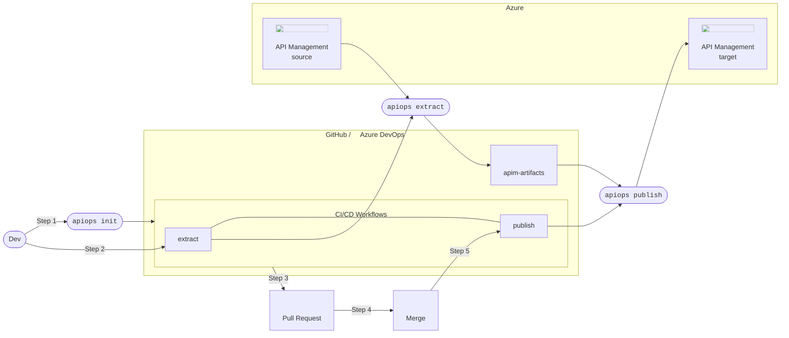
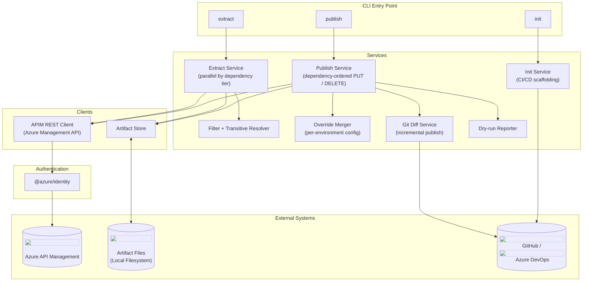

# Architecture

## Overview

`apiops` implements a **configuration-as-code** workflow for Azure API Management (APIM). Configuration is extracted from a running APIM instance into version-controlled artifact files. Those files become the source of truth for publishing to one or more environments, driven by a CI/CD pipeline.

---

## Configuration-as-Code Workflow

The diagram below shows how `apiops` fits into a typical team workflow:

_Icon attribution: Azure Architecture Icons (https://learn.microsoft.com/en-us/azure/architecture/icons/) and Font Awesome Free (https://fontawesome.com/)._ 

| Step | Command | Description |
|------|---------|-------------|
| 1 | `apiops init` | Scaffolds the Git repository with CI/CD workflow files and an identity setup guide |
| 2 | `apiops extract` | Reads the running APIM configuration and writes it to local artifact files |
| 3 | Pull Request | Developer submits extracted artifact changes for review |
| 4 | Merge | Approved changes are merged |
| 5 | `apiops publish` | On merge, the publish workflow runs and applies artifact files to the target API Management instance |

### Icon Usage

> [!NOTE]
> Chart uses [Azure Architecture Icons ](https://learn.microsoft.com/en-us/azure/architecture/icons/) and GitHub icons from [Font Awesome](https://fontawesome.com/).

---

## Component Architecture

The diagram below shows the internal structure of the `apiops` CLI:

## Authentication

`apiops` uses [`DefaultAzureCredential`](https://learn.microsoft.com/javascript/api/%40azure/identity/defaultazurecredential?view=azure-node-latest) from the `@azure/identity` SDK.

For the up-to-date credential chain and authentication behavior, see Microsoft docs:

- [Credential chains in the Azure Identity library for JavaScript](https://learn.microsoft.com/azure/developer/javascript/sdk/authentication/credential-chains)
- [Authenticate JavaScript apps to Azure services during local development](https://learn.microsoft.com/azure/developer/javascript/sdk/authentication/local-development-environment-service-principal)

No secrets are required when running in GitHub Actions workflows generated by `apiops init` — authentication is handled entirely via OIDC federated credentials.

---
