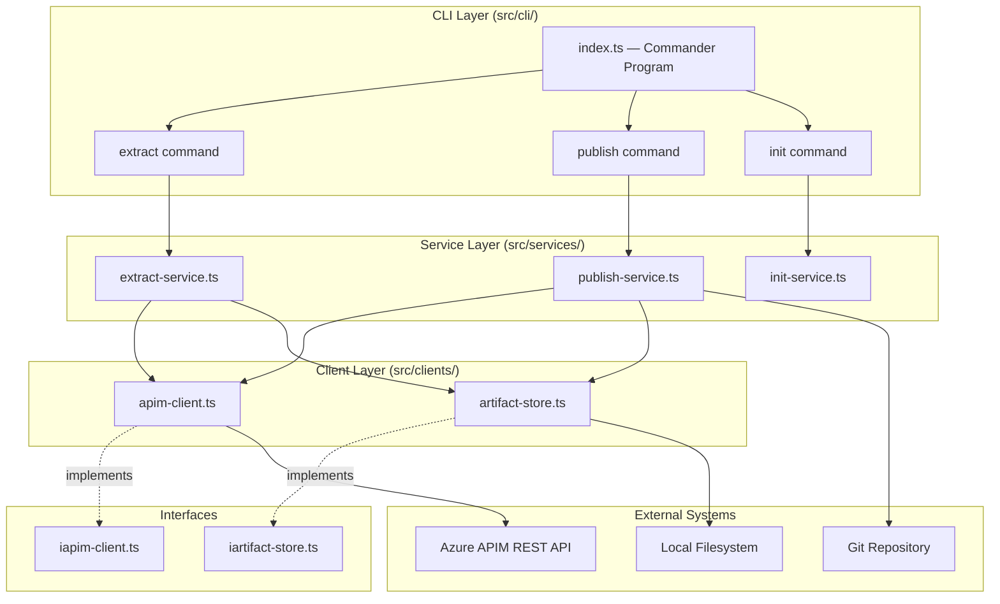
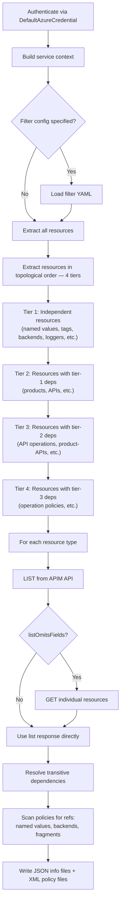
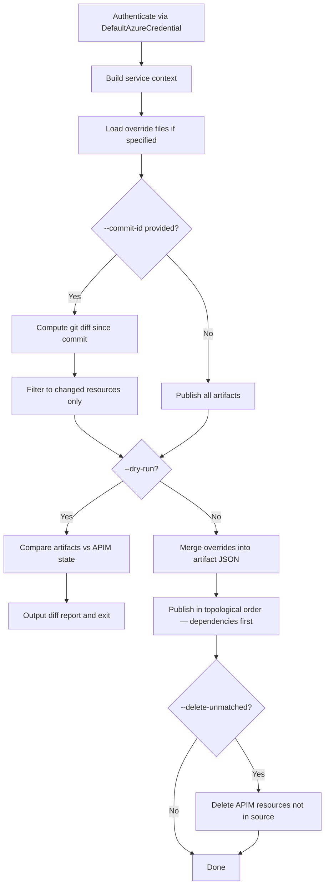

# Architecture Overview

> High-level system design for contributors and advanced users.

## Component Diagram

## Layers

| Layer | Responsibility | Key files |
|-------|---------------|-----------|
| **CLI** | Parse arguments, wire dependencies, format output | `src/cli/index.ts` |
| **Services** | Orchestrate business logic (extract, publish, init) | `src/services/` |
| **Clients** | Communicate with external systems | `src/clients/` |
| **Interfaces** | Define contracts for testability | `iapim-client.ts`, `iartifact-store.ts` |

## CLI Entry Point

`src/cli/index.ts` defines a [Commander](https://github.com/tj/commander.js) program with three subcommands:

| Command | Purpose |
|---------|---------|
| `apiops extract` | Pull APIM configuration into local artifact files |
| `apiops publish` | Push local artifact files to an APIM instance |
| `apiops init` | Scaffold a new APIops repository with CI/CD pipelines |

### Global Options

| Flag | Description |
|------|-------------|
| `--subscription-id` | Azure subscription ID (or `AZURE_SUBSCRIPTION_ID` env var) |
| `--cloud` | Azure cloud environment (`AzureCloud`, `AzureChinaCloud`, etc.) |
| `--log-level` | `debug`, `info` (default), `warn`, `error` |
| `--format` | Output format — `text` (default) or `json` (machine-readable) |
| `--client-id`, `--client-secret`, `--tenant-id` | Service principal credentials |

## Authentication

All commands authenticate via [`DefaultAzureCredential`](https://learn.microsoft.com/en-us/javascript/api/@azure/identity/defaultazurecredential) from `@azure/identity`. The credential chain tries, in order:

1. Environment variables (`AZURE_CLIENT_ID`, `AZURE_CLIENT_SECRET`, `AZURE_TENANT_ID`)
2. Workload identity (federated credentials / OIDC)
3. Managed identity
4. Azure CLI (`az login`)
5. Azure PowerShell (`Connect-AzAccount`)
6. Azure Developer CLI (`azd auth login`)

See [Authentication Guide](../guides/authentication.md) for per-context setup.

## Extract Data Flow

### Key Extract Behaviors

- **Topological ordering** — Resources are extracted in dependency order across 4 tiers, ensuring parent resources are written before children.
- **Transitive dependency resolution** — Policy XML is scanned for references to named values, backends, and policy fragments. Referenced resources are included even if not explicitly listed in the filter.
- **Dual output format** — Resource metadata is written as JSON (`*.info.json`), while policies are written as raw XML (`policy.xml`).
- **LIST then GET** — Some APIM list endpoints omit fields. When `listOmitsFields` is set for a resource type, individual GET calls fetch the full representation.

## Publish Data Flow

### Key Publish Behaviors

- **Incremental publish** — When `--commit-id` is provided, only resources changed since that commit (via `git diff`) are published. This reduces blast radius and speeds up CI/CD.
- **Dry-run mode** — `--dry-run` compares local artifacts against live APIM state and outputs a change report without modifying anything.
- **Override merging** — Environment-specific override files are merged into artifact JSON before publishing, enabling promotion across environments (dev → staging → prod).
- **Topological ordering** — Resources are published in dependency order (e.g., named values before APIs that reference them).
- **Delete-unmatched** — Optionally removes APIM resources not present in the artifact source. Requires explicit opt-in and is mutually exclusive with `--commit-id`.

## Design Principles

The architecture follows these principles (see [Design Principles](design-principles.md) for details):

| Principle | How it manifests |
|-----------|-----------------|
| **CLI-First** | All functionality as `apiops <command>` subcommands. Text I/O. `--format json` for machines. |
| **APIM-Native** | Domain vocabulary matches APIM terminology. Resource types mirror the APIM REST API. |
| **Config-as-Code** | JSON/YAML artifact files, version-controlled, git-diffable. |
| **Idempotent** | Same input → same result. Safe to re-run extract or publish. |
| **Testable** | `IApimClient` and `IArtifactStore` interfaces enable full mocking in unit tests. |

## Related Docs

- [Design Principles](design-principles.md) — Detailed principles for contributors
- [Getting Started](../getting-started.md) — Install and first extract → publish cycle
- [Extract Reference](../commands/extract.md) — Full extract command documentation
- [Publish Reference](../commands/publish.md) — Full publish command documentation
- [Artifact Format](../reference/artifact-format.md) — Directory layout and file structure
