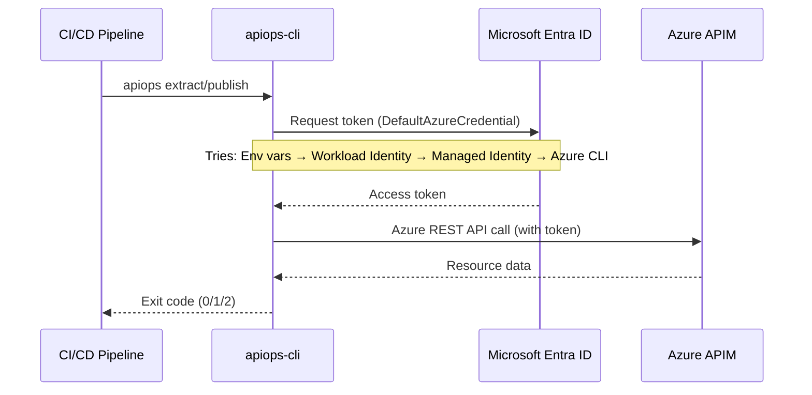

# CI/CD Authentication Patterns

This guide covers every authentication method supported by apiops-cli in CI/CD pipelines. Choose the pattern that matches your platform and security requirements.

## Authentication Flow



apiops-cli uses the **DefaultAzureCredential** chain from `@azure/identity`. It tries multiple credential sources in order and uses the first one that succeeds. In CI/CD, you control which credential is available by setting environment variables or configuring the pipeline runner.

## Pattern Comparison

| Pattern | Platform | Secrets Stored? | Setup Effort | Security |
|---------|----------|-----------------|--------------|----------|
| [OIDC Federation](#pattern-1-github-actions-oidc-recommended) | GitHub Actions | No | Medium | ★★★★★ |
| [Service Connection](#pattern-2-azure-devops-service-connection) | Azure DevOps | No (with WIF) | Low | ★★★★☆ |
| [Service Principal + Secret](#pattern-3-service-principal-with-secret) | Any | Yes | Low | ★★★☆☆ |
| [Managed Identity](#pattern-4-managed-identity) | Self-hosted on Azure | No | Medium | ★★★★★ |
| [Sovereign Clouds](#pattern-5-sovereign-clouds) | Any | Varies | Low | Varies |

---

## Pattern 1: GitHub Actions OIDC (Recommended)

**Best for:** GitHub-hosted runners. No secrets to rotate — GitHub and Azure exchange tokens via OpenID Connect federation.

### Prerequisites

1. An **Azure AD app registration** (or user-assigned managed identity)
2. A **federated credential** linking your GitHub repo to the app registration
3. RBAC roles assigned to the app registration on your APIM instance

### Azure Setup

```bash
# Create app registration
az ad app create --display-name "apiops-ci"
APP_ID=$(az ad app list --display-name "apiops-ci" --query "[0].appId" -o tsv)

# Create service principal
az ad sp create --id $APP_ID

# Add federated credential for your repo
az ad app federated-credential create --id $APP_ID --parameters '{
  "name": "github-main",
  "issuer": "https://token.actions.githubusercontent.com",
  "subject": "repo:YOUR_ORG/YOUR_REPO:ref:refs/heads/main",
  "audiences": ["api://AzureADTokenExchange"]
}'

# Assign RBAC role
az role assignment create \
  --assignee $APP_ID \
  --role "API Management Service Contributor" \
  --scope "/subscriptions/{sub-id}/resourceGroups/{rg}/providers/Microsoft.ApiManagement/service/{apim-name}"
```

### GitHub Workflow

```yaml
name: Extract APIM

on:
  workflow_dispatch:

permissions:
  id-token: write   # Required for OIDC token request
  contents: read

jobs:
  extract:
    runs-on: ubuntu-latest
    steps:
      - uses: actions/checkout@v4

      - uses: azure/login@v2
        with:
          client-id: ${{ secrets.AZURE_CLIENT_ID }}
          tenant-id: ${{ secrets.AZURE_TENANT_ID }}
          subscription-id: ${{ secrets.AZURE_SUBSCRIPTION_ID }}

      - uses: actions/setup-node@v4
        with:
          node-version: 22

      - run: npm ci

      - name: Extract
        run: npx apiops extract \
          --resource-group ${{ vars.APIM_RESOURCE_GROUP }} \
          --service-name ${{ vars.APIM_SERVICE_NAME }} \
          --subscription-id ${{ secrets.AZURE_SUBSCRIPTION_ID }}
```

### GitHub Secrets to Configure

| Secret/Variable | Value | Where |
|-----------------|-------|-------|
| `AZURE_CLIENT_ID` | App registration Application (client) ID | Repository secret |
| `AZURE_TENANT_ID` | Azure AD tenant ID | Repository secret |
| `AZURE_SUBSCRIPTION_ID` | Azure subscription ID | Repository secret |
| `APIM_RESOURCE_GROUP` | Resource group name | Repository variable |
| `APIM_SERVICE_NAME` | APIM service name | Repository variable |

> **Note:** `permissions: id-token: write` is **required** at the job or workflow level. Without it, the OIDC token request fails silently.

---

## Pattern 2: Azure DevOps Service Connection

**Best for:** Azure DevOps pipelines. Service connections manage credentials centrally.

### Setup

1. In Azure DevOps → Project Settings → Service connections
2. Create a new **Azure Resource Manager** connection
3. Choose **Workload identity federation** (recommended) or **Service principal (automatic)**
4. Grant the service principal RBAC access to your APIM instance

### Pipeline YAML

```yaml
trigger:
  branches:
    include:
      - main

pool:
  vmImage: ubuntu-latest

variables:
  - group: apim-config  # Contains APIM_RESOURCE_GROUP, APIM_SERVICE_NAME, etc.

steps:
  - task: NodeTool@0
    inputs:
      versionSpec: '22.x'

  - script: npm ci
    displayName: Install dependencies

  - task: AzureCLI@2
    displayName: Extract APIM resources
    inputs:
      azureSubscription: 'my-apim-service-connection'
      scriptType: bash
      scriptLocation: inlineScript
      inlineScript: |
        npx apiops extract \
          --resource-group $(APIM_RESOURCE_GROUP) \
          --service-name $(APIM_SERVICE_NAME) \
          --subscription-id $(AZURE_SUBSCRIPTION_ID)
```

The `AzureCLI@2` task logs in to Azure before running your script. `DefaultAzureCredential` picks up the Azure CLI session automatically.

### Variable Group Setup

Create a variable group named `apim-config` with:

| Variable | Value | Secret? |
|----------|-------|---------|
| `APIM_RESOURCE_GROUP` | Resource group name | No |
| `APIM_SERVICE_NAME` | APIM service name | No |
| `AZURE_SUBSCRIPTION_ID` | Subscription ID | No |

For multi-environment pipelines, create a variable group per environment (`apim-dev`, `apim-prod`).

---

## Pattern 3: Service Principal with Secret

**Best for:** Any CI/CD platform (Jenkins, GitLab CI, CircleCI, etc.) or when OIDC is not available.

> ⚠️ **Less secure** than OIDC or managed identity. Secrets must be rotated regularly and stored securely in your CI/CD platform's secret store.

### Option A: Environment Variables

Set these environment variables in your pipeline:

```bash
export AZURE_CLIENT_ID="00000000-0000-0000-0000-000000000000"
export AZURE_CLIENT_SECRET="your-client-secret"
export AZURE_TENANT_ID="00000000-0000-0000-0000-000000000000"

npx apiops extract \
  --resource-group my-rg \
  --service-name my-apim \
  --subscription-id $AZURE_SUBSCRIPTION_ID
```

### Option B: CLI Flags

```bash
npx apiops extract \
  --resource-group my-rg \
  --service-name my-apim \
  --subscription-id $AZURE_SUBSCRIPTION_ID \
  --client-id "00000000-0000-0000-0000-000000000000" \
  --client-secret "$CLIENT_SECRET" \
  --tenant-id "00000000-0000-0000-0000-000000000000"
```

> **Note:** CLI flags set the corresponding `AZURE_*` environment variables internally via a `preAction` hook, so `DefaultAzureCredential` picks them up.

### Secret Rotation

- Azure AD app secrets expire (default: 2 years, configurable)
- Set a calendar reminder or use Azure Key Vault for automatic rotation
- Update your CI/CD secret store when rotating

---

## Pattern 4: Managed Identity

**Best for:** Self-hosted agents running on Azure VMs, Azure Container Apps, or Azure Kubernetes Service.

### How It Works

When your pipeline agent runs on an Azure resource with a managed identity, `DefaultAzureCredential` automatically discovers and uses that identity. **No credentials or configuration needed** beyond RBAC.

### Setup

1. Enable managed identity on the Azure resource running your agent
2. Assign RBAC role to the managed identity:

```bash
# Get the managed identity principal ID
PRINCIPAL_ID=$(az vm identity show --resource-group agent-rg --name agent-vm --query principalId -o tsv)

# Assign APIM Contributor role
az role assignment create \
  --assignee $PRINCIPAL_ID \
  --role "API Management Service Contributor" \
  --scope "/subscriptions/{sub-id}/resourceGroups/{rg}/providers/Microsoft.ApiManagement/service/{apim-name}"
```

3. Run apiops-cli — no auth flags needed:

```bash
npx apiops extract \
  --resource-group my-rg \
  --service-name my-apim \
  --subscription-id $AZURE_SUBSCRIPTION_ID
```

### User-Assigned vs. System-Assigned

| Type | When to Use |
|------|-------------|
| **System-assigned** | One identity per VM. Simplest setup. Identity lifecycle tied to the VM. |
| **User-assigned** | Share one identity across multiple VMs. Survives VM recreation. Recommended for agent pools. |

For user-assigned identity, set `AZURE_CLIENT_ID` to the managed identity's client ID so `DefaultAzureCredential` selects the correct one (if multiple identities are assigned).

---

## Pattern 5: Sovereign Clouds

For Azure Government, Azure China, or Azure Germany, add the `--cloud` flag to point apiops-cli at the correct ARM endpoint.

### Supported Clouds

| Cloud | Flag Value | ARM Endpoint |
|-------|-----------|--------------|
| Azure Public | *(default)* | `management.azure.com` |
| Azure China | `--cloud china` | `management.chinacloudapi.cn` |
| Azure US Government | `--cloud usgov` | `management.usgovcloudapi.net` |
| Azure Germany | `--cloud germany` | `management.microsoftazure.de` |

### Example

```bash
npx apiops extract \
  --resource-group my-rg \
  --service-name my-apim \
  --subscription-id $AZURE_SUBSCRIPTION_ID \
  --cloud usgov
```

### Sovereign Cloud + OIDC

When using OIDC with sovereign clouds, ensure your federated credential issuer and audience match the sovereign cloud's Entra ID endpoint. The app registration must exist in the sovereign cloud tenant.

---

## RBAC Requirements

apiops-cli needs these Azure RBAC roles on the APIM service instance:

| Role | Scope | Purpose |
|------|-------|---------|
| **API Management Service Contributor** | APIM service resource | Read and write APIM resources (APIs, products, policies, etc.) |
| **Reader** | Resource group | List resources in the resource group |

### Assign RBAC

```bash
# Replace {principal-id} with your service principal, managed identity, or app registration object ID
az role assignment create \
  --assignee {principal-id} \
  --role "API Management Service Contributor" \
  --scope "/subscriptions/{sub-id}/resourceGroups/{rg}/providers/Microsoft.ApiManagement/service/{apim-name}"

az role assignment create \
  --assignee {principal-id} \
  --role "Reader" \
  --scope "/subscriptions/{sub-id}/resourceGroups/{rg}"
```

> **Principle of least privilege:** Scope the Contributor role to the specific APIM instance, not the entire resource group or subscription.

---

## Troubleshooting Authentication Failures

| Error | Likely Cause | Fix |
|-------|-------------|-----|
| `AADSTS700016: Application not found` | Wrong `client-id` or app not in the correct tenant | Verify `AZURE_CLIENT_ID` and `AZURE_TENANT_ID` |
| `AADSTS7000215: Invalid client secret` | Secret expired or incorrect | Rotate the secret in Azure AD and update CI/CD secrets |
| `AADSTS70025: ID token validation failed` | OIDC federated credential `subject` doesn't match | Check repo name, branch, and environment in the federated credential |
| `AADSTS700213: No matching federated identity` | Federated credential not configured for this branch/environment | Add a federated credential for the triggering ref |
| `AuthorizationFailed` | Missing RBAC role assignment | Assign API Management Service Contributor to the identity |
| `ResourceGroupNotFound` | Wrong resource group name or subscription | Verify `--resource-group` and `--subscription-id` values |
| `ResourceNotFound` (APIM service) | Wrong service name or service doesn't exist | Check `--service-name` spelling and that the service is provisioned |
| `DefaultAzureCredential failed` | No credential source available | Ensure at least one auth method is configured (env vars, CLI login, managed identity) |
| `Network unreachable` | Firewall or NSG blocking outbound HTTPS | Allow outbound to `management.azure.com` (or sovereign equivalent) on port 443 |

### Debug Authentication

Run with `--log-level debug` to see the full credential chain:

```bash
npx apiops extract \
  --resource-group my-rg \
  --service-name my-apim \
  --subscription-id $AZURE_SUBSCRIPTION_ID \
  --log-level debug
```

This shows which credential provider was attempted and which succeeded or failed.

## Related Docs

- [Authentication Guide](../guides/authentication.md) — general authentication overview including local development
- [GitHub Actions CI/CD](./github-actions.md) — complete GitHub Actions workflow setup
- [Exit Codes](../reference/exit-codes.md) — understanding exit code `2` (fatal/auth failure)
- [Getting Started](../getting-started.md) — first-time setup and prerequisites
