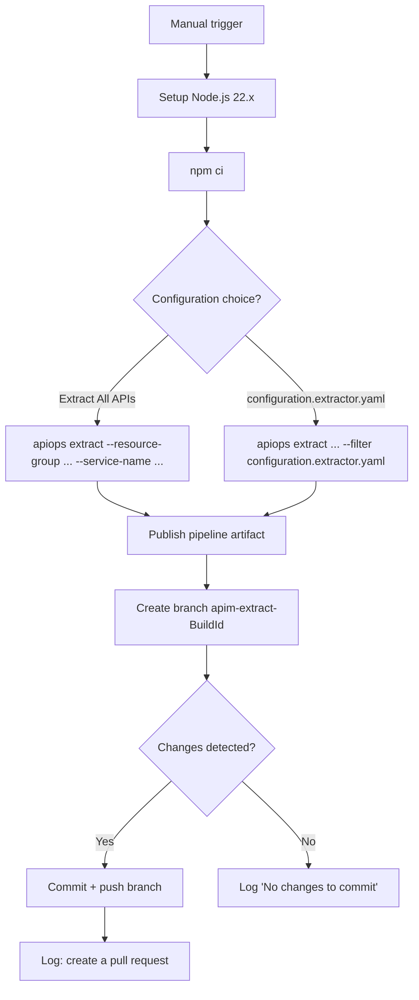
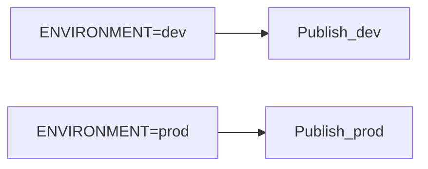

# Azure DevOps Pipelines Integration

apiops-cli generates ready-to-use Azure DevOps pipelines for extracting and publishing APIM configuration. This guide walks through setup, configuration, and customization.

## Prerequisites

- An Azure API Management instance (dev and optionally prod)
- An Azure DevOps project with a Git repository for your APIM configuration
- An [Azure Resource Manager service connection](https://learn.microsoft.com/en-us/azure/devops/pipelines/library/service-endpoints) configured per environment
- [Variable groups](#variable-groups-configuration) for common and per-environment settings
- Node.js 22.x (used in pipelines)

---

## Quick Setup

The fastest way to get started is with `apiops init`:

```bash
apiops init --ci azure-devops
```

This generates:

```
pipelines/
├── run-extractor.yaml    # Manual extract pipeline
└── run-publisher.yaml    # Publish on push to main
```

> If you also want GitHub Actions workflows, omit the `--ci` flag and select interactively, or use `--ci github-actions`. See [GitHub Actions Integration](github-actions.md).

---

## Extract Pipeline

**File:** `pipelines/run-extractor.yaml`
**Trigger:** Manual (no automatic trigger — `trigger: none`)

The extract pipeline pulls configuration from your APIM instance, publishes the result as a pipeline artifact, and creates a branch for PR review.

### Parameters

| Parameter | Type | Default | Description |
|-----------|------|---------|-------------|
| `CONFIGURATION_YAML_PATH` | string | `Extract All APIs` | Choose `Extract All APIs` for a full extract, or `configuration.extractor.yaml` to use a [filter file](../guides/filtering-resources.md) |
| `resourceGroup` | string | `$(APIM_RESOURCE_GROUP)` | Azure resource group containing your APIM instance |
| `serviceName` | string | `$(APIM_SERVICE_NAME)` | Name of the APIM service instance |

### What It Does



1. **Node.js setup** — Installs Node.js 22.x via `UseNode@1`
2. **Install dependencies** — Runs `npm ci`
3. **Run extract** — Executes `apiops extract` via `AzureCLI@2` task, authenticating through the service connection
4. **Publish artifacts** — Uploads the artifact directory as a pipeline artifact named `apim-artifacts`
5. **Create branch** — Creates a branch named `apim-extract-$(Build.BuildId)`, commits changes, and pushes. If no changes are detected, it logs a message and skips the commit
6. **Suggest PR** — Logs a warning message prompting you to create a pull request

### Extract Pipeline Walkthrough

The key task is `AzureCLI@2`, which authenticates using your service connection:

```yaml
- task: AzureCLI@2
  displayName: 'Run APIM Extract (All APIs)'
  condition: eq('${{ parameters.CONFIGURATION_YAML_PATH }}', 'Extract All APIs')
  inputs:
    azureSubscription: '$(AZURE_SERVICE_CONNECTION)'
    scriptType: 'bash'
    scriptLocation: 'inlineScript'
    inlineScript: |
      npx apiops extract \
        --resource-group ${{ parameters.resourceGroup }} \
        --service-name ${{ parameters.serviceName }} \
        --output ./apim-artifacts \
        --subscription-id $(AZURE_SUBSCRIPTION_ID)
```

When the filter option is selected, `--filter configuration.extractor.yaml` is added to the command.

> **Why AzureCLI@2?** This task injects Azure credentials into the shell environment, allowing `apiops extract` to authenticate via `DefaultAzureCredential`. See [Authentication Guide](../guides/authentication.md).

---

## Publish Pipeline

**File:** `pipelines/run-publisher.yaml`
**Trigger:** Push to `main` branch (paths: artifact directory + `configuration.*.yaml`) _and_ manual

The publish pipeline deploys APIM configuration to one or more environments using a multi-stage design with environment approval gates.

### Trigger

```yaml
trigger:
  branches:
    include:
      - main
  paths:
    include:
      - './apim-artifacts/**'
      - 'configuration.*.yaml'

pr: none
```

The pipeline runs automatically when changes to artifact files or configuration files are merged to `main`. Pull requests do **not** trigger it.

### Parameters

| Parameter | Type | Default | Description |
|-----------|------|---------|-------------|
| `COMMIT_ID_CHOICE` | string | `publish-artifacts-in-last-commit` | Choose `publish-artifacts-in-last-commit` for incremental publish, or `publish-all-artifacts-in-repo` for a full publish |
| `ENVIRONMENT` | string | `dev` | Which environment to publish to (for example `dev` or `prod`) |

### Multi-Stage Deployment

The pipeline generates one stage per environment. The selected stage runs based on the `ENVIRONMENT` parameter.



Each stage:

1. **Conditionally runs** — Only executes when the `ENVIRONMENT` parameter matches the stage name
2. **Uses a deployment job** — Wraps the publish step in a `deployment` job targeting an [Azure DevOps environment](https://learn.microsoft.com/en-us/azure/devops/pipelines/process/environments) for approval gates
3. **Loads per-environment variables** — Each stage uses its own variable group (`apim-dev`, `apim-prod`)
4. **Authenticates per-environment** — Uses environment-specific service connections (`AZURE_SERVICE_CONNECTION_DEV`, `AZURE_SERVICE_CONNECTION_PROD`)
5. **Substitutes tokens** — Replaces `{#[TOKEN_NAME]#}` placeholders in `configuration.<env>.yaml` with secret variable values before publishing
6. **Applies overrides** — Passes `--overrides configuration.{env}.yaml` to apply [environment-specific overrides](../guides/environment-overrides.md)

### Publish Pipeline Walkthrough

For incremental publish (default), `--commit-id $(Build.SourceVersion)` is passed so only resources changed in the triggering commit are published:

```yaml
- task: AzureCLI@2
  displayName: 'Publish to dev (incremental - last commit only)'
  condition: ne('${{ parameters.COMMIT_ID_CHOICE }}', 'publish-all-artifacts-in-repo')
  inputs:
    azureSubscription: 'AZURE_SERVICE_CONNECTION_DEV'
    scriptType: 'bash'
    scriptLocation: 'inlineScript'
    inlineScript: |
      npx apiops publish \
        --resource-group $(APIM_RESOURCE_GROUP_DEV) \
        --service-name $(APIM_SERVICE_NAME_DEV) \
        --source ./apim-artifacts \
        --overrides configuration.dev.yaml \
        --commit-id $(Build.SourceVersion) \
        --subscription-id $(AZURE_SUBSCRIPTION_ID)
```

For a full publish (when `COMMIT_ID_CHOICE` = `publish-all-artifacts-in-repo`), `--commit-id` is omitted and all artifacts are published:

```yaml
- task: AzureCLI@2
  displayName: 'Publish to dev (all artifacts)'
  condition: eq('${{ parameters.COMMIT_ID_CHOICE }}', 'publish-all-artifacts-in-repo')
  inputs:
    azureSubscription: '$(AZURE_SERVICE_CONNECTION_DEV)'
    # ... same as above but without --commit-id
```

---

## Variable Groups Configuration

The generated pipelines reference variable groups that you must create in Azure DevOps:

### `apim-common` (used by extract pipeline)

| Variable | Description |
|----------|-------------|
| `AZURE_SERVICE_CONNECTION` | Name of the Azure service connection |
| `AZURE_SUBSCRIPTION_ID` | Azure subscription ID |
| `APIM_RESOURCE_GROUP` | Resource group containing the APIM instance |
| `APIM_SERVICE_NAME` | APIM service name |

### `apim-{env}` (one per environment, used by publish pipeline)

For each environment (e.g., `apim-dev`, `apim-prod`):

| Variable | Description |
|----------|-------------|
| `AZURE_SERVICE_CONNECTION_{ENV}` | Service connection for this environment (e.g., `AZURE_SERVICE_CONNECTION_DEV`) |
| `AZURE_SUBSCRIPTION_ID` | Azure subscription ID for this environment |
| `APIM_RESOURCE_GROUP_{ENV}` | Resource group (e.g., `APIM_RESOURCE_GROUP_DEV`) |
| `APIM_SERVICE_NAME_{ENV}` | APIM service name (e.g., `APIM_SERVICE_NAME_DEV`) |

To create a variable group:
1. Go to **Pipelines → Library** in Azure DevOps
2. Click **+ Variable group**
3. Name it (e.g., `apim-dev`) and add the variables above
4. Link it to your pipeline in the pipeline settings

---

## Service Connections Setup

Each environment needs an Azure Resource Manager service connection:

1. Go to **Project Settings → Service connections**
2. Click **New service connection → Azure Resource Manager**
3. Choose **Workload Identity federation (automatic)** or **Service principal (manual)**
4. Scope to the subscription and resource group containing the target APIM instance
5. Name it to match your variable (e.g., the value of `AZURE_SERVICE_CONNECTION_DEV`)

The service principal backing the connection needs these RBAC roles on the APIM instance:

| Role | When |
|------|------|
| **API Management Service Reader** | Extract only |
| **API Management Service Contributor** | Publish (create/update resources) |

See [Authentication Guide — RBAC roles](../guides/authentication.md) for details.

---

## Environment Approval Gates

Azure DevOps [environments](https://learn.microsoft.com/en-us/azure/devops/pipelines/process/environments) provide approval gates for deployments. The publish pipeline uses `deployment` jobs targeting named environments:

```yaml
jobs:
  - deployment: Deploy
    environment: prod     # ← gates defined here
```

To add an approval gate:
1. Go to **Pipelines → Environments → prod**
2. Click the "⋮" menu → **Approvals and checks**
3. Add **Approvals** and specify required approvers
4. Optionally add **Business hours**, **Exclusive lock**, or **Branch control** checks

This means merging to `main` auto-deploys to dev, but prod waits for human approval.

---

## Customization Tips

### Add a new environment

1. Re-run `apiops init --ci azure-devops --environments dev,staging,prod` (or edit the pipeline YAML manually)
2. Create the `apim-staging` variable group with the required variables
3. Create a service connection for staging
4. Create the `staging` environment in Azure DevOps with desired approval gates
5. Add a `configuration.staging.yaml` override file

### Use a custom artifact directory

```bash
apiops init --ci azure-devops --artifact-dir ./my-artifacts
```

The generated pipelines will reference `./my-artifacts` instead of `./apim-artifacts`.

### Add pre-publish validation

Insert a step before the `AzureCLI@2` publish task:

```yaml
- script: npx apiops publish --dry-run --source ./apim-artifacts ...
  displayName: 'Dry run validation'
```

### Pin the CLI version

In your `package.json`, pin to a specific version:

```json
{
  "dependencies": {
    "@peterhauge/apiops-cli": "1.2.3"
  }
}
```

### Using Token Substitution

To replace `{#[TOKEN_NAME]#}` placeholders in `configuration.<env>.yaml` with secret variable values:

1. **Install the [Replace Tokens extension](https://marketplace.visualstudio.com/items?itemName=qetza.replacetokens)** in your Azure DevOps organization (if not already installed).

  You can do this via CLI:
  ```bash
  az devops extension install --publisher-id qetza --extension-id replacetokens
  ```

2. **Add secret variables** to the `apim-<env>` variable group. See the Azure DevOps documentation for [adding variables to a variable group](https://learn.microsoft.com/en-us/azure/devops/pipelines/library/variable-groups) and [marking variables as secret](https://learn.microsoft.com/en-us/azure/devops/pipelines/process/set-secret-variables).

   For example, to substitute `{#[BACKEND_URL]#}` in your configuration file:

   `configuration.prod.yaml`:
   ```yaml
   backends:
     - name: my-backend
       properties:
         url: "{#[BACKEND_URL]#}"
   ```

   Add `BACKEND_URL` as a secret variable in the `apim-prod` variable group with the actual backend URL as the value.

3. The substitution step runs automatically before publish.

See the [Token Substitution Guide](../guides/token-substitution.md) for full details, including migration from APIOps Toolkit.

---

## Troubleshooting

| Symptom | Cause | Fix |
|---------|-------|-----|
| `AzureCLI@2` fails with "service connection not found" | Variable group not linked or variable name mismatch | Verify the variable group is linked to the pipeline and `AZURE_SERVICE_CONNECTION` is defined |
| Extract shows "No changes to commit" | APIM config hasn't changed since last extract | Expected behavior — no branch is created |
| Publish stage is skipped | `ENVIRONMENT` parameter doesn't match the stage | Set `ENVIRONMENT` to the specific stage name (for example `dev` or `prod`) |
| `npm ci` fails | `package.json` or `package-lock.json` missing | Run `apiops init` to generate project files, then commit them |
| "publish-all-artifacts-in-repo" deploys everything | Expected — this mode publishes all artifacts, ignoring git diff | Use `publish-artifacts-in-last-commit` (default) for incremental |
| Approval gate blocks deployment | Environment checks configured | Approve in **Pipelines → Environments → {env}** |
| Run is stuck with "This pipeline needs permission to access a resource" | Environment resource isn't authorized for pipeline use | Authorize the environment in Azure DevOps or run the prompt step that PATCHes `pipelinePermissions/environment/{id}` with `{"allPipelines":{"authorized":true}}` |
| `--subscription-id` error | `AZURE_SUBSCRIPTION_ID` not set in variable group | Add it to the relevant variable group |

---

## Further Reading

- [GitHub Actions Integration](github-actions.md) — alternative CI/CD platform
- [apiops init](../commands/init.md) — generates pipeline files
- [apiops extract](../commands/extract.md) — extract command reference
- [apiops publish](../commands/publish.md) — publish command reference
- [Authentication Guide](../guides/authentication.md) — auth methods and RBAC
- [Environment Overrides](../guides/environment-overrides.md) — per-environment configuration
- [Token Substitution](../guides/token-substitution.md) — pipeline placeholder substitution with `{#[TOKEN_NAME]#}`
- [Filtering Resources](../guides/filtering-resources.md) — extract specific APIs
