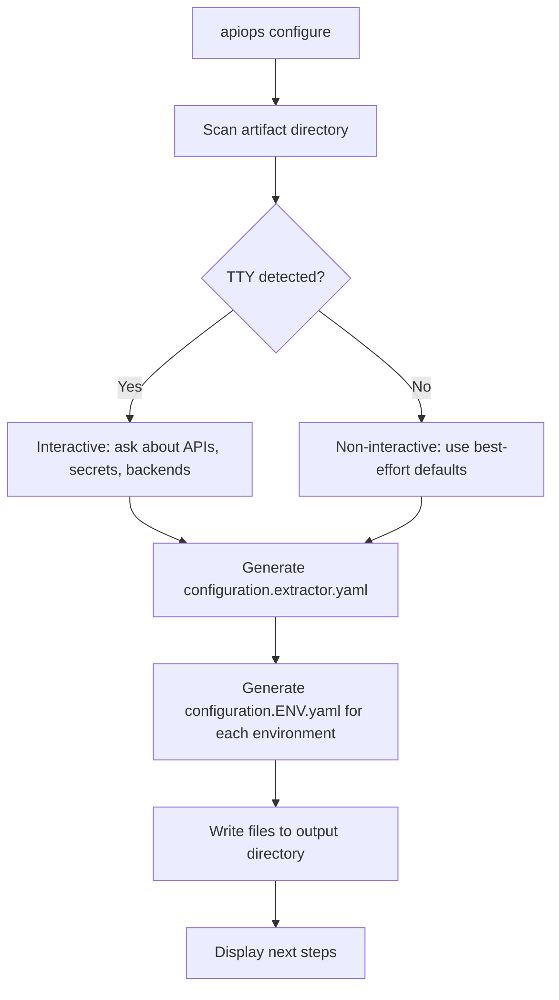

# apiops configure

Generate filter and override configuration files from extracted APIM artifacts.

## Overview

After running `apiops extract` to pull down your APIM configuration, `apiops configure` scans the extracted artifacts and produces:

1. **`configuration.extractor.yaml`** — a filter configuration that controls which APIs and resources are included in future extractions
2. **`configuration.<env>.yaml`** — per-environment override files that supply environment-specific values (backend URLs, secret named values, etc.)

## Usage

```bash
apiops configure [options]
```

## Options

| Flag | Description | Default |
|------|-------------|---------|
| `--artifact-dir <dir>` | Directory containing the extracted APIM artifacts | `./apim-artifacts` |
| `--environments <list>` | Comma-separated environment names to generate override files for | `dev,prod` |
| `--output <dir>` | Directory where the generated configuration files are written | `.` (current directory) |
| `--non-interactive` | Skip interactive prompts; use best-effort defaults | `false` |
| `--force` | Overwrite existing configuration files without prompting | `false` |

## Examples

### Interactive mode (default)

```bash
apiops configure
```

You will be guided through:

1. A summary of discovered resources (APIs, named values, backends, etc.)
2. Which APIs to include in the extractor filter
3. Per-environment token names for secret named values
4. Per-environment URL overrides for backends

### Non-interactive mode

```bash
apiops configure --non-interactive
```

Best-effort defaults are applied:

- **APIs**: all discovered APIs are included in the filter
- **Secret named values**: each secret gets a `{#[TOKEN_NAME]#}` placeholder derived from its name (e.g. `api-key` → `{#[API_KEY]#}`)
- **Backends**: no URL overrides are written (edit the generated file manually)

### Custom artifact directory and environments

```bash
apiops configure \
  --artifact-dir ./my-apim-artifacts \
  --environments dev,staging,prod \
  --non-interactive
```

### Overwrite existing files

```bash
apiops configure --force
```

## Generated files

### configuration.extractor.yaml

Controls which resources are extracted:

```yaml
# APIM Extract Filter Configuration
# Generated by "apiops configure"
apis:
  - echo-api
  - petstore-api
  - orders-api
```

### configuration.prod.yaml

Per-environment overrides — example with a secret named value and a backend URL override:

```yaml
# APIM Override Configuration for prod environment
# Generated by "apiops configure"
namedValues:
  - name: api-key
    properties:
      value: "{#[API_KEY]#}"

backends:
  - name: orders-backend
    properties:
      url: "https://prod-api.example.com"
```

## Secret placeholders

Values wrapped in `{#[...]#}` are token references that the publisher resolves at deploy time from pipeline variables or Key Vault secrets.  See [Environment Overrides](../guides/environment-overrides.md) for details.

## Onboarding flow

`apiops configure` is the **fourth step** in the standard onboarding flow:

```
1. apiops init          — scaffold repo & CI/CD pipelines
2. Identity setup       — connect GitHub / Azure DevOps to Azure OIDC
3. apiops extract       — pull current APIM state into the repo
4. apiops configure     — generate filter & override config files  ← you are here
5. Review & commit      — commit configuration files to source control
6. apiops publish       — deploy with environment-specific overrides
```

## How it works


