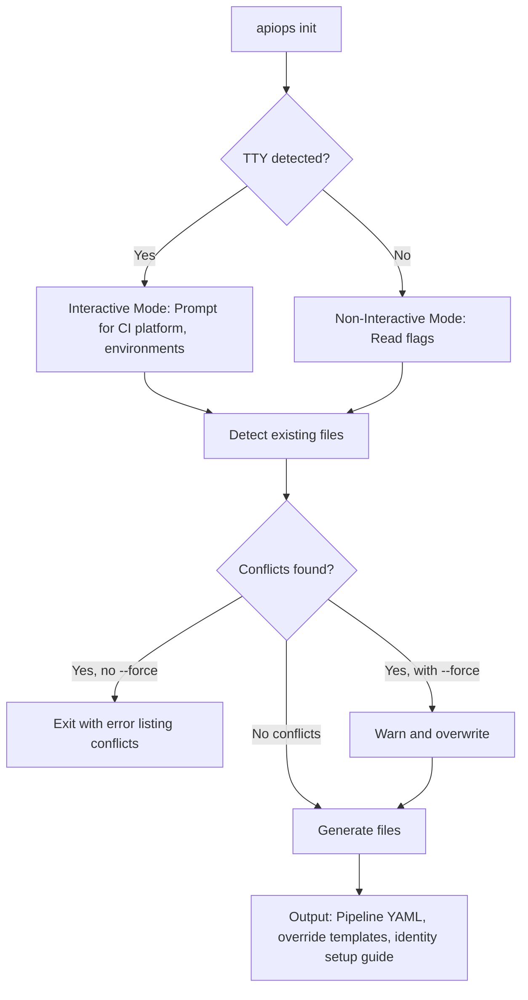

# apiops init

Scaffold a repository with CI/CD pipelines, configuration templates, and identity setup guides for APIOps workflows.

```bash
apiops init [options]
```

## Examples

### Interactive mode (default)

```bash
apiops init
```

You'll be prompted to select a CI/CD platform and configure environments.

### Non-interactive with GitHub Actions

```bash
apiops init --ci github-actions --non-interactive
```

### Custom environments

```bash
apiops init --ci azure-devops --environments dev,staging,prod --non-interactive
```

### Overwrite existing files

```bash
apiops init --ci github-actions --non-interactive --force
```

### Custom artifact directory

```bash
apiops init --ci github-actions --artifact-dir ./my-artifacts --non-interactive
```

## Flags

| Flag | Type | Default | Required | Description |
|------|------|---------|----------|-------------|
| `--ci <provider>` | string | — | No | CI/CD provider: `github-actions` or `azure-devops` |
| `--non-interactive` | boolean | `false` | No | Skip interactive prompts (requires `--ci`) |
| `--artifact-dir <dir>` | string | `./apim-artifacts` | No | Artifact directory path |
| `--environments <list>` | string | `dev,prod` | No | Comma-separated environment names |
| `--cli-package <path>` | string | — | No | Path to apiops npm tarball (from `npm pack`) |
| `--force` | boolean | `false` | No | Overwrite existing files without prompting |

> **Note:** When `--non-interactive` is set, `--ci` is required.

## How it works



In interactive mode (the default when running in a terminal), `apiops init` prompts you to choose a CI/CD platform and configure environment names. In non-interactive mode (CI environments or when using `--non-interactive`), all options must be provided via flags.

## Generated files

### GitHub Actions (`--ci github-actions`)

| File | Purpose |
|------|---------|
| `.github/workflows/run-apiops-extractor.yml` | Workflow to extract APIM artifacts |
| `.github/workflows/run-apiops-publish.yml` | Workflow to publish artifacts to APIM |
| `configuration.extractor.yaml` | Sample filter configuration for extraction |
| `configuration.{env}.yaml` | Override templates per environment (e.g., `configuration.dev.yaml`, `configuration.prod.yaml`) |
| `.github/prompts/apiops-setup-workflow-identity.prompt.md` | Copilot prompt for GitHub Actions identity setup |
| `APIOPS-WORKFLOW-IDENTITY-SETUP.md` | Step-by-step guide for configuring GitHub Actions Azure access and workflow identity |

### Azure DevOps (`--ci azure-devops`)

| File | Purpose |
|------|---------|
| `.azdo/pipelines/run-apiops-extractor.yml` | Pipeline to extract APIM artifacts |
| `.azdo/pipelines/run-apiops-publish.yml` | Pipeline to publish artifacts to APIM |
| `configuration.extractor.yaml` | Sample filter configuration for extraction |
| `configuration.{env}.yaml` | Override templates per environment |
| `.github/prompts/apiops-setup-pipeline-identity.prompt.md` | Copilot prompt for Azure DevOps identity setup |
| `APIOPS-PIPELINE-IDENTITY-SETUP.md` | Step-by-step guide for configuring Azure DevOps pipeline identity and repo permissions |

### Both platforms

| File | Purpose |
|------|---------|
| `.github/prompts/apiops-configure-filter.prompt.md` | Copilot prompt for creating extraction filter files |
| `.github/prompts/apiops-configure-overrides.prompt.md` | Copilot prompt for creating environment override files |
| `<artifact-dir>/` | Empty artifact directory (default: `./apim-artifacts`) |

## Package consumption modes

By default, generated pipeline files reference the published npm package `@peterhauge/apiops-cli`. This is the standard consumption pattern — no local files are needed.

If you pass `--cli-package <path>`, the tarball is copied into a `.apiops/` directory and the generated `package.json` references it as a local file dependency. This mode is useful for local development and testing before the package is published to npm.

## Conflict detection

`apiops init` checks for existing files before writing. If conflicts are found:

- **Without `--force`:** exits with an error listing the conflicting files.
- **With `--force`:** warns about each conflict, then overwrites.

## Next steps after init

1. **Set up identity** — Follow the generated `APIOPS-*-IDENTITY-SETUP.md` guide or provider-specific Copilot prompt to configure Azure credentials for your CI/CD platform.
2. **Extract your first snapshot** — Run [`apiops extract`](./extract.md) to pull your current APIM configuration into the artifact directory.
3. **Configure filters** — Edit `configuration.extractor.yaml` to control which resources are extracted. Use the `.github/prompts/apiops-configure-filter.prompt.md` Copilot prompt for guided setup.
4. **Commit and push** — Check the generated files into version control.
5. **Configure overrides** — Edit `configuration.{env}.yaml` files with environment-specific values. Use the `.github/prompts/apiops-configure-overrides.prompt.md` Copilot prompt for guided setup. See the [environment overrides guide](../guides/environment-overrides.md).
6. **Run your pipeline** — Trigger the publish pipeline to deploy artifacts to your target APIM instance.

## Related docs

- [apiops extract](./extract.md) — extract APIM configuration to local files
- [apiops publish](./publish.md) — publish artifacts to APIM
- [GitHub Actions integration](../ci-cd/github-actions.md)
- [Azure DevOps integration](../ci-cd/azure-devops.md)
- [Environment overrides guide](../guides/environment-overrides.md)
- [Authentication guide](../guides/authentication.md)
