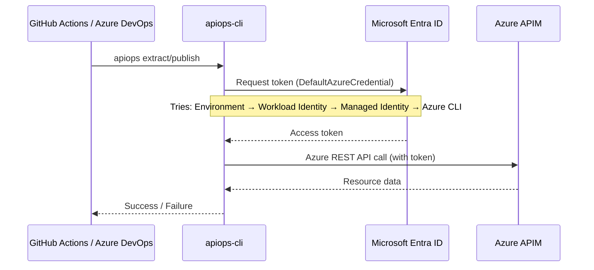

# Authentication Guide

apiops-cli uses [`DefaultAzureCredential`](https://learn.microsoft.com/en-us/javascript/api/@azure/identity/defaultazurecredential) from the `@azure/identity` SDK to authenticate with Azure. This means it automatically tries multiple credential sources in order — no special configuration needed for most setups.

## How Authentication Works



## Credential Chain

`DefaultAzureCredential` tries these credential sources in order, using the first one that succeeds:

| Priority | Credential | When it's used |
|----------|-----------|----------------|
| 1 | **Environment variables** | `AZURE_CLIENT_ID` + `AZURE_CLIENT_SECRET` + `AZURE_TENANT_ID` are set |
| 2 | **Workload Identity** | `AZURE_FEDERATED_TOKEN_FILE` is set (GitHub Actions OIDC, Kubernetes) |
| 3 | **Managed Identity** | Running on Azure VM, Container Apps, App Service, etc. |
| 4 | **Azure CLI** | `az login` session exists |
| 5 | **Azure PowerShell** | `Connect-AzAccount` session exists |
| 6 | **Azure Developer CLI** | `azd auth login` session exists |

> **Tip:** The CLI tries each credential in order and stops at the first success. If you're getting unexpected auth behavior, check that higher-priority credentials aren't set unintentionally.

---

## Local Development

The simplest way to authenticate during local development:

```bash
# 1. Log in with Azure CLI
az login

# 2. Set your subscription
az account set --subscription <subscription-id>

# 3. Run apiops commands
apiops extract \
  --subscription-id <subscription-id> \
  --resource-group <rg-name> \
  --service-name <apim-name>
```

No additional flags or environment variables needed — `DefaultAzureCredential` picks up your `az login` session automatically.

---

## Service Principal

For CI/CD pipelines, use a service principal with either environment variables or explicit CLI flags.

### Using Environment Variables

```bash
export AZURE_CLIENT_ID="<app-registration-client-id>"
export AZURE_CLIENT_SECRET="<client-secret>"
export AZURE_TENANT_ID="<tenant-id>"

apiops extract \
  --subscription-id <subscription-id> \
  --resource-group <rg-name> \
  --service-name <apim-name>
```

### Using CLI Flags

```bash
apiops extract \
  --client-id <app-registration-client-id> \
  --client-secret <client-secret> \
  --tenant-id <tenant-id> \
  --subscription-id <subscription-id> \
  --resource-group <rg-name> \
  --service-name <apim-name>
```

> CLI flags (`--client-id`, `--client-secret`, `--tenant-id`) set the corresponding `AZURE_CLIENT_ID`, `AZURE_CLIENT_SECRET`, and `AZURE_TENANT_ID` environment variables internally, so `DefaultAzureCredential` picks them up as the highest-priority credential.

### CLI Auth Flags Reference

| Flag | Environment Variable | Description |
|------|---------------------|-------------|
| `--client-id <id>` | `AZURE_CLIENT_ID` | Service principal / app registration client ID |
| `--client-secret <secret>` | `AZURE_CLIENT_SECRET` | Service principal client secret |
| `--tenant-id <id>` | `AZURE_TENANT_ID` | Microsoft Entra ID (Azure AD) tenant ID |
| `--subscription-id <id>` | `AZURE_SUBSCRIPTION_ID` | Azure subscription ID |

---

## GitHub Actions (OIDC)

The recommended approach for GitHub Actions is **OpenID Connect (OIDC)** with federated credentials. This eliminates the need to store secrets.

```yaml
- name: Azure Login (Federated Credential)
  uses: azure/login@v2
  with:
    client-id: ${{ secrets.AZURE_CLIENT_ID }}
    tenant-id: ${{ secrets.AZURE_TENANT_ID }}
    subscription-id: ${{ secrets.AZURE_SUBSCRIPTION_ID }}
```

The `azure/login` action establishes a session that `DefaultAzureCredential` picks up automatically.

**Setup steps:**

1. Create an App Registration in Microsoft Entra ID.
2. Add a federated credential for your GitHub repository (Settings → Certificates & secrets → Federated credentials).
3. Assign RBAC roles to the App Registration (see [Required RBAC Roles](#required-rbac-roles)).
4. Add `AZURE_CLIENT_ID`, `AZURE_TENANT_ID`, and `AZURE_SUBSCRIPTION_ID` as GitHub environment secrets.

For full workflow setup, see [GitHub Actions Integration](../ci-cd/github-actions.md).

---

## Azure DevOps

Azure DevOps uses **service connections** for authentication:

1. Create an Azure Resource Manager service connection (Project Settings → Service connections).
2. Use the `AzureCLI@2` task to authenticate before running apiops commands.

```yaml
- task: AzureCLI@2
  inputs:
    azureSubscription: 'my-service-connection'
    scriptType: 'bash'
    scriptLocation: 'inlineScript'
    inlineScript: |
      apiops extract \
        --subscription-id $(AZURE_SUBSCRIPTION_ID) \
        --resource-group $(APIM_RESOURCE_GROUP) \
        --service-name $(APIM_SERVICE_NAME)
```

The `AzureCLI@2` task logs in to Azure CLI, and `DefaultAzureCredential` detects the session.

---

## Managed Identity

When running apiops-cli on an Azure resource (VM, Container Apps, App Service, Azure Kubernetes Service), **managed identity** is the preferred auth method. No secrets to manage.

1. Enable a system-assigned or user-assigned managed identity on your Azure resource.
2. Assign the required RBAC roles to the managed identity.
3. Run apiops commands — `DefaultAzureCredential` detects the managed identity automatically.

```bash
# No auth flags needed — managed identity is automatic
apiops extract \
  --subscription-id <subscription-id> \
  --resource-group <rg-name> \
  --service-name <apim-name>
```

---

## Sovereign Clouds

apiops-cli supports Azure sovereign clouds via the `--cloud` flag:

| Flag Value | Cloud | ARM Endpoint |
|------------|-------|-------------|
| `public` (default) | Azure Public | `management.azure.com` |
| `china` | Azure China (21Vianet) | `management.chinacloudapi.cn` |
| `usgov` | Azure US Government | `management.usgovcloudapi.net` |
| `germany` | Azure Germany | `management.microsoftazure.de` |

```bash
# Extract from Azure China
apiops extract \
  --cloud china \
  --subscription-id <subscription-id> \
  --resource-group <rg-name> \
  --service-name <apim-name>
```

> When using sovereign clouds, ensure your Azure CLI or service principal is configured for the correct cloud environment (`az cloud set --name AzureChinaCloud`).

---

## Required RBAC Roles

The identity used by apiops-cli needs these Azure RBAC roles on the APIM resource:

| Role | Required For | Why |
|------|-------------|-----|
| **API Management Service Contributor** | `extract` and `publish` | Read/write APIM resources via ARM API |
| **Reader** | `extract` (minimum) | List and read APIM resources |

Assign roles at the APIM resource scope:

```bash
# Assign API Management Service Contributor
az role assignment create \
  --assignee <client-id-or-object-id> \
  --role "API Management Service Contributor" \
  --scope /subscriptions/<sub-id>/resourceGroups/<rg>/providers/Microsoft.ApiManagement/service/<apim-name>
```

---

## Troubleshooting

| Symptom | Cause | Fix |
|---------|-------|-----|
| `CredentialUnavailableError` | No valid credential found | Run `az login` or set service principal env vars |
| `AuthenticationError: AADSTS700016` | Wrong `--client-id` | Verify App Registration client ID |
| `AuthorizationFailed` | Missing RBAC role | Assign API Management Service Contributor role |
| `AADSTS70025` / `AADSTS700213` | OIDC federated credential misconfigured | Check subject identifier matches your repo/branch/environment |
| Wrong subscription | `--subscription-id` not set | Pass `--subscription-id` or set `AZURE_SUBSCRIPTION_ID` |

Use `--log-level debug` to see which credential source is being used:

```bash
apiops extract --log-level debug \
  --subscription-id <sub-id> \
  --resource-group <rg> \
  --service-name <apim>
```

## Related

- [GitHub Actions Integration](../ci-cd/github-actions.md)
- [Environment Overrides](environment-overrides.md)
- [Scenarios and Workflows](scenarios-and-workflows.md)
