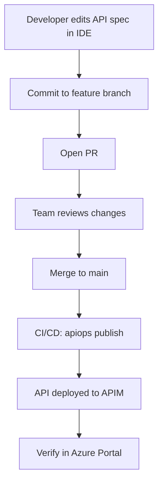

# Code-First Developer Workflow

Author API specs and APIM configuration directly in your IDE — git is the source of truth, not the Azure Portal.

## When to Use Code-First

Code-first is the right approach when:

- **Greenfield APIs** — You're building new APIs and don't have existing portal configuration to extract.
- **OpenAPI design-first teams** — You already write OpenAPI specs before implementing. Adding APIM artifacts is a natural extension.
- **Git as source of truth** — You want all API configuration in version control from day one, without the extract → commit → push cycle.
- **Multi-environment deployments** — You maintain separate APIM instances for dev, staging, and production and want consistent, repeatable deployments.

If you already have APIs configured in the Azure Portal, the [portal-first workflow](./scenarios-and-workflows.md) (extract → commit → publish) may be a better starting point. You can always transition to code-first later.

---

## Workflow Overview



### Step by step

1. **Create or edit** API specification files (OpenAPI JSON/YAML) and APIM artifact files directly in your IDE.
2. **Organize files** following the artifact directory structure (see below).
3. **Commit** changes to a feature branch.
4. **Open a PR** for team review — reviewers see exactly what API changes are proposed via file diffs.
5. **Merge to main** — a CI/CD pipeline runs `apiops publish` to deploy to your APIM instance.
6. **Use overrides** for environment-specific values (backend URLs, named values, etc.).

---

## Setting Up the Artifact Directory

Create a directory structure that mirrors the APIM resource hierarchy. The default source path is `./apim-artifacts`, but you can use any path via `--source`.

```
apim-artifacts/
├── apis/
│   └── petstore/
│       ├── apiInformation.json          # API metadata (display name, path, protocols)
│       ├── specification.yaml           # OpenAPI spec
│       └── policy.xml                   # API-level policy (optional)
├── backends/
│   └── petstore-backend/
│       └── backendInformation.json      # Backend URL and credentials
├── namedValues/
│   └── api-key/
│       └── namedValueInformation.json   # Named value (secret or plain)
├── products/
│   └── starter/
│       └── productInformation.json      # Product configuration
└── tags/
    └── v1/
        └── tagInformation.json          # Tag metadata
```

> **Tip:** To see exactly how files should look, run `apiops extract` against an existing APIM instance and inspect the output. The extracted files serve as templates you can copy and modify.

---

## Creating API Artifacts by Hand

### API information file

`apis/petstore/apiInformation.json`:

```json
{
  "properties": {
    "displayName": "Petstore API",
    "path": "petstore",
    "protocols": ["https"],
    "format": "openapi+json",
    "serviceUrl": "https://petstore-dev.contoso.com",
    "apiType": "http"
  }
}
```

### OpenAPI specification

`apis/petstore/specification.yaml` — a standard OpenAPI 3.0 spec:

```yaml
openapi: "3.0.1"
info:
  title: Petstore API
  version: "1.0"
paths:
  /pets:
    get:
      summary: List all pets
      operationId: listPets
      responses:
        "200":
          description: A list of pets
```

### API-level policy

`apis/petstore/policy.xml`:

```xml
<policies>
  <inbound>
    <rate-limit calls="100" renewal-period="60" />
    <base />
  </inbound>
  <backend>
    <base />
  </backend>
  <outbound>
    <base />
  </outbound>
  <on-error>
    <base />
  </on-error>
</policies>
```

### Backend

`backends/petstore-backend/backendInformation.json`:

```json
{
  "properties": {
    "url": "https://petstore-dev.contoso.com",
    "protocol": "http",
    "description": "Petstore backend service"
  }
}
```

---

## Using Overrides for Environment Promotion

Your artifacts contain dev values by default. Use [override files](./environment-overrides.md) to replace environment-specific properties at publish time.

`overrides.prod.yaml`:

```yaml
backends:
  - name: petstore-backend
    properties:
      url: https://petstore.contoso.com

namedValues:
  - name: api-key
    properties:
      value: "{{key-vault-reference}}"
```

Publish to production with overrides:

```bash
apiops publish \
  --resource-group prod-rg \
  --service-name apim-prod \
  --source ./apim-artifacts \
  --overrides overrides.prod.yaml
```

---

## PR Review Process

Code-first turns every API change into a reviewable diff:

```diff
# apis/petstore/apiInformation.json
 {
   "properties": {
     "displayName": "Petstore API",
-    "path": "petstore",
+    "path": "petstore/v2",
     "protocols": ["https"],
```

Reviewers can see:
- Which APIs are being added, modified, or removed
- Changes to policies, backends, and named values
- OpenAPI spec changes (new endpoints, modified schemas)

**Recommended:** Add a [dry-run step](./dry-run-workflow.md) to your PR workflow so reviewers also see the APIM deployment impact.

---

## CI/CD Pipeline

### GitHub Actions

```yaml
name: Publish APIs

on:
  push:
    branches: [main]
    paths:
      - 'apim-artifacts/**'
      - 'overrides.*.yaml'

jobs:
  publish:
    runs-on: ubuntu-latest
    permissions:
      id-token: write
      contents: read
    steps:
      - uses: actions/checkout@v4

      - uses: azure/login@v2
        with:
          client-id: ${{ secrets.AZURE_CLIENT_ID }}
          tenant-id: ${{ secrets.AZURE_TENANT_ID }}
          subscription-id: ${{ secrets.AZURE_SUBSCRIPTION_ID }}

      - name: Publish to APIM
        run: |
          npx apiops publish \
            --subscription-id ${{ secrets.AZURE_SUBSCRIPTION_ID }} \
            --resource-group ${{ secrets.APIM_RESOURCE_GROUP }} \
            --service-name ${{ secrets.APIM_SERVICE_NAME }} \
            --source ./apim-artifacts \
            --overrides overrides.prod.yaml
```

### Azure DevOps

```yaml
trigger:
  branches:
    include: [main]
  paths:
    include:
      - apim-artifacts/*
      - overrides.*.yaml

steps:
  - task: AzureCLI@2
    displayName: Publish to APIM
    inputs:
      azureSubscription: $(SERVICE_CONNECTION)
      scriptType: bash
      inlineScript: |
        npx apiops publish \
          --subscription-id $(AZURE_SUBSCRIPTION_ID) \
          --resource-group $(APIM_RESOURCE_GROUP) \
          --service-name $(APIM_SERVICE_NAME) \
          --source ./apim-artifacts \
          --overrides overrides.prod.yaml
```

---

## Tips for Code-First Teams

1. **Start by extracting a reference API.** Run `apiops extract` once against an existing APIM instance to see the exact file format. Use those files as templates for hand-authored artifacts.

2. **Validate your OpenAPI specs.** Use tools like [Spectral](https://github.com/stoplightio/spectral) or [redocly lint](https://redocly.com/docs/cli/) in CI to catch spec errors before they reach APIM.

3. **Use `--dry-run` on every PR.** This catches issues like missing dependencies or invalid resource references before merge.

4. **Keep overrides in the same repo.** Store `overrides.dev.yaml`, `overrides.staging.yaml`, and `overrides.prod.yaml` alongside your artifacts for a single source of truth.

5. **Don't mix portal edits with code-first.** If someone changes an API in the portal, those changes won't be in git. Either re-extract to capture them or revert the portal change. Choose one source of truth.

6. **Use feature branches per API change.** Treat API changes like code changes — one PR per logical change, reviewed before merge.

---

## Related

- [Scenarios and Workflows](./scenarios-and-workflows.md) — Portal-first vs. code-first comparison
- [Environment Overrides](./environment-overrides.md) — Override configuration per environment
- [Dry-Run Workflow](./dry-run-workflow.md) — Preview changes before publishing
- [apiops publish](../commands/publish.md) — Full command reference
- [CI/CD: GitHub Actions](../ci-cd/github-actions.md) — Complete pipeline setup
