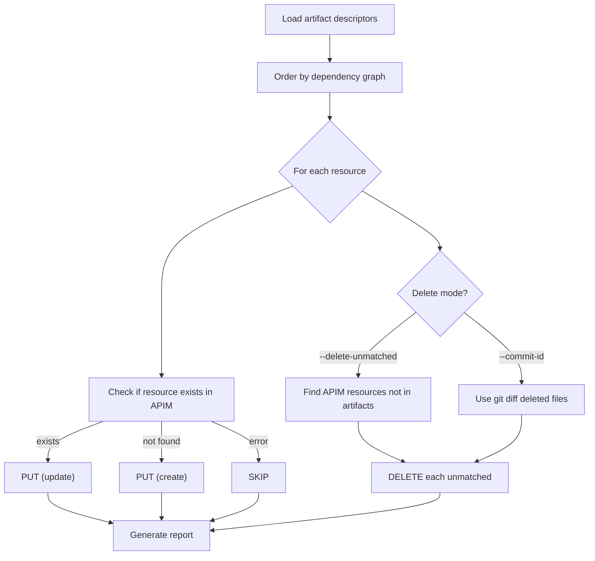

# Dry-Run Workflow

Preview exactly what `apiops publish` would do — without making any changes to your APIM instance.

## What Is Dry-Run?

Adding `--dry-run` to `apiops publish` compares your local artifact files against the current state of your APIM instance and reports what **would** happen: which resources would be created, updated, or deleted. No API calls that modify APIM are made.

This lets you:

- **Review changes** before applying them
- **Validate CI/CD pipelines** without risk
- **Catch mistakes** like accidental deletions before they hit production

---

## Usage

### Basic dry-run

```bash
apiops publish \
  --subscription-id 00000000-0000-0000-0000-000000000000 \
  --resource-group my-rg \
  --service-name my-apim \
  --source ./apim-artifacts \
  --dry-run
```

### Dry-run with delete-unmatched

Preview which resources in APIM would be **deleted** because they don't exist in your artifacts:

```bash
apiops publish \
  --resource-group my-rg \
  --service-name my-apim \
  --source ./apim-artifacts \
  --dry-run \
  --delete-unmatched
```

### Incremental dry-run

Preview only the resources changed in a specific commit:

```bash
apiops publish \
  --resource-group my-rg \
  --service-name my-apim \
  --source ./apim-artifacts \
  --dry-run \
  --commit-id abc123def456
```

### Machine-readable JSON output

```bash
apiops publish \
  --resource-group my-rg \
  --service-name my-apim \
  --source ./apim-artifacts \
  --dry-run \
  --format json
```

---

## Output Format

### Text output (default)

```
--- Dry-Run Report ---
3 creates/updates
1 deletes
0 skipped

Planned actions:
  PUT Api/my-api
  PUT ApiPolicy/my-api
  PUT Backend/my-backend
  DELETE NamedValue/old-key
```

Each action shows the operation (`PUT`, `DELETE`, `SKIP`), the resource type, and the resource name.

| Operation | Meaning |
|-----------|---------|
| `PUT` | Resource would be created (new) or updated (existing) |
| `DELETE` | Resource would be removed from APIM |
| `SKIP` | Resource could not be checked (error reading from APIM) |

### JSON output (`--format json`)

```json
{
  "dryRun": {
    "actions": [
      { "operation": "PUT", "type": "Api", "name": "my-api" },
      { "operation": "PUT", "type": "ApiPolicy", "name": "my-api" },
      { "operation": "PUT", "type": "Backend", "name": "my-backend" },
      { "operation": "DELETE", "type": "NamedValue", "name": "old-key" }
    ],
    "summary": {
      "creates": 3,
      "deletes": 1,
      "skips": 0
    }
  }
}
```

JSON output goes to **stdout** while log messages go to **stderr**, so you can pipe or parse the result:

```bash
apiops publish --dry-run --format json 2>/dev/null | jq '.dryRun.summary'
```

---

## How It Works



Key behaviors:

- Resources are processed in **topological order** — dependencies first, dependents after. This mirrors the real publish order.
- When combined with `--delete-unmatched`, the dry-run shows which APIM resources would be removed because they have no matching artifact.
- When combined with `--commit-id`, the dry-run shows deletions based on files removed in the commit's git diff.
- SKIP entries indicate errors reading the resource from APIM (permission issues, transient failures). Investigate these before publishing.

---

## PR Review Workflow

Use dry-run in CI to show reviewers exactly what a merge would deploy. Post the dry-run output as a PR comment for visibility.

### GitHub Actions example

```yaml
name: Dry-Run on PR

on:
  pull_request:
    branches: [main]
    paths:
      - 'apim-artifacts/**'

permissions:
  id-token: write
  contents: read
  pull-requests: write

jobs:
  dry-run:
    runs-on: ubuntu-latest
    steps:
      - uses: actions/checkout@v4

      - uses: azure/login@v2
        with:
          client-id: ${{ secrets.AZURE_CLIENT_ID }}
          tenant-id: ${{ secrets.AZURE_TENANT_ID }}
          subscription-id: ${{ secrets.AZURE_SUBSCRIPTION_ID }}

      - name: Run dry-run
        id: dryrun
        run: |
          OUTPUT=$(npx apiops publish \
            --subscription-id ${{ secrets.AZURE_SUBSCRIPTION_ID }} \
            --resource-group ${{ secrets.APIM_RESOURCE_GROUP }} \
            --service-name ${{ secrets.APIM_SERVICE_NAME }} \
            --source ./apim-artifacts \
            --dry-run 2>&1)
          echo "result<<EOF" >> $GITHUB_OUTPUT
          echo "$OUTPUT" >> $GITHUB_OUTPUT
          echo "EOF" >> $GITHUB_OUTPUT

      - name: Comment on PR
        uses: actions/github-script@v7
        with:
          script: |
            github.rest.issues.createComment({
              issue_number: context.issue.number,
              owner: context.repo.owner,
              repo: context.repo.repo,
              body: `### 🔍 Dry-Run Report\n\`\`\`\n${process.env.RESULT}\n\`\`\``
            })
        env:
          RESULT: ${{ steps.dryrun.outputs.result }}
```

This lets reviewers see _"this PR will create 2 APIs and update 1 backend"_ directly in the PR conversation.

---

## Combining with Other Flags

| Combination | Effect |
|------------|--------|
| `--dry-run` | Preview full publish |
| `--dry-run --delete-unmatched` | Preview full publish + unmatched resource deletions |
| `--dry-run --commit-id <sha>` | Preview incremental publish (changed files only) |
| `--dry-run --overrides config.yaml` | Preview publish with environment overrides applied |
| `--dry-run --format json` | Machine-readable preview output |
| `--dry-run --log-level debug` | Preview with verbose diagnostic logging |

> **Note:** `--commit-id` and `--delete-unmatched` remain mutually exclusive, even in dry-run mode.

---

## Best Practices

1. **Always dry-run before first publish** to a new environment. Verify the action list matches your expectations.
2. **Use dry-run in CI pull requests** so reviewers see the deployment impact before merge.
3. **Use JSON output for automation** — parse the summary to enforce guardrails (e.g., fail the pipeline if deletes exceed a threshold).
4. **Investigate SKIP entries** — they indicate resources the CLI couldn't check. Fix permissions or connectivity before publishing.
5. **Combine with `--delete-unmatched` in dry-run first** to preview deletions before running a real delete-unmatched publish.

---

## Related

- [apiops publish](../commands/publish.md) — Full command reference
- [Incremental Publish](./incremental-publish.md) — Deploy only changed resources
- [Environment Overrides](./environment-overrides.md) — Override values per environment
