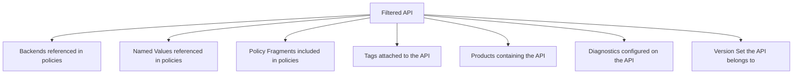

# Filtering Resources

By default, `apiops extract` pulls every resource from your APIM instance. For large instances or multi-team setups, you can filter extraction to specific resources using a YAML filter file.

## Why Filter?

- **Speed** — Extract only what your team owns instead of hundreds of APIs
- **Isolation** — Each team manages its own APIs in separate repos or branches
- **Noise reduction** — Avoid cluttering PRs with unrelated changes
- **Permissions** — Limit who sees what in version control

---

## Quick Start

1. Create a filter file:

```yaml
# configuration.extractor.yaml
apis:
  - petstore-api
  - orders-api
```

2. Pass it to extract:

```bash
apiops extract \
  --resource-group my-rg \
  --service-name my-apim \
  --subscription-id 00000000-0000-0000-0000-000000000000 \
  --filter configuration.extractor.yaml
```

Only `petstore-api`, `orders-api`, and their transitive dependencies are extracted.

---

## Filter YAML Format

The filter file is a YAML document where each key is a resource type and the value is an array of resource names:

```yaml
# configuration.extractor.yaml

# APIs to extract (by display name or API ID)
apis:
  - petstore-api
  - orders-api

# Backends to include
backends:
  - orders-backend

# Products to include
products:
  - starter
  - enterprise

# Named values to include
namedValues:
  - api-key
  - connection-string

# Leave sections out (or comment them) to extract ALL of that type
# loggers:
#   - appinsights
```

**Rules:**
- Each field is optional — omit it to extract all resources of that type
- Simple fields must be an array of strings
- `apis` and `workspaces` also accept nested object entries for sub-resource filtering (see below)
- Names are matched case-insensitively against APIM resource names
- Wildcard patterns are supported — `*` matches any characters, `?` matches a single character (see below)
- Exact names and wildcard patterns can be mixed in the same array
- An empty file extracts everything (same as no filter)
- An empty array (`[]`) excludes ALL resources of that type

---

## Wildcard Pattern Matching

Filter entries support glob-style wildcard patterns for matching multiple resources by naming convention:

| Wildcard | Meaning | Example |
|----------|---------|---------|
| `*` | Matches zero or more characters | `prod-*` matches `prod-api`, `prod-users` |
| `?` | Matches exactly one character | `api-v?` matches `api-v1`, `api-v2` but not `api-v10` |

### Examples

```yaml
apis:
  - '*-test'          # All APIs ending with -test
  - 'prod-*'          # All APIs starting with prod-
  - '*-internal-*'    # All APIs containing -internal-
  - 'v2-*-api'        # APIs following v2-{name}-api pattern
  - 'echo-api'        # Exact names and patterns can be mixed

products:
  - 'test-*'          # All test products
  - '*-starter'       # All starter tier products

backends:
  - 'backend-*-prod'  # All production backends

namedValues:
  - '*-connection-string'  # All connection string named values
```

Wildcard matching is case-insensitive, just like exact matching. Special characters in resource names (e.g., dots in `my.api.v1`) are treated literally — `my.api.*` matches `my.api.test` but not `myXapiXtest`.

---

## Nested Sub-Resource Filtering

### API sub-resource filters

For APIs, you can control which sub-resources (operations, diagnostics, schemas, releases) are extracted. Use an object entry instead of a plain string:

```yaml
apis:
  - petstore-api                  # Simple: include all sub-resources
  - orders-api:                   # Nested: control sub-resources
      operations:
        - get-order
        - create-order
      diagnostics:
        - applicationinsights
      schemas: []                 # Empty = exclude ALL schemas
      releases:
        - v1-release
```

**Sub-filter rules:**
- If a sub-resource key is **omitted**, all sub-resources of that type are included
- If a sub-resource key is an **empty array** (`[]`), all sub-resources of that type are excluded
- If a sub-resource key lists **names**, only those sub-resources are included

### Workspace sub-resource filters

The configuration format supports specifying which workspace-scoped resources to extract:

```yaml
workspaces:
  - team-a-workspace:             # Nested: control workspace resources
      apis:
        - team-api-1
        - team-api-2
      backends:
        - team-backend
      namedValues:
        - team-api-key
  - team-b-workspace              # Simple: extract all resources
```

Supported workspace sub-filter keys: `apis`, `backends`, `diagnostics`, `groups`, `loggers`, `namedValues`, `policyFragments`, `products`, `subscriptions`, `tags`, `versionSets`.

---

## All 16 Filterable Resource Types

| Filter Field | APIM Resource | Example Values |
|-------------|---------------|----------------|
| `apis` | APIs | `petstore-api`, `orders-v2` |
| `backends` | Backends | `orders-backend`, `payment-service` |
| `products` | Products | `starter`, `enterprise`, `internal` |
| `namedValues` | Named Values | `api-key`, `db-connection-string` |
| `loggers` | Loggers | `appinsights-logger`, `eventhub-logger` |
| `diagnostics` | Diagnostics | `applicationinsights`, `azuremonitor` |
| `tags` | Tags | `production`, `beta`, `internal` |
| `policyFragments` | Policy Fragments | `rate-limit-fragment`, `cors-policy` |
| `gateways` | Self-hosted Gateways | `on-prem-gateway`, `edge-gateway` |
| `versionSets` | API Version Sets | `orders-version-set` |
| `groups` | Groups | `developers`, `partners`, `admins` |
| `subscriptions` | Subscriptions | `team-a-subscription` |
| `schemas` | Global Schemas | `shared-error-schema` |
| `policies` | Service-level Policies | `policy` |
| `policyRestrictions` | Policy Restrictions | `no-external-calls` |
| `documentations` | Documentation | `getting-started`, `changelog` |
| `workspaces` | Workspaces | `team-a-workspace`, `team-b-workspace` |

---

## Transitive Dependency Behavior

When you filter by API name, `apiops extract` automatically includes resources referenced by those APIs. This is **transitive dependency resolution** — it ensures the extracted artifacts are self-contained and publishable.

### What Gets Auto-Included



### Example

Given this filter:

```yaml
apis:
  - petstore-api
```

If `petstore-api` has a policy that references:
- Backend `petstore-backend` → **auto-included**
- Named value `petstore-api-key` → **auto-included**
- Policy fragment `rate-limit-fragment` → **auto-included**

And `petstore-api` is assigned to:
- Product `starter` → **auto-included**
- Tag `production` → **auto-included**

The extract output includes all of these, even though only `apiNames` was specified in the filter.

### Why Transitive Matters

Without transitive resolution, publishing the extracted artifacts to a new APIM instance would fail — the API references a backend that doesn't exist, a named value that's missing, or a policy fragment that can't be found.

---

## Disabling Transitive Dependencies

Use `--no-transitive` to extract **only** the explicitly listed resources:

```bash
apiops extract \
  --resource-group my-rg \
  --service-name my-apim \
  --subscription-id 00000000-0000-0000-0000-000000000000 \
  --filter configuration.extractor.yaml \
  --no-transitive
```

**When to use `--no-transitive`:**
- You manage dependencies separately (e.g., shared backends are in a different repo)
- You want a minimal extract and will handle missing references manually
- Debugging — to see exactly what was explicitly filtered

> ⚠️ **Caution:** Extracted artifacts without transitive dependencies may not be publishable standalone. You'll need to ensure all referenced resources exist in the target APIM instance.

---

## Common Patterns

### Single API Team

A team that owns one or two APIs:

```yaml
# configuration.extractor.yaml
apis:
  - orders-api
  - orders-admin-api
```

Transitive dependencies (backends, named values, policy fragments) are auto-included.

### Product-Focused Extract

Extract everything associated with a product:

```yaml
# configuration.extractor.yaml
products:
  - enterprise
```

> **Note:** Filtering by `products` extracts the product definition and its associations, but does **not** transitively include the APIs in that product. To include the APIs, add them to `apis` as well.

### Shared Infrastructure Team

A platform team managing cross-cutting resources:

```yaml
# configuration.extractor.yaml
namedValues:
  - global-api-key
  - rate-limit-threshold
  - cors-allowed-origins

policyFragments:
  - standard-rate-limit
  - cors-policy
  - auth-validation

loggers:
  - appinsights-logger

backends:
  - identity-service
```

### Full Extract Minus Specific Resources

There is no "exclude" syntax. To extract everything except certain resources, list all the resources you _do_ want. For large instances, it's often easier to extract everything and use `.gitignore` or separate branches to manage visibility.

### Pattern-Based Team Filtering

Using wildcard patterns to extract resources by naming convention:

```yaml
# configuration.extractor.yaml
apis:
  - 'team-payments-*'     # All APIs owned by the payments team
namedValues:
  - 'payments-*'          # All named values for payments
backends:
  - '*-payments-*'        # All backends related to payments
```

---

## Tips

- **Start broad, narrow later** — Begin with no filter to see what's in your APIM instance, then create a filter for your team's slice
- **One filter per team** — In multi-team setups, each team maintains its own `configuration.extractor.yaml`
- **Commit the filter file** — Keep it in version control alongside your artifacts so CI/CD pipelines can use it
- **Case-insensitive matching** — Filter values are matched case-insensitively against APIM resource names
- **Use wildcard patterns** — `*` and `?` patterns let you match resources by naming convention instead of listing each name individually
- **Validate early** — The config loader validates filter entries and will throw `Failed to load filter config` on invalid YAML. Unknown top-level keys produce a warning.

---

## Related

- [apiops extract](../commands/extract.md) — extract command reference
- [Artifact Directory Format](../reference/artifact-format.md) — what the extracted files look like
- [Environment Overrides](environment-overrides.md) — per-environment configuration
- [Configuration Reference](../reference/configuration.md) — config priority chain
- [APIM Glossary](../reference/apim-glossary.md) — APIM resource terminology
