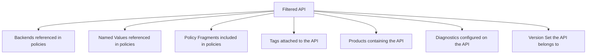

# Filtering Resources

By default, `apiops extract` pulls every resource from your APIM instance. For large instances or multi-team setups, you can filter extraction to specific resources using a YAML filter file.

## Why Filter?

- **Speed** — Extract only what your team owns instead of hundreds of APIs
- **Isolation** — Each team manages its own APIs in separate repos or branches
- **Noise reduction** — Avoid cluttering PRs with unrelated changes
- **Permissions** — Limit who sees what in version control

---

## Quick Start

1. Create a filter file:

```yaml
# configuration.extract.yaml
apiNames:
  - petstore-api
  - orders-api
```

2. Pass it to extract:

```bash
apiops extract \
  --resource-group my-rg \
  --service-name my-apim \
  --subscription-id 00000000-0000-0000-0000-000000000000 \
  --filter configuration.extract.yaml
```

Only `petstore-api`, `orders-api`, and their transitive dependencies are extracted.

---

## Filter YAML Format

The filter file is a YAML document where each key is a resource type and the value is an array of resource names:

```yaml
# configuration.extract.yaml

# APIs to extract (by display name or API ID)
apiNames:
  - petstore-api
  - orders-api

# Backends to include
backendNames:
  - orders-backend

# Products to include
productNames:
  - starter
  - enterprise

# Named values to include
namedValueNames:
  - api-key
  - connection-string

# Leave sections out (or comment them) to extract ALL of that type
# loggerNames:
#   - appinsights
```

**Rules:**
- Each field is optional — omit it to extract all resources of that type
- Each field must be an array of strings (validated at load time)
- Names are case-sensitive and must match the APIM resource name exactly
- An empty file extracts everything (same as no filter)

---

## All 16 Filterable Resource Types

| Filter Field | APIM Resource | Example Values |
|-------------|---------------|----------------|
| `apiNames` | APIs | `petstore-api`, `orders-v2` |
| `backendNames` | Backends | `orders-backend`, `payment-service` |
| `productNames` | Products | `starter`, `enterprise`, `internal` |
| `namedValueNames` | Named Values | `api-key`, `db-connection-string` |
| `loggerNames` | Loggers | `appinsights-logger`, `eventhub-logger` |
| `diagnosticNames` | Diagnostics | `applicationinsights`, `azuremonitor` |
| `tagNames` | Tags | `production`, `beta`, `internal` |
| `policyFragmentNames` | Policy Fragments | `rate-limit-fragment`, `cors-policy` |
| `gatewayNames` | Self-hosted Gateways | `on-prem-gateway`, `edge-gateway` |
| `versionSetNames` | API Version Sets | `orders-version-set` |
| `groupNames` | Groups | `developers`, `partners`, `admins` |
| `subscriptionNames` | Subscriptions | `team-a-subscription` |
| `schemaNames` | Global Schemas | `shared-error-schema` |
| `policyRestrictionNames` | Policy Restrictions | `no-external-calls` |
| `documentationNames` | Documentation | `getting-started`, `changelog` |
| `workspaceNames` | Workspaces | `team-a-workspace`, `team-b-workspace` |

---

## Transitive Dependency Behavior

When you filter by API name, `apiops extract` automatically includes resources referenced by those APIs. This is **transitive dependency resolution** — it ensures the extracted artifacts are self-contained and publishable.

### What Gets Auto-Included



### Example

Given this filter:

```yaml
apiNames:
  - petstore-api
```

If `petstore-api` has a policy that references:
- Backend `petstore-backend` → **auto-included**
- Named value `petstore-api-key` → **auto-included**
- Policy fragment `rate-limit-fragment` → **auto-included**

And `petstore-api` is assigned to:
- Product `starter` → **auto-included**
- Tag `production` → **auto-included**

The extract output includes all of these, even though only `apiNames` was specified in the filter.

### Why Transitive Matters

Without transitive resolution, publishing the extracted artifacts to a new APIM instance would fail — the API references a backend that doesn't exist, a named value that's missing, or a policy fragment that can't be found.

---

## Disabling Transitive Dependencies

Use `--no-transitive` to extract **only** the explicitly listed resources:

```bash
apiops extract \
  --resource-group my-rg \
  --service-name my-apim \
  --subscription-id 00000000-0000-0000-0000-000000000000 \
  --filter configuration.extract.yaml \
  --no-transitive
```

**When to use `--no-transitive`:**
- You manage dependencies separately (e.g., shared backends are in a different repo)
- You want a minimal extract and will handle missing references manually
- Debugging — to see exactly what was explicitly filtered

> ⚠️ **Caution:** Extracted artifacts without transitive dependencies may not be publishable standalone. You'll need to ensure all referenced resources exist in the target APIM instance.

---

## Common Patterns

### Single API Team

A team that owns one or two APIs:

```yaml
# configuration.extract.yaml
apiNames:
  - orders-api
  - orders-admin-api
```

Transitive dependencies (backends, named values, policy fragments) are auto-included.

### Product-Focused Extract

Extract everything associated with a product:

```yaml
# configuration.extract.yaml
productNames:
  - enterprise
```

> **Note:** Filtering by `productNames` extracts the product definition and its associations, but does **not** transitively include the APIs in that product. To include the APIs, add them to `apiNames` as well.

### Shared Infrastructure Team

A platform team managing cross-cutting resources:

```yaml
# configuration.extract.yaml
namedValueNames:
  - global-api-key
  - rate-limit-threshold
  - cors-allowed-origins

policyFragmentNames:
  - standard-rate-limit
  - cors-policy
  - auth-validation

loggerNames:
  - appinsights-logger

backendNames:
  - identity-service
```

### Full Extract Minus Specific Resources

There is no "exclude" syntax. To extract everything except certain resources, list all the resources you _do_ want. For large instances, it's often easier to extract everything and use `.gitignore` or separate branches to manage visibility.

---

## Tips

- **Start broad, narrow later** — Begin with no filter to see what's in your APIM instance, then create a filter for your team's slice
- **One filter per team** — In multi-team setups, each team maintains its own `configuration.extract.yaml`
- **Commit the filter file** — Keep it in version control alongside your artifacts so CI/CD pipelines can use it
- **Case-sensitive names** — Filter values must match APIM resource names exactly (usually lowercase with hyphens)
- **Validate early** — The config loader validates that each filter field is an array of strings and will throw `Failed to load filter config` on invalid YAML

---

## Related

- [apiops extract](../commands/extract.md) — extract command reference
- [Artifact Directory Format](../reference/artifact-format.md) — what the extracted files look like
- [Environment Overrides](environment-overrides.md) — per-environment configuration
- [Configuration Reference](../reference/configuration.md) — config priority chain
- [APIM Glossary](../reference/apim-glossary.md) — APIM resource terminology
