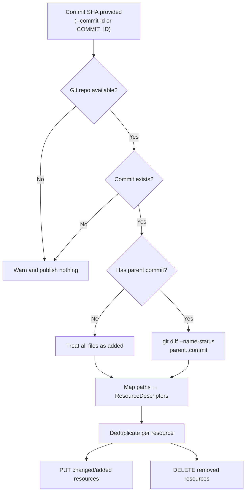

# Incremental Publish

Deploy only the resources that changed in a specific git commit — instead of publishing your entire artifact set every time.

## What Is Incremental Publish?

A full publish pushes **every** artifact in your source directory to APIM, even if only one file changed. Incremental publish uses `git diff` to detect which files changed in a commit and publishes **only those resources**. This is faster, reduces API management control-plane calls, and limits blast radius in CI/CD.

---

## How It Works

Pass a git commit SHA via `--commit-id` or the `COMMIT_ID` environment variable. The CLI:

1. Runs `git diff --name-status` between the commit and its parent (`commit~1`).
2. Maps changed file paths to resource descriptors.
3. PUTs added/modified resources and DELETEs removed resources.
4. Deduplicates descriptors — multiple file changes in the same resource produce a single PUT.



### Git diff status mapping

| Git status | Action |
|-----------|--------|
| `A` (added) | PUT (create) |
| `M` (modified) | PUT (update) |
| `D` (deleted) | DELETE |
| `R` (renamed) | DELETE old path + PUT new path |
| `C` (copied) | PUT destination path |

### Edge cases

- **First commit (no parent):** All files are treated as added — equivalent to a full publish.
- **Git unavailable or commit not found:** The CLI warns and publishes nothing (zero resources). This is a safe fallback, not a full publish.
- **Multiple files per resource:** If `apis/my-api/apiInformation.json` and `apis/my-api/specification.yaml` both change, `my-api` is published once.
- **Override file changes only:** If a commit only modifies the override configuration file (e.g., `configuration.prod.yaml`) and no artifact files in the `--source` directory change, **nothing is published**.

---

## CLI Usage

### Using the `--commit-id` flag

```bash
apiops publish \
  --subscription-id 00000000-0000-0000-0000-000000000000 \
  --resource-group my-rg \
  --service-name my-apim \
  --source ./apim-artifacts \
  --commit-id abc123def456
```

### Using the `COMMIT_ID` environment variable

```bash
export COMMIT_ID=abc123def456

apiops publish \
  --subscription-id 00000000-0000-0000-0000-000000000000 \
  --resource-group my-rg \
  --service-name my-apim \
  --source ./apim-artifacts
```

> The `--commit-id` flag takes precedence over the `COMMIT_ID` environment variable.

### Combine with dry-run

Preview what an incremental publish would do, without applying changes:

```bash
apiops publish \
  --resource-group my-rg \
  --service-name my-apim \
  --source ./apim-artifacts \
  --commit-id abc123def456 \
  --dry-run
```

---

## CI/CD Integration

Incremental publish is most valuable in CI/CD pipelines where each merge commit is deployed automatically.

### GitHub Actions

```yaml
- name: Publish changed APIs
  run: |
    npx apiops publish \
      --subscription-id ${{ secrets.AZURE_SUBSCRIPTION_ID }} \
      --resource-group ${{ secrets.APIM_RESOURCE_GROUP }} \
      --service-name ${{ secrets.APIM_SERVICE_NAME }} \
      --source ./apim-artifacts \
      --commit-id ${{ github.sha }}
```

### Azure DevOps

```yaml
- task: AzureCLI@2
  displayName: Publish changed APIs
  inputs:
    azureSubscription: $(SERVICE_CONNECTION)
    scriptType: bash
    inlineScript: |
      npx apiops publish \
        --subscription-id $(AZURE_SUBSCRIPTION_ID) \
        --resource-group $(APIM_RESOURCE_GROUP) \
        --service-name $(APIM_SERVICE_NAME) \
        --source ./apim-artifacts \
        --commit-id $(Build.SourceVersion)
```

> **Tip:** Both `${{ github.sha }}` and `$(Build.SourceVersion)` resolve to the merge commit SHA — exactly what `--commit-id` expects.

---

## When NOT to Use Incremental Publish

Force a full publish (omit `--commit-id`) when:

- **First deployment** to a new APIM instance — there's no commit history to diff against.
- **Configuration drift** — someone changed APIM directly in the portal and you want to overwrite everything from git.
- **Major refactoring** — renaming many APIs or restructuring directories. A full publish ensures nothing is missed.
- **Override-only changes** — you updated an override file but no artifact files changed. See [Gotcha: Override-only changes are not published incrementally](environment-overrides.md#gotcha-override-only-changes-are-not-published-incrementally).
- **You need `--delete-unmatched`** — see below.

### `--commit-id` and `--delete-unmatched` are mutually exclusive

You cannot combine incremental publish with `--delete-unmatched`. The CLI exits with an error if both are specified.

```
Options --commit-id (or COMMIT_ID) and --delete-unmatched are mutually exclusive.
```

**Why?** `--delete-unmatched` removes APIM resources that don't exist in the artifact directory — it requires a full view of all artifacts. Incremental publish only sees one commit's diff.

---

## Troubleshooting

| Symptom | Cause | Fix |
|---------|-------|-----|
| `Not in a git repository; skipping incremental diff` | The `--source` directory is not inside a git repo | Ensure your artifact directory is inside a cloned repo. In CI, check that the checkout step runs before publish. |
| `Commit <sha> not found; skipping incremental diff` | Shallow clone doesn't include the commit | Use `fetch-depth: 2` (or more) in your checkout step to include at least the parent commit. |
| Nothing published, no errors | Commit diff returned no artifact file changes | Verify the commit actually touches files in the `--source` directory. Use `git diff --name-status HEAD~1 HEAD` locally to check. |
| Nothing published after override change | Override file changed but no artifact files changed | Override files are not artifact files — they don't trigger resource selection. Run a full publish (omit `--commit-id`) or include an artifact file change in the same commit. See [Gotcha: Override-only changes](environment-overrides.md#gotcha-override-only-changes-are-not-published-incrementally). |
| `mutually exclusive` error | Both `--commit-id` and `--delete-unmatched` specified | Remove one. Use `--commit-id` for incremental or `--delete-unmatched` for full sync — not both. |

### GitHub Actions: fetch depth

By default, `actions/checkout` performs a shallow clone with `fetch-depth: 1`. Incremental publish needs the parent commit to compute the diff. Set `fetch-depth: 2`:

```yaml
- uses: actions/checkout@v4
  with:
    fetch-depth: 2
```

---

## Related

- [apiops publish](../commands/publish.md) — Full command reference
- [Dry-Run Workflow](./dry-run-workflow.md) — Preview changes before applying
- [CI/CD: GitHub Actions](../ci-cd/github-actions.md) — Full pipeline setup
