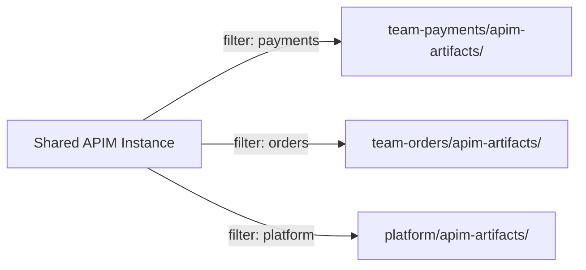
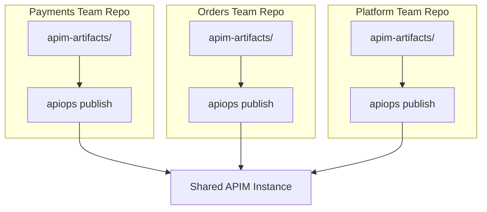

# Multi-Team Workflows

How multiple API teams share a single Azure API Management instance without stepping on each other.

## The Challenge

When several teams publish APIs to the same APIM instance, conflicts arise:

- **Ownership** — Who controls shared resources like named values or policy fragments?
- **Blast radius** — One team's pipeline should not delete another team's APIs.
- **Permissions** — PR approvals should be scoped to each team's APIs.

This guide covers three patterns for organizing multi-team APIM workflows: selective extraction, monorepo, and polyrepo.

---

## Pattern 1: Selective Extraction

Each team extracts only the APIs they own by passing a [filter file](../commands/extract.md) to `apiops extract`.

### Filter file example

`team-payments/filter.yaml`:

```yaml
apiNames:
  - payments-api
  - billing-api
backendNames:
  - payments-backend
```

### Extract with filter

```bash
apiops extract \
  --resource-group shared-rg \
  --service-name shared-apim \
  --output ./team-payments/apim-artifacts \
  --filter ./team-payments/filter.yaml
```

Each team extracts into their own directory. Only the resources matching the filter are captured.



> **Tip:** Enable transitive dependency inclusion (the default) so that shared resources referenced by your APIs are included automatically. Use `--no-transitive` only when you explicitly manage dependencies.

---

## Pattern 2: Monorepo

All teams share a single repository. Each team owns a subdirectory containing their APIM artifacts.

### Directory structure

```
apim-repo/
├── .github/
│   ├── CODEOWNERS
│   └── workflows/
│       ├── publish-payments.yml
│       ├── publish-orders.yml
│       └── publish-platform.yml
├── payments/
│   ├── apim-artifacts/
│   │   ├── apis/payments-api/
│   │   └── backends/payments-backend/
│   └── overrides.prod.yaml
├── orders/
│   ├── apim-artifacts/
│   │   └── apis/orders-api/
│   └── overrides.prod.yaml
└── platform/
    ├── apim-artifacts/
    │   ├── namedValues/
    │   ├── products/
    │   └── policyFragments/
    └── overrides.prod.yaml
```

### CODEOWNERS

Use GitHub's `CODEOWNERS` file to require team-specific PR approvals:

```
# .github/CODEOWNERS
payments/                @payments-team
orders/                  @orders-team
platform/                @platform-team
```

With this configuration:
- Changes to `payments/` require approval from `@payments-team`
- Changes to `platform/` (shared resources) require approval from `@platform-team`
- No team can merge changes to another team's directory without the owning team's review

### Scoped pipelines

Each team has their own publish workflow, triggered only by changes in their directory:

```yaml
# .github/workflows/publish-payments.yml
name: Publish Payments APIs

on:
  push:
    branches: [main]
    paths:
      - 'payments/**'

jobs:
  publish:
    runs-on: ubuntu-latest
    steps:
      - uses: actions/checkout@v4

      - uses: azure/login@v2
        with:
          client-id: ${{ secrets.AZURE_CLIENT_ID }}
          tenant-id: ${{ secrets.AZURE_TENANT_ID }}
          subscription-id: ${{ secrets.AZURE_SUBSCRIPTION_ID }}

      - run: |
          npx apiops publish \
            --subscription-id ${{ secrets.AZURE_SUBSCRIPTION_ID }} \
            --resource-group ${{ secrets.APIM_RESOURCE_GROUP }} \
            --service-name ${{ secrets.APIM_SERVICE_NAME }} \
            --source ./payments/apim-artifacts \
            --overrides ./payments/overrides.prod.yaml
```

---

## Pattern 3: Polyrepo

Each team has their own repository. Each repo publishes independently to the shared APIM instance.



### Advantages

- **Natural isolation** — Each team manages their own repo, CI/CD, and permissions.
- **Independent release cadence** — Teams deploy on their own schedule.
- **Simple ownership** — No CODEOWNERS complexity; each repo is owned by one team.

### Considerations

- **No single view** of all artifacts — harder to see the full APIM configuration.
- **Shared resource conflicts** — Two repos modifying the same named value or policy fragment can overwrite each other.
- **Coordination required** for shared resources (see below).

---

## Shared Resource Ownership

Regardless of pattern, you need clear ownership rules for shared resources:

| Resource type | Typical owner | Example |
|--------------|---------------|---------|
| Named values | Platform team | API keys, connection strings |
| Policy fragments | Platform team | Common rate-limiting, CORS policies |
| Products | Platform team or product owners | "Starter", "Premium" product tiers |
| Tags | Platform team | API categorization |
| Backends | Owning API team | Service-specific backend URLs |
| APIs | Owning API team | Team's API definitions |

### Rules of thumb

1. **One owner per resource.** Never have two teams publishing the same named value or policy fragment from different repos/directories.
2. **Platform team owns cross-cutting resources.** Named values, products, policy fragments, and tags should be managed by a platform or infrastructure team.
3. **API teams own their APIs and backends.** Each API and its backend should be managed by the team that builds the service.

---

## Pipeline Scoping

### Scope by source directory

Each pipeline only publishes artifacts from its own directory. Resources outside that directory are untouched.

### Scope by filter

If teams share a single artifact directory (less recommended), use filter files to scope what each pipeline publishes:

```bash
# Payments pipeline
apiops publish \
  --source ./apim-artifacts \
  --filter ./filters/payments.yaml \
  ...
```

### ⚠️ Use `--delete-unmatched` carefully

`--delete-unmatched` removes APIM resources that don't exist in the source directory. In a multi-team setup, **one team's pipeline could delete another team's resources**.

**Recommendations:**

- **Avoid `--delete-unmatched` in multi-team scenarios** unless the pipeline has access to ALL teams' artifacts.
- If you must use it, ensure the source directory contains the complete set of artifacts for the APIM instance.
- Use `--dry-run --delete-unmatched` to preview what would be deleted before running the real command.
- Consider using [incremental publish](./incremental-publish.md) (`--commit-id`) instead — it only deletes resources whose files were explicitly removed in the commit.

---

## Anti-Patterns

| ❌ Anti-pattern | ✅ Better approach |
|----------------|-------------------|
| Multiple teams editing the same named value from different repos | Designate one team (usually platform) to own all named values |
| Using `--delete-unmatched` in a team-scoped pipeline | Use incremental publish or omit `--delete-unmatched` |
| No CODEOWNERS in monorepo | Add CODEOWNERS so teams review only their own artifacts |
| Shared override files across teams | Use team-scoped override files (`payments/overrides.prod.yaml`) |
| Manual portal edits alongside code-first pipelines | Choose one source of truth per resource |
| Merging without dry-run in shared APIM | Always run `--dry-run` in PR checks to preview cross-team impact |

---

## Choosing a Pattern

| Factor | Selective Extract | Monorepo | Polyrepo |
|--------|:-:|:-:|:-:|
| Single view of all artifacts | ✅ | ✅ | ❌ |
| Independent release cadence | ❌ | ⚠️ | ✅ |
| Simple permissions | ⚠️ | ✅ (CODEOWNERS) | ✅ |
| Shared resource coordination | Manual | CODEOWNERS | Manual |
| `--delete-unmatched` safety | ⚠️ | ✅ (if all in one dir) | ❌ |
| Best for | Small teams, few APIs | Medium orgs, many APIs | Large orgs, independent teams |

---

## Related

- [Scenarios and Workflows](./scenarios-and-workflows.md) — Portal-first vs. code-first overview
- [Incremental Publish](./incremental-publish.md) — Safer alternative to `--delete-unmatched` in multi-team setups
- [Dry-Run Workflow](./dry-run-workflow.md) — Preview changes before applying
- [apiops extract](../commands/extract.md) — Filter-based extraction
- [apiops publish](../commands/publish.md) — Full publish command reference
