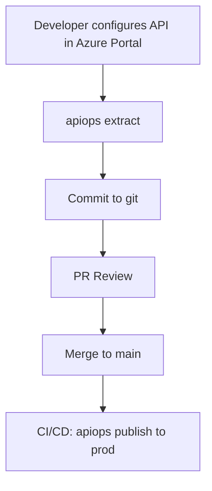
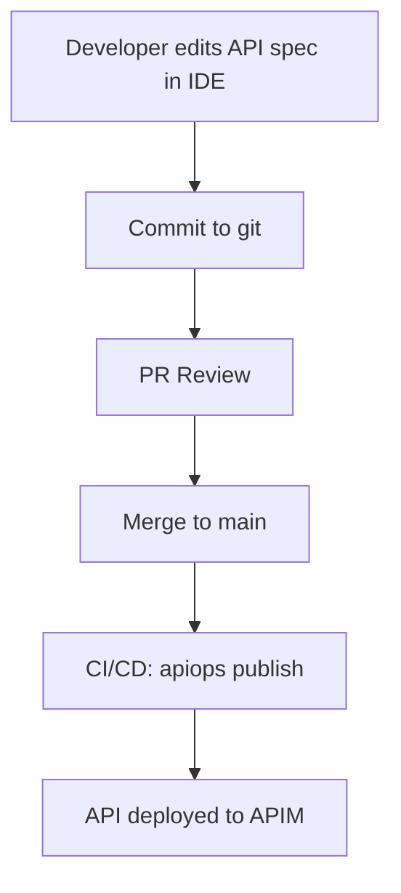

# Supported Scenarios and Workflows

apiops-cli supports two primary workflows for managing Azure API Management configuration as code. Choose the one that fits your team's habits — or combine them.

## Portal-First Workflow

**Best for:** Teams already using the Azure Portal to configure APIs.

In this workflow, the portal is the source of truth. You configure APIs in the portal, then use `apiops extract` to capture that configuration as files in git.



### How it works

1. A developer creates or updates an API in the Azure Portal (dev environment).
2. Run [`apiops extract`](../commands/extract.md) to capture the current APIM configuration as local files.
3. Commit the extracted files to git and open a pull request.
4. Team reviews the PR — diffs show exactly what changed in the portal.
5. On merge to `main`, a CI/CD pipeline runs [`apiops publish`](../commands/publish.md) to deploy changes to staging/production.

### When to use

- Your team is comfortable configuring APIs through the Azure Portal.
- You want portal changes tracked in git for auditability.
- You need to promote portal-configured APIs across environments (dev → staging → prod).

---

## Code-First Workflow

**Best for:** Teams who prefer editing API specs and configuration in an IDE.

In this workflow, git is the source of truth. Developers edit OpenAPI specs and APIM configuration JSON directly, and CI/CD deploys on merge.



### How it works

1. A developer edits OpenAPI specifications and APIM resource JSON files in their IDE.
2. Commit changes and open a pull request.
3. Team reviews — standard code review process.
4. On merge to `main`, CI/CD runs [`apiops publish`](../commands/publish.md) to deploy to APIM.

### When to use

- Your team prefers working in an IDE over the Azure Portal.
- You want full version control from day one — no portal dependency.
- You already have OpenAPI specs and want to manage them alongside APIM configuration.

> **Tip:** Even in a code-first workflow, you can run `apiops extract` once to bootstrap your initial artifact files from an existing APIM instance.

---

## Comparison

| Aspect | Portal-First | Code-First |
|--------|-------------|------------|
| **Source of truth** | Azure Portal → extracted files | Files in git repository |
| **Best for** | Teams already using APIM portal | Teams preferring IDE workflows |
| **Extract usage** | Regular (captures portal changes) | Rare (initial setup only) |
| **Key benefit** | Familiar portal experience | Full version control from start |
| **PR diffs show** | What changed in the portal | What you edited in the IDE |
| **Learning curve** | Lower — portal skills transfer | Lower — standard dev workflow |

---

## Hybrid Scenarios

Many teams combine both workflows:

- **Bootstrap with portal, maintain in code.** Start portal-first to set up your initial API configuration. Run `apiops extract` to capture it. Then switch to code-first for ongoing changes.

- **Different APIs, different workflows.** Some APIs are managed in the portal (e.g., by a partner team), while others are maintained in code. Both flows use the same artifact format and CI/CD pipeline.

- **Portal for experimentation, code for production.** Use the portal to prototype API policies in dev, extract the result, then commit and promote through git.

### Artifact format is the same

Regardless of which workflow you use, the artifact files on disk are identical. The `apim-artifacts/` directory structure is the common language between portal-first and code-first:

```
apim-artifacts/
├── apis/
│   └── petstore/
│       ├── apiInformation.json
│       ├── specification.yaml
│       └── policy.xml
├── backends/
│   └── petstore-backend.json
├── namedValues/
│   └── api-key.json
└── products/
    └── starter.json
```

This means you can switch workflows at any time without restructuring your repository.

---

## Setting Up CI/CD

Both workflows use the same CI/CD integration. Run `apiops init` to scaffold your repository with workflow files:

```bash
# GitHub Actions
apiops init --ci github-actions

# Azure DevOps
apiops init --ci azure-devops
```

For detailed CI/CD setup, see:

- [GitHub Actions Integration](../ci-cd/github-actions.md)
- [Authentication Guide](authentication.md) — configure credentials for your pipeline

## Related

- [`apiops extract` Command Reference](../commands/extract.md)
- [`apiops publish` Command Reference](../commands/publish.md)
- [Environment Overrides](environment-overrides.md) — deploy the same artifacts to different environments
