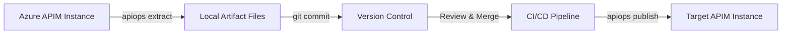
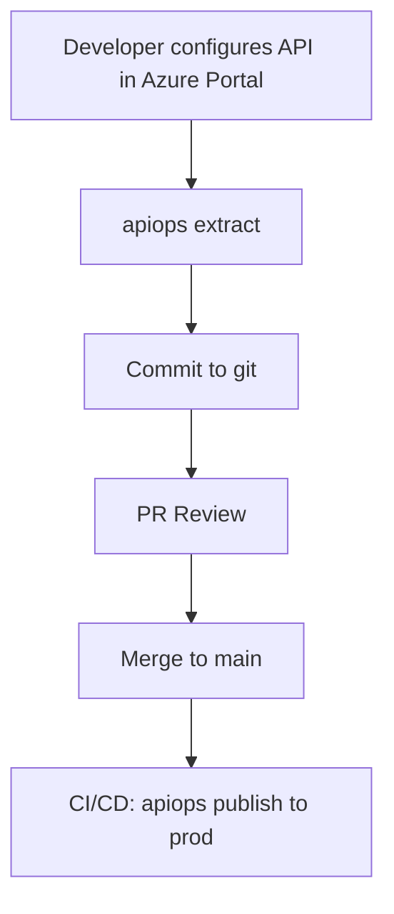
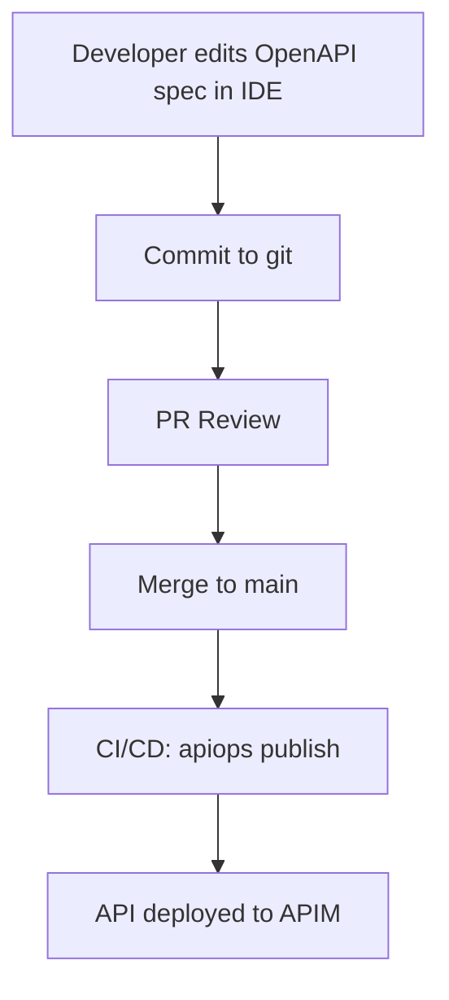
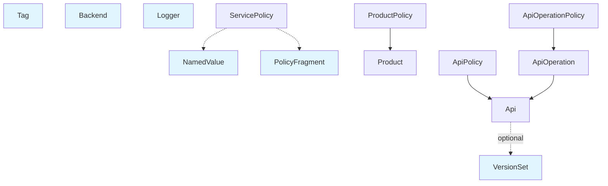
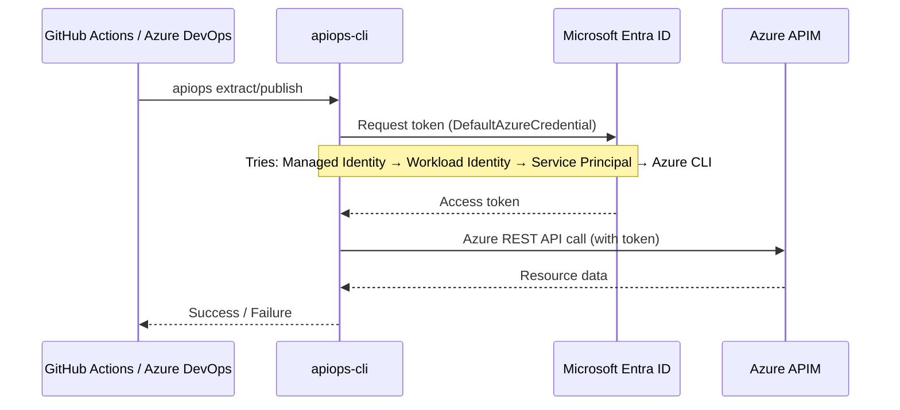
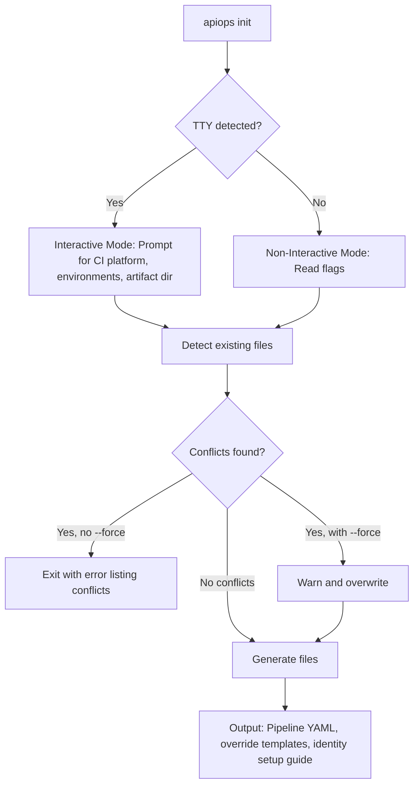

# apiops-cli Documentation Plan

**Author:** DocWriter  
**Date:** 2026-04-30  
**Status:** For Review  
**Audience:** API developers working with Azure API Management

---

## Overview

This plan outlines the complete documentation structure for apiops-cli — a CLI tool for Azure API Management configuration-as-code. The documentation lives in the `/docs` folder on GitHub and serves developers who want to extract APIM configurations to local files, publish them back to Azure, and integrate apiops into CI/CD pipelines.

The primary goals are:

1. **Get developers productive fast** — clear quickstart, command references, and common workflows
2. **Support all skill levels** — from first-time users (via `apiops init`) to advanced scenarios (incremental publish, filtering, overrides)
3. **Enable CI/CD integration** — GitHub Actions and Azure DevOps pipeline setup, authentication patterns
4. **Provide depth when needed** — artifact file format reference, architecture diagrams, troubleshooting guides

---

## Landing Page Strategy

**File:** `/docs/README.md`

GitHub automatically displays `README.md` as the landing page when users browse the `/docs` folder. This is our front door.

**Content:**

- **Hero section** — One-sentence value proposition: "apiops-cli is a command-line tool for managing Azure API Management as code."
- **Quick links** navigation — Prominent links to Getting Started, Command Reference, CI/CD Guide
- **Visual architecture diagram** (Mermaid) — Show the extract → version control → publish flow
- **Key features list** — Extract, publish, init, filtering, overrides, incremental deploy, dry-run
- **Next steps** — Link to Getting Started guide

This page is navigation-focused, not content-heavy. Developers should be able to orient themselves and jump to the right guide within 10 seconds.

---

## Proposed Directory Structure

```
docs/
├── README.md                     # Landing page (navigation hub)
├── getting-started.md            # Quickstart: install, first extract, first publish
│
├── commands/                     # Command reference (one file per command)
│   ├── extract.md
│   ├── publish.md
│   └── init.md
│
├── guides/                       # Task-oriented how-to guides
│   ├── scenarios-and-workflows.md
│   ├── code-first-workflow.md
│   ├── filtering-resources.md
│   ├── environment-overrides.md
│   ├── incremental-publish.md
│   ├── dry-run-workflow.md
│   ├── authentication.md
│   ├── multi-environment-setup.md
│   ├── multi-team-workflows.md
│   └── migration-from-v1.md
│
├── ci-cd/                        # CI/CD platform integration guides
│   ├── github-actions.md
│   ├── azure-devops.md
│   └── authentication-patterns.md
│
├── reference/                    # Deep reference material
│   ├── artifact-format.md
│   ├── dependency-graph.md
│   ├── resource-types.md
│   ├── configuration.md
│   ├── apim-glossary.md
│   └── exit-codes.md
│
├── architecture/                 # System design and internals
│   ├── overview.md
│   └── design-principles.md
│
└── troubleshooting/              # Problem-solution guides
    ├── common-errors.md
    ├── debugging-guide.md
    └── pipeline-recovery.md
```

### Rationale

- **commands/** — One file per command. Matches the mental model developers have when they run `apiops <command> --help`.
- **guides/** — Task-focused. "How do I...?" answers. Each guide solves one specific problem.
- **ci-cd/** — Separated from guides because CI/CD integration is a major use case. Users want platform-specific instructions (GitHub Actions vs Azure DevOps) in one place.
- **reference/** — Deep material you don't need until you need it. Artifact file schemas, full resource type lists, technical details.
- **architecture/** — For contributors and advanced users who want to understand design decisions and system internals.
- **troubleshooting/** — Problem-solution format. Searchable error messages, diagnostic steps.

---

## Content Inventory

Below is every planned documentation page with a 1-2 sentence description.

### Core Documentation

| File | Description |
|------|-------------|
| `README.md` | Landing page with navigation, architecture diagram, and feature overview. |
| `getting-started.md` | Step-by-step guide: install the CLI, authenticate to Azure, run your first extract and publish. |

### Command Reference (commands/)

| File | Description |
|------|-------------|
| `extract.md` | Full reference for `apiops extract`: all flags, examples, output format, filtering, and spec format options. |
| `publish.md` | Full reference for `apiops publish`: all flags, examples, dry-run mode, overrides, incremental publish, delete-unmatched. |
| `init.md` | Full reference for `apiops init`: scaffold pipelines, interactive vs non-interactive modes, environment setup, force mode. |

### How-To Guides (guides/)

| File | Description |
|------|-------------|
| `scenarios-and-workflows.md` | Portal-first vs Code-first workflows. When to use extract→publish (portal users) vs code-first authoring. Includes Mermaid diagrams for each scenario. |
| `code-first-workflow.md` | Step-by-step code-first developer workflow: edit API specs in IDE → commit → PR → publisher triggers. Day-in-the-life walkthrough. |
| `filtering-resources.md` | How to extract a subset of resources using filter YAML files, transitive inclusion behavior, and `--no-transitive` flag. |
| `environment-overrides.md` | How to use override YAML files to inject environment-specific values (backend URLs, named value secrets) during publish. Includes section on override rules: resource NAMES must be consistent across environments but PROPERTIES can be overridden. |
| `incremental-publish.md` | How to configure commit-based incremental publish to deploy only changed resources, reducing deployment time. |
| `dry-run-workflow.md` | How to use `--dry-run` to preview changes before applying, integrating it into PR review workflows. |
| `authentication.md` | Authentication patterns: DefaultAzureCredential chain, service principals, managed identities, federated credentials, explicit flags. |
| `multi-environment-setup.md` | How to set up dev/staging/prod environments with separate override files and pipeline stages. |
| `multi-team-workflows.md` | How multiple API teams manage different APIs in one APIM instance. Selective extraction per team, monorepo vs polyrepo patterns, CODEOWNERS integration. |
| `migration-from-v1.md` | How to migrate from the existing Azure/apiops toolkit to apiops-cli. Artifact format differences, pipeline migration, new features. |

### CI/CD Integration (ci-cd/)

| File | Description |
|------|-------------|
| `github-actions.md` | Complete guide to using apiops-cli in GitHub Actions: OIDC authentication, workflow structure, extract on schedule, publish on merge. |
| `azure-devops.md` | Complete guide to using apiops-cli in Azure Pipelines: service connections, pipeline YAML, multi-stage deployment. |
| `authentication-patterns.md` | CI/CD-specific authentication: OIDC/workload identity federation, service principals with secrets, managed identities in hosted agents. |

### Reference Material (reference/)

| File | Description |
|------|-------------|
| `artifact-format.md` | Complete specification of the artifact directory layout: folder structure, file naming conventions, JSON schemas, policy XML format. |
| `dependency-graph.md` | Visual dependency graph (Mermaid) showing APIM resource type relationships and publish ordering. |
| `resource-types.md` | Exhaustive list of all APIM resource types supported by apiops-cli with ARM paths and artifact file locations. |
| `configuration.md` | How config sources (CLI flags, env vars, YAML files) are prioritized. Documents the full priority chain. |
| `apim-glossary.md` | Brief primer on APIM terminology: APIs, products, named values, policies, backends, gateways, subscriptions, tags, policy fragments. Links to Microsoft Docs for depth. |
| `exit-codes.md` | Reference table of CLI exit codes and their meanings for scripting and CI/CD error handling. |

### Architecture (architecture/)

| File | Description |
|------|-------------|
| `overview.md` | High-level architecture: how extract works, how publish works, design principles (CLI-first, idempotent, passthrough JSON). |
| `design-principles.md` | Summary of Constitution principles (CLI-first design, APIM-native, config-as-code, idempotency, simplicity, testability, forward compatibility). |

### Troubleshooting (troubleshooting/)

| File | Description |
|------|-------------|
| `common-errors.md` | Searchable list of common error messages with explanations and solutions (auth failures, rate limits, version conflicts). |
| `debugging-guide.md` | How to diagnose issues: `--log-level debug`, `--dry-run`, inspecting artifact files, Azure portal comparison. |
| `pipeline-recovery.md` | How to recover from failed CI/CD runs. Scenarios: failed adds, failed deletes, commit ordering issues. |

---

## Suggested Mermaid Diagrams

### 1. Extract → Publish Flow (for README.md)



**Purpose:** Show the core workflow at a glance. Developers understand the tool fits into a GitOps pattern.

### 1a. Portal-First Workflow (for guides/scenarios-and-workflows.md)



**Purpose:** Show the portal-first adoption pattern — existing APIM users who want to version control their manual changes.

### 1b. Code-First Workflow (for guides/scenarios-and-workflows.md)



**Purpose:** Show the code-first pattern — developers who want to author API specs as code and deploy to APIM without touching the portal.

### 2. Resource Dependency Graph (for reference/dependency-graph.md)



**Purpose:** Visualize why resources are published in a specific order. Helps developers understand why Backend must be created before API.

### 3. Authentication Flow (for ci-cd/authentication-patterns.md)



**Purpose:** Demystify how authentication works. Shows the credential chain and where tokens come from.

### 4. Init Command Flow (for commands/init.md)



**Purpose:** Explain how `apiops init` decides between interactive and non-interactive modes, and how conflict detection works.

---

## Recommended Authoring Order

Prioritize based on user value — most common workflows first, advanced material later.

1. **README.md** — Create the landing page first. Developers need navigation before content.
2. **getting-started.md** — The first guide new users hit. Install → authenticate → extract → publish.
3. **guides/scenarios-and-workflows.md** — Help users understand which workflow (portal-first vs code-first) fits their team. Critical for orientation.
4. **commands/extract.md** — Most common command. Full flag reference with examples.
5. **commands/publish.md** — Second most common command. Cover dry-run, overrides, incremental publish.
6. **commands/init.md** — Critical for onboarding. Scaffold pipelines and identity setup.
7. **guides/authentication.md** — Authentication is the #1 blocker for new users. Clear guide with examples for each credential type.
8. **ci-cd/github-actions.md** — GitHub Actions is the primary CI/CD platform. Full walkthrough with OIDC setup.
9. **guides/environment-overrides.md** — Multi-environment workflows depend on this. Show dev/prod override patterns. Include override rules (names vs properties).
10. **ci-cd/azure-devops.md** — Azure DevOps integration for enterprise users.
11. **guides/filtering-resources.md** — Advanced use case: extracting subsets of resources.
12. **reference/artifact-format.md** — Reference material. Users need this when hand-editing artifacts.
13. **reference/apim-glossary.md** — APIM terminology primer for developers new to APIM.
14. **reference/configuration.md** — Config priority chain (flags → env vars → YAML files).
15. **architecture/overview.md** — System design for contributors and advanced users.
16. **troubleshooting/common-errors.md** — Build this incrementally as real-world errors surface.
17. **guides/incremental-publish.md** — Optimization for large instances.
18. **guides/dry-run-workflow.md** — Best practice for production safety.
19. **guides/code-first-workflow.md** — Day-in-the-life: IDE → git → CI/CD → APIM.
20. **guides/multi-team-workflows.md** — Selective extraction, monorepo/polyrepo patterns, CODEOWNERS.
21. **guides/migration-from-v1.md** — Migration guide for existing Azure/apiops toolkit users.
22. **reference/dependency-graph.md** — Visual reference for advanced users.
23. **reference/resource-types.md** — Complete reference table (can be adapted from specs/APIM-RestAPI-Coverage.md).
24. **troubleshooting/pipeline-recovery.md** — Failed run recovery scenarios.
25. **architecture/design-principles.md** — Constitution summary for contributors.
26. **troubleshooting/debugging-guide.md** — Diagnostic techniques.
27. **reference/exit-codes.md** — Scripting reference (low priority — most users won't need this).
28. **ci-cd/authentication-patterns.md** — Deep dive after the platform-specific guides are done.

**Phases:**

- **Phase 1 (MVP):** Items 1-9 — Core commands, getting started, scenarios, authentication, GitHub Actions integration, environment overrides.
- **Phase 2 (CI/CD + Advanced):** Items 10-21 — Azure DevOps, filtering, artifact format, glossary, configuration, troubleshooting, multi-team workflows, migration guide.
- **Phase 3 (Reference + Architecture):** Items 22-28 — Deep reference material, system internals, advanced debugging, pipeline recovery.

---

## Writing Style & Conventions

### Voice and Tone

- **Direct and concise** — API developers skim before they read. Lead with the action, then explain why.
- **Active voice** — "Run `apiops extract`" not "The extract command can be run."
- **Imperative mood for instructions** — "Set the `--output` flag" not "You can set the `--output` flag."
- **Assumes competence** — Readers know HTTP, REST, JSON, YAML, git, CI/CD concepts. Don't over-explain basics.

### Code Examples

- **Prefer multi-line with backslash continuation** for readability:
  ```bash
  apiops extract \
    --resource-group my-rg \
    --service-name my-apim \
    --output ./artifacts
  ```
- **Show both Windows and Unix shells where behavior differs** (e.g., environment variables: `$VAR` vs `%VAR%`).
- **Include comments in complex examples** to explain non-obvious flags or values.
- **Always show expected output or next steps** after a command — don't leave the reader hanging.

### Mermaid Diagrams

- **Prefer Mermaid over static images** — Diagrams are version-controlled, editable, and render natively on GitHub.
- **Keep diagrams simple** — 5-10 nodes maximum. Complex graphs belong in reference docs, not guides.
- **Use color sparingly** — Highlight critical nodes only (e.g., user actions in blue, errors in red).
- **Label all edges** — "depends on", "references", "triggers" — make relationships explicit.

### Markdown Conventions

- **File names:** `lowercase-hyphen-separated.md` (e.g., `getting-started.md`, `artifact-format.md`).
- **Headings:** Use `## Heading` for top-level sections (H1 is reserved for page title). No skipping levels (H2 → H4).
- **Cross-references:** Relative links — `[Authentication guide](../guides/authentication.md)` not absolute URLs.
- **Code blocks:** Always specify language for syntax highlighting — ` ```bash `, ` ```yaml `, ` ```json `.
- **Admonitions:** Use blockquotes for callouts:
  ```markdown
  > **Note:** Incremental publish requires `COMMIT_ID` environment variable.
  ```

### Tables

- **Use tables for flag references** — Flag, Type, Default, Description columns.
- **Use tables for error code listings** — Code, Meaning, Solution columns.
- **Keep tables scannable** — Short descriptions. Link to detailed guides if needed.

### Examples Before Prose

- **Show the code first, explain second.** Developers learn by seeing working examples, then understanding the details.
- **Bad:** "The extract command accepts a --filter flag that points to a YAML file. The YAML file contains..."
- **Good:**
  ```bash
  apiops extract --filter filter.yaml
  ```
  This extracts only the resources listed in `filter.yaml`. See [Filtering Resources](../guides/filtering-resources.md) for the YAML schema.

---

## Success Metrics

How do we know the documentation is working?

1. **New users can complete Getting Started in <10 minutes** without external resources.
2. **Command references answer "How do I...?" without reading architecture docs** — flags and examples are self-contained.
3. **CI/CD guides produce working pipelines on first try** — no trial-and-error on authentication or paths.
4. **Troubleshooting docs surface in search** — error messages link to solutions.
5. **Mermaid diagrams render correctly on GitHub** — no broken syntax, clear visual hierarchy.
6. **Cross-references don't break** — relative links work when docs folder is browsed on GitHub or cloned locally.
7. **Zero assumptions about prior APIOps knowledge** — tool stands on its own, doesn't require reading v1 docs.

---

## Open Questions / Decisions Needed

1. **Do we auto-generate reference/resource-types.md from data-model.md?** — Could save maintenance effort. Requires build-time script. Alternatively, adapt specs/APIM-RestAPI-Coverage.md to user-facing format.
2. **Should architecture docs link to Constitution directly or summarize?** — Avoid duplication vs. provide context for external readers.
3. ~~**Do we need a "Migration from v1" guide?**~~ — **RESOLVED: YES.** Added as `guides/migration-from-v1.md` in Phase 2. Many users are migrating from Azure/apiops toolkit and need guidance on artifact format differences and pipeline migration.
4. **Versioned docs?** — If breaking changes occur, do we version the docs folder (e.g., `/docs/v2/`) or use branch/tag-based docs?
5. **Contribution guide location?** — CONTRIBUTING.md lives in repo root. Do we link to it from architecture/ or create a docs/contributing.md wrapper?

---

## Next Steps

1. Review this plan with the team (ApiOpsLead, ApimExpert, OpenSourceExpert).
2. Get approval on directory structure and content inventory.
3. Start authoring Phase 1 docs (items 1-8 from authoring order).
4. Create Mermaid diagrams for README.md and key guides.
5. Set up cross-reference validation (manual or scripted link checker).
6. Iterate based on early user feedback (GitHub issues, questions).

---

## Spec-to-Docs Migration

This section identifies content in `specs/` that should be adapted for user-facing documentation in `/docs`.

### Files to Migrate / Adapt

| Source File | Destination | Editing Required | Priority |
|-------------|-------------|------------------|----------|
| `specs/quickstart.md` | `docs/getting-started.md` | Light editing: remove internal rationale, add navigation links, adjust tone for public audience. Already 90% user-ready. | **High** — Phase 1 |
| `specs/APIM-RestAPI-Coverage.md` | `docs/reference/resource-types.md` | **Major adaptation**: Remove v1/v2 comparison columns (internal), remove "Should Cover" rationale column. Keep: Resource Type name, ARM Path, artifact directory path, brief user-facing description. Add: Links to Microsoft Docs for each resource type. Reorganize into scannable categories (Service-Level, Product, API, etc.). | **Medium** — Phase 2 |
| `specs/data-model.md` (ResourceType table) | `docs/reference/artifact-format.md` | **Extract and reformat**: Pull the ResourceType enum table (artifact directory paths, info file names). Add prose explaining directory layout conventions, file naming patterns, JSON structure. Add examples of actual artifact files. Remove internal implementation details (TypeScript interfaces, validation rules). | **Medium** — Phase 2 |
| `specs/data-model.md` (DependencyGraph) | `docs/reference/dependency-graph.md` | **Extract and visualize**: Convert the dependency edges table into a Mermaid diagram (already designed in plan.md). Add prose explaining why resources are published in topological order. Remove internal graph algorithm details. | **Low** — Phase 3 |

### Files to Keep in specs/ (Not User-Facing)

| File | Reason |
|------|--------|
| `specs/spec.md` | Product specification — internal design document, not user-facing. |
| `specs/tasks.md` | Task tracking — project management artifact, not user documentation. |
| `specs/research.md` | Internal research on API client patterns and alternatives considered. Useful for contributors but not end users. |
| `specs/v1-research-report.md` | Internal analysis of APIOps Toolkit. Useful reference material for writing `guides/migration-from-v1.md` but not directly publishable. Keep as source material. |
| `specs/checklists/` | Requirements checklists — project artifacts, not user-facing. |
| `specs/contracts/` | Interface contracts (cli-commands.md, iapim-client.md, iartifact-store.md) — internal API design, not user documentation. |

### Migration Strategy

1. **Phase 1 (Immediate):**
   - Adapt `specs/quickstart.md` → `docs/getting-started.md` with light editing (tone, navigation, public-facing polish).
   - Validate all code examples still work with current CLI.

2. **Phase 2 (After Core Docs Complete):**
   - Transform `specs/APIM-RestAPI-Coverage.md` → `docs/reference/resource-types.md` with major restructuring (remove internal columns, add user descriptions).
   - Extract artifact layout table from `specs/data-model.md` → `docs/reference/artifact-format.md` with examples and prose.
   - Cross-reference the glossary (`docs/reference/apim-glossary.md`) when describing resource types.

3. **Phase 3 (Advanced Reference Material):**
   - Convert dependency graph from `specs/data-model.md` → `docs/reference/dependency-graph.md` with Mermaid visualization.
   - Use `specs/v1-research-report.md` as source material when writing `docs/guides/migration-from-v1.md`.

### Content Transformation Guidelines

When adapting spec content for docs:

- **Remove internal rationale** — Users don't need to know why we chose to support/exclude a feature, just what's supported.
- **Add user-friendly descriptions** — Replace terse technical labels with helpful explanations ("Why would I use this?").
- **Link to Microsoft Docs** — Don't duplicate APIM conceptual documentation. Link to authoritative sources for depth.
- **Show examples** — Specs contain tables; docs need working examples and code snippets.
- **Reorganize for scannability** — Specs optimize for completeness; docs optimize for findability.

---

**End of Plan**
