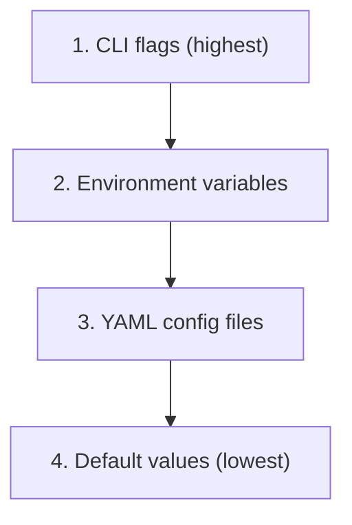

# Configuration Reference

apiops-cli accepts configuration from multiple sources. This reference documents the priority chain, all CLI flags, environment variables, YAML config files, and default values.

## Priority Chain

When the same setting is specified in multiple places, the highest-priority source wins:



| Priority | Source | Example |
|----------|--------|---------|
| **1 (highest)** | CLI flags | `--resource-group my-rg` |
| **2** | Environment variables | `AZURE_SUBSCRIPTION_ID=...` |
| **3** | YAML config files | `configuration.extract.yaml`, `configuration.dev.yaml` |
| **4 (lowest)** | Default values | `--output ./apim-artifacts` |

For example, if `AZURE_SUBSCRIPTION_ID` is set as an environment variable but `--subscription-id` is also passed on the command line, the CLI flag wins.

---

## CLI Flags

### Global Flags

Available on all commands (`extract`, `publish`, `init`):

| Flag | Description | Default |
|------|-------------|---------|
| `--subscription-id <id>` | Azure subscription ID | `AZURE_SUBSCRIPTION_ID` env var |
| `--client-id <id>` | Service principal client ID (sets `AZURE_CLIENT_ID`) | — |
| `--client-secret <secret>` | Service principal client secret (sets `AZURE_CLIENT_SECRET`) | — |
| `--tenant-id <id>` | Azure AD tenant ID (sets `AZURE_TENANT_ID`) | — |
| `--cloud <name>` | Azure cloud environment | `public` |
| `--log-level <level>` | Log verbosity: `debug`, `info`, `warn`, `error` | `info` |
| `--format <format>` | Output format | `text` |
| `--api-version <version>` | APIM REST API version | `2025-09-01-preview` |

### `apiops extract` Flags

| Flag | Description | Default |
|------|-------------|---------|
| `--resource-group <rg>` | Azure resource group **(required)** | — |
| `--service-name <name>` | APIM service name **(required)** | — |
| `--output <dir>` | Output directory for artifacts | `./apim-artifacts` |
| `--filter <path>` | Path to [filter YAML](../guides/filtering-resources.md) | — |
| `--no-transitive` | Disable transitive dependency inclusion | `false` (transitive enabled) |

### `apiops publish` Flags

| Flag | Description | Default |
|------|-------------|---------|
| `--resource-group <rg>` | Azure resource group **(required)** | — |
| `--service-name <name>` | APIM service name **(required)** | — |
| `--source <dir>` | Source directory containing artifacts | `./apim-artifacts` |
| `--overrides <path>` | Path to [override YAML](../guides/environment-overrides.md) | — |
| `--commit-id <sha>` | Git commit SHA for [incremental publish](../commands/publish.md) | `COMMIT_ID` env var |
| `--dry-run` | Preview changes without applying | `false` |
| `--delete-unmatched` | Delete resources not in artifacts | `false` |

> ⚠️ `--commit-id` and `--delete-unmatched` are **mutually exclusive**. You cannot use both.

### `apiops init` Flags

| Flag | Description | Default |
|------|-------------|---------|
| `--ci <provider>` | CI/CD platform: `github-actions` or `azure-devops` | _(interactive prompt)_ |
| `--artifact-dir <dir>` | Artifact directory path in generated pipelines | `./apim-artifacts` |
| `--environments <list>` | Comma-separated environment names | `dev,prod` |
| `--cli-package <path>` | Path to local CLI tarball (for development) | — |
| `--non-interactive` | Skip interactive prompts | `false` |
| `--force` | Overwrite existing files | `false` |

---

## Environment Variables

| Variable | Used By | Description |
|----------|---------|-------------|
| `AZURE_SUBSCRIPTION_ID` | extract, publish | Azure subscription ID (alternative to `--subscription-id`) |
| `AZURE_CLIENT_ID` | all | Service principal client ID for authentication |
| `AZURE_CLIENT_SECRET` | all | Service principal client secret for authentication |
| `AZURE_TENANT_ID` | all | Microsoft Entra ID (Azure AD) tenant ID |
| `AZURE_API_VERSION` | extract, publish | APIM REST API version (default: `2025-09-01-preview`) |
| `COMMIT_ID` | publish | Git commit SHA for incremental publish (alternative to `--commit-id`) |

### Authentication Environment Variables

These are used by `DefaultAzureCredential` from `@azure/identity`:

| Variable | Purpose |
|----------|---------|
| `AZURE_CLIENT_ID` | Service principal or managed identity client ID |
| `AZURE_CLIENT_SECRET` | Service principal client secret |
| `AZURE_TENANT_ID` | Tenant ID for service principal auth |
| `AZURE_FEDERATED_TOKEN_FILE` | Path to federated token file (OIDC/workload identity) |
| `AZURE_AUTHORITY_HOST` | Override authority host for sovereign clouds |

See [Authentication Guide](../guides/authentication.md) for details on each auth method.

---

## YAML Config Files

### Filter Configuration

**File:** `configuration.extract.yaml` (or any path passed to `--filter`)

Controls which resources are extracted. See [Filtering Resources](../guides/filtering-resources.md) for the full reference.

```yaml
# configuration.extract.yaml
apiNames:
  - petstore-api
  - orders-api
backendNames:
  - petstore-backend
```

### Override Configuration

**File:** `configuration.{env}.yaml` (or any path passed to `--overrides`)

Replaces environment-specific values at publish time. See [Environment Overrides](../guides/environment-overrides.md) for the full reference.

```yaml
# configuration.prod.yaml
namedValues:
  - name: api-key
    properties:
      value: "{{api-key-prod}}"
backends:
  - name: petstore-backend
    properties:
      url: "https://api.contoso.com"
```

---

## Default Values

| Setting | Default Value | Override With |
|---------|--------------|---------------|
| Output directory | `./apim-artifacts` | `--output` |
| Source directory | `./apim-artifacts` | `--source` |
| Azure cloud | `public` | `--cloud` |
| Log level | `info` | `--log-level` |
| Output format | `text` | `--format` |
| API version | `2025-09-01-preview` | `--api-version` or `AZURE_API_VERSION` |
| Transitive deps | enabled | `--no-transitive` |
| Dry run | disabled | `--dry-run` |
| Delete unmatched | disabled | `--delete-unmatched` |
| Environments (init) | `dev,prod` | `--environments` |
| Artifact dir (init) | `./apim-artifacts` | `--artifact-dir` |

---

## Related

- [apiops extract](../commands/extract.md) — extract command reference
- [apiops publish](../commands/publish.md) — publish command reference
- [apiops init](../commands/init.md) — init command reference
- [Authentication Guide](../guides/authentication.md) — auth methods and credential chain
- [Filtering Resources](../guides/filtering-resources.md) — filter YAML format
- [Environment Overrides](../guides/environment-overrides.md) — override YAML format
