# Resource Dependency Graph

apiops-cli processes APIM resources in a strict **tiered order** during both extraction and publishing. Understanding this graph helps you predict processing order, diagnose ordering failures, and design artifact repositories that align with the tool's behavior.

## Why Ordering Matters

Azure API Management resources have parent–child and reference relationships. For example, an **ApiPolicy** references an **Api** — if you publish the policy before the API exists, the ARM call fails.

apiops-cli solves this by organizing all 34 resource types into **4 tiers**. Each tier is processed completely before the next tier begins. Within a tier, resources are processed in parallel.

- **Extract:** Tier 1 resources are extracted first, Tier 4 last.
- **Publish:** Tier 1 resources are published first, Tier 4 last. Deletions run in **reverse** order (Tier 4 first).

## Tier Breakdown

| Tier | Resources | Rule |
|------|-----------|------|
| **1** | NamedValue, Tag, Gateway, VersionSet, Backend, Logger, Group, PolicyFragment, GlobalSchema, PolicyRestriction, Documentation | No dependencies — safe to process in any order |
| **2** | Diagnostic, ServicePolicy, Product, Api | Depend only on Tier 1 resources |
| **3** | ProductPolicy, ProductGroup, ProductTag, ProductApi, ProductWiki, ApiPolicy, ApiTag, ApiDiagnostic, ApiOperation, ApiSchema, ApiRelease, ApiTagDescription, ApiWiki, McpServer, GraphQLResolver, GatewayApi, Subscription | Depend on Tier 1 and/or Tier 2 resources |
| **4** | ApiOperationPolicy, GraphQLResolverPolicy | Depend on Tier 3 resources |

## Dependency Graph

```mermaid
graph TD
    %% Tier 1 — no dependencies
    classDef tier1 fill:#e1f5ff,stroke:#0288d1
    classDef tier2 fill:#e8f5e9,stroke:#388e3c
    classDef tier3 fill:#fff8e1,stroke:#f9a825
    classDef tier4 fill:#fce4ec,stroke:#c62828

    NamedValue:::tier1
    Tag:::tier1
    Gateway:::tier1
    VersionSet:::tier1
    Backend:::tier1
    Logger:::tier1
    Group:::tier1
    PolicyFragment:::tier1
    GlobalSchema:::tier1
    PolicyRestriction:::tier1
    Documentation:::tier1

    %% Tier 2
    Diagnostic:::tier2
    ServicePolicy:::tier2
    Product:::tier2
    Api:::tier2

    Diagnostic -.->|optional| Logger
    ServicePolicy -.->|optional| NamedValue
    ServicePolicy -.->|optional| PolicyFragment
    Api -.->|optional| VersionSet

    %% Tier 3
    ProductPolicy:::tier3
    ProductGroup:::tier3
    ProductTag:::tier3
    ProductApi:::tier3
    ProductWiki:::tier3
    ApiPolicy:::tier3
    ApiTag:::tier3
    ApiDiagnostic:::tier3
    ApiOperation:::tier3
    ApiSchema:::tier3
    ApiRelease:::tier3
    ApiTagDescription:::tier3
    ApiWiki:::tier3
    McpServer:::tier3
    GraphQLResolver:::tier3
    GatewayApi:::tier3
    Subscription:::tier3

    ProductPolicy -->|required| Product
    ProductGroup -->|required| Product
    ProductGroup -->|required| Group
    ProductTag -->|required| Product
    ProductTag -->|required| Tag
    ProductApi -->|required| Product
    ProductApi -->|required| Api
    ProductWiki -->|required| Product
    ApiPolicy -->|required| Api
    ApiTag -->|required| Api
    ApiTag -->|required| Tag
    ApiDiagnostic -->|required| Api
    ApiDiagnostic -.->|optional| Logger
    ApiOperation -->|required| Api
    ApiSchema -->|required| Api
    ApiRelease -->|required| Api
    ApiTagDescription -->|required| Api
    ApiTagDescription -->|required| Tag
    ApiWiki -->|required| Api
    GraphQLResolver -->|required| Api
    GatewayApi -->|required| Gateway
    GatewayApi -->|required| Api
    Subscription -.->|optional| Product
    Subscription -.->|optional| Api
    McpServer -->|required| Api

    %% Tier 4
    ApiOperationPolicy:::tier4
    GraphQLResolverPolicy:::tier4

    ApiOperationPolicy -->|required| ApiOperation
    GraphQLResolverPolicy -->|required| GraphQLResolver
```

**Legend:** Solid arrows = required dependency · Dashed arrows = optional dependency  
**Colors:** 🔵 Tier 1 · 🟢 Tier 2 · 🟡 Tier 3 · 🔴 Tier 4

## All Dependency Edges

The complete list of 31 edges in the dependency graph:

| Source | Target | Required? | Notes |
|--------|--------|-----------|-------|
| Diagnostic | Logger | Optional | Logger referenced in diagnostic config |
| ServicePolicy | NamedValue | Optional | Policy XML may reference named values |
| ServicePolicy | PolicyFragment | Optional | Policy XML may include fragments |
| Api | VersionSet | Optional | API may belong to a version set |
| ProductPolicy | Product | Required | Policy belongs to a product |
| ProductGroup | Product | Required | Association links product to group |
| ProductGroup | Group | Required | Association links product to group |
| ProductTag | Product | Required | Tag applied to a product |
| ProductTag | Tag | Required | Tag applied to a product |
| ProductApi | Product | Required | Association links product to API |
| ProductApi | Api | Required | Association links product to API |
| ProductWiki | Product | Required | Wiki belongs to a product |
| ApiPolicy | Api | Required | Policy belongs to an API |
| ApiTag | Api | Required | Tag applied to an API |
| ApiTag | Tag | Required | Tag applied to an API |
| ApiDiagnostic | Api | Required | Diagnostic scoped to an API |
| ApiDiagnostic | Logger | Optional | Logger referenced in diagnostic config |
| ApiOperation | Api | Required | Operation belongs to an API |
| ApiSchema | Api | Required | Schema belongs to an API |
| ApiRelease | Api | Required | Release belongs to an API |
| ApiTagDescription | Api | Required | Tag description scoped to an API |
| ApiTagDescription | Tag | Required | References a tag entity |
| ApiWiki | Api | Required | Wiki belongs to an API |
| GraphQLResolver | Api | Required | Resolver belongs to a GraphQL API |
| GatewayApi | Gateway | Required | Associates gateway with API |
| GatewayApi | Api | Required | Associates gateway with API |
| Subscription | Product | Optional | Subscription may scope to a product |
| Subscription | Api | Optional | Subscription may scope to an API |
| McpServer | Api | Required | MCP server belongs to an API |
| ApiOperationPolicy | ApiOperation | Required | Policy belongs to an operation |
| GraphQLResolverPolicy | GraphQLResolver | Required | Policy belongs to a resolver |

## Practical Implications

### Publish Ordering

When you run `apiops publish`, resources are created/updated in tier order (1 → 2 → 3 → 4). This ensures that every resource's dependencies exist before it is published.

**Deletions run in reverse** (4 → 3 → 2 → 1) so that child resources are removed before their parents.

### Partial Failures

If a Tier 2 resource fails to publish, its dependents in Tier 3 and 4 will also fail. Check [exit codes](./exit-codes.md) — exit code `1` (partial failure) often indicates a dependency chain failure. Fix the root resource and re-run.

### Filtering Considerations

When using `filter.yaml` to include specific resources, be aware of dependencies.

**During publish**, apiops-cli does **not** auto-include dependencies at the
artifact level — your filter (and hence your extracted artifact tree) must
already contain every required parent. For example, publishing an **ApiPolicy**
without its parent **Api** present in the artifact tree will fail.

**During extract**, apiops-cli **does** auto-follow a limited set of transitive
references when a filter is applied and `--no-transitive` is not passed. See
[`apiops extract` — Transitive dependencies](../commands/extract.md#transitive-dependencies)
for the full list of reference types the extractor scans.

## Related Docs

- [Resource Types](./resource-types.md) — full list of supported resource types
- [Exit Codes](./exit-codes.md) — understanding partial vs. total failure
- [`apiops publish`](../commands/publish.md) — publish command reference
