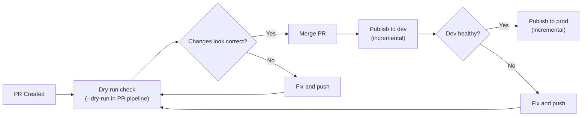
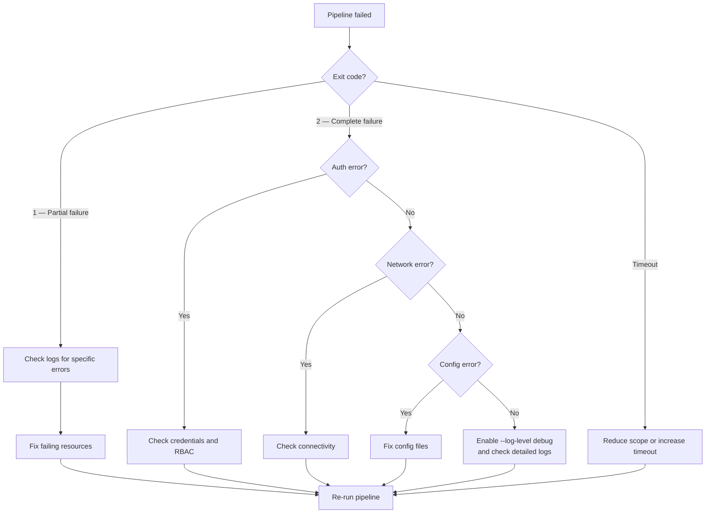

# Pipeline Recovery

> How to recover from failed CI/CD runs. Every scenario below is safe to re-run — apiops-cli operations are idempotent.

---

## Scenario 1: Partial Publish Failure (Exit Code 1)

**What happened:** Some resources were published successfully, others failed. The pipeline exited with code `1`.

**Why it's safe:** Already-published resources won't be affected by a re-run. The CLI uses PUT (create-or-update) semantics, so re-publishing an unchanged resource is a no-op.

### Recovery Steps

1. **Check the error output** — look at the pipeline logs for specific failure messages:

   ```
   ERROR: Failed to publish api "petstore-v2": 400 Bad Request — ...
   INFO: Published 14 of 16 resources (2 failed)
   ```

2. **Fix the failing resources** — common causes:
   - Invalid JSON in artifact files
   - Missing dependencies (e.g., publishing an API that references a named value that doesn't exist)
   - Policy XML syntax errors
   - RBAC permissions insufficient for specific resource types

3. **Re-run the pipeline** — the same pipeline run can be re-triggered:
   - **GitHub Actions:** Click "Re-run failed jobs" on the workflow run
   - **Azure DevOps:** Click "Retry stage" on the failed stage

4. **If re-run fails again**, fix the root cause in the artifact files, commit, and push. The next pipeline run will pick up the changes.

---

## Scenario 2: Failed Incremental Publish

**What happened:** An incremental publish (using `--commit-id`) missed resources or failed because the commit reference was invalid.

**Common causes:**
- The base commit was amended or rebased after the pipeline was configured
- A force-push changed the commit history
- The commit ID references a commit that no longer exists in the branch

### Recovery Steps

1. **Force a full publish** by omitting `--commit-id`:

   - **GitHub Actions:** Re-run the workflow and select **"publish-all-artifacts-in-repo"** as the commit ID choice:

     ```yaml
     # In the workflow dispatch inputs:
     commit_id_choice:
       description: 'Commit ID choice'
       type: choice
       options:
         - publish-all-artifacts-in-repo
         - last-merged-commit
     ```

   - **Azure DevOps:** Re-run the pipeline with the variable:

     ```
     COMMIT_ID_CHOICE = publish-all-artifacts-in-repo
     ```

2. **A full publish** compares all artifacts against APIM state. It's slower but reliable — no git history dependency.

3. **After recovery**, future incremental publishes will work normally from the new commit baseline.

### Prevention

- Avoid amending or force-pushing commits that are used as `--commit-id` baselines
- Use the CI/CD-generated commit reference (e.g., `${{ github.event.before }}` in GitHub Actions) rather than hardcoded commit hashes

---

## Scenario 3: Failed Delete-Unmatched

**What happened:** A publish with `--delete-unmatched` partially completed — some resources were deleted, others failed to delete.

**Why it's safe:** Already-deleted resources won't cause errors on re-run. The CLI handles "not found" responses gracefully for delete operations.

### Recovery Steps

1. **Check which deletes failed** — look at the pipeline logs:

   ```
   ERROR: Failed to delete product "legacy-product": 409 Conflict — resource has active subscriptions
   INFO: Deleted 5 of 7 unmatched resources (2 failed)
   ```

2. **Fix the blocking issue:**
   - `409 Conflict` — The resource has dependencies that prevent deletion (e.g., subscriptions on a product). Remove those dependencies first.
   - `403 Forbidden` — The identity lacks delete permissions on that resource type.

3. **Re-run the pipeline** — already-deleted resources are skipped. Only the previously-failed deletes are retried.

---

## Scenario 4: Auth Expired Mid-Run

**What happened:** The pipeline started successfully but failed partway through with a `401 Unauthorized` error. The authentication token expired during a long-running publish.

### Recovery Steps

1. **Simply re-run the pipeline** — `DefaultAzureCredential` will obtain a fresh token at the start of the new run.

2. **If using OIDC (federated credentials):**
   - Check that the token lifetime is sufficient for the pipeline duration
   - GitHub Actions OIDC tokens have a default lifetime — ensure your publish completes within it

3. **If using service principal:**
   - Verify the client secret hasn't expired: `az ad app credential list --id <app-id>`
   - Rotate if needed: `az ad app credential reset --id <app-id>`

### Prevention

- Reduce publish duration by using incremental publish (`--commit-id`)
- Split large publish operations across multiple pipeline stages

---

## Scenario 5: Pipeline Timeout

**What happened:** The CI/CD pipeline timed out before the apiops command completed.

### Recovery Steps

1. **Re-run the pipeline** — idempotent operations mean partial progress isn't lost. Already-published resources are skipped or safely overwritten.

2. **Reduce scope to fit within the timeout:**
   - Use `--filter` to extract/publish a subset of APIs
   - Use `--commit-id` for incremental publish (only changed resources)
   - Split environments across separate pipeline stages

3. **Increase the pipeline timeout** if the full operation legitimately takes longer:

   ```yaml
   # GitHub Actions
   jobs:
     publish:
       timeout-minutes: 60  # default is 360

   # Azure DevOps
   jobs:
   - job: publish
     timeoutInMinutes: 60
   ```

---

## Prevention Checklist

Follow these practices to minimize pipeline failures:

| Practice | Why |
|----------|-----|
| **Use `--dry-run` in PR checks** | Catch issues before merging to main |
| **Start with smaller resource sets** | Validate the pipeline with a few APIs before expanding |
| **Use incremental publish** | Reduces blast radius — only changed resources are published |
| **Test overrides locally first** | Run `apiops publish --dry-run` with your override file before pushing |
| **Monitor pipeline duration** | If publish times grow, consider splitting across stages |
| **Pin APIM API version** | Avoid surprises from API behavior changes |

### Recommended Pipeline Structure



---

## Quick Decision Tree



---

## Related Docs

- [Common Errors](common-errors.md) — Error message reference with solutions
- [Debugging Guide](debugging-guide.md) — How to diagnose issues with `--log-level debug`
- [GitHub Actions Integration](../ci-cd/github-actions.md) — GitHub Actions workflow setup
- [Azure DevOps Integration](../ci-cd/azure-devops.md) — Azure DevOps pipeline setup
