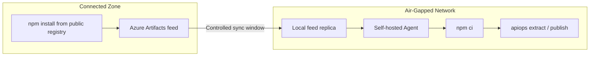

# Air-Gapped Setup: Azure DevOps — Local npm Registry

Deploy APIM configuration using apiops-cli on [self-hosted Azure Pipelines agents](https://learn.microsoft.com/en-us/azure/devops/pipelines/agents/agents?view=azure-devops#self-hosted-agents) with **no internet access** at runtime. This walkthrough uses an Azure Artifacts npm feed as the package source so agents never reach the public npm registry.

> [!NOTE]
> Looking for the alternative that doesn't require a registry? See [Offline Tarball walkthrough](air-gapped-azure-devops-offline-tarball.md).

---

## When to Use This Guide

- Self-hosted agents in a private network with no outbound internet
- You can host (or already have) an Azure Artifacts npm feed reachable from the agent
- Corporate networks that block access to the public npm registry

---

## Architecture Overview



---

## Prerequisites

| Requirement | Details |
|-------------|---------|
| **Connected workstation** | A machine with internet access to seed the feed |
| **Node.js 22.x** | Installed on both the workstation and the agent (includes npm) |
| **[Self-hosted Azure Pipelines agent](https://learn.microsoft.com/en-us/azure/devops/pipelines/agents/agents?view=azure-devops#self-hosted-agents)** | Registered in your agent pool, running in the air-gapped network |
| **Azure connectivity from agent** | The agent must reach your APIM instance's ARM endpoint (network-level, not npm) |
| **Local npm registry** | An [Azure Artifacts npm feed](https://learn.microsoft.com/en-us/azure/devops/artifacts/npm/npmrc?view=azure-devops) accessible from the air-gapped network |

> [!NOTE]
> **On-premises Azure DevOps:** If you run [Azure DevOps Server](https://learn.microsoft.com/en-us/azure/devops/server/install/get-started?view=azure-devops-2022), the same approach applies — Azure Artifacts is included in the server installation.
---

## 1. Configure the Azure Artifacts npm Feed

Set up an Azure Artifacts `npm` feed that serves packages to your air-gapped agents without requiring internet access at install time.

###  Set variable values

If using the command line examples, instead of the Azure DevOps website, the following variables must be set.

```bash
ORG="<org>"
ORG_URL="https://dev.azure.com/${ORG}"

PROJECT="<project>"

FEED="apiops-cli-airgap"
FEED_REGISTRY="https://pkgs.dev.azure.com/${ORG}/${PROJECT}/_packaging/${FEED}/npm/registry/"
```

### 1.1 **[Create a new feed](https://learn.microsoft.com/en-us/azure/devops/artifacts/get-started-npm?view=azure-devops#create-a-feed)** in your Azure DevOps organization.


Authenticate to Azure CLI and configure which devops project you are working with.
```bash
az login

az devops configure --defaults organization="$ORG_URL" project="$PROJECT"
```

Create feed (for example, `apiops-cli-airgap`):
```bash
cat > feed-create.json <<JSON
{
    "name": "${FEED}",
    "description": "Local npm feed for air-gapped agents"
}
JSON

az devops invoke \
    --area packaging \
    --resource feeds \
    --route-parameters project="$PROJECT" \
    --http-method POST \
    --api-version 7.1 \
    --in-file feed-create.json
```

### 1.2 Configure an upstream source

**[Configure an upstream source](https://learn.microsoft.com/en-us/azure/devops/artifacts/how-to/set-up-upstream-sources?view=azure-devops)** pointing to `https://registry.npmjs.org`. The upstream is only used during controlled sync windows; once `@peterhauge/apiops-cli` and its dependencies are cached, the feed serves them locally.

```bash
cat > feed-upstream.json <<'JSON'
{
    "upstreamEnabled": true,
    "upstreamSources": [
        {
            "name": "npmjs",
            "protocol": "npm",
            "location": "https://registry.npmjs.org/",
            "upstreamSourceType": 1
        }
    ]
}
JSON

az devops invoke \
    --area packaging \
    --resource feeds \
    --route-parameters project="$PROJECT" feedId="$FEED" \
    --http-method PATCH \
    --api-version 7.1 \
    --in-file feed-upstream.json
```
### 1.3 Populate the feed

**[Populate the feed](https://learn.microsoft.com/en-us/azure/devops/artifacts/npm/npmrc?view=azure-devops)** from a connected workstation by running `npm install @peterhauge/apiops-cli` against the feed registry URL. This pulls the package and its transitive dependencies into the feed cache.

```bash
npm install @peterhauge/apiops-cli \
    --registry "$FEED_REGISTRY" \
    --//pkgs.dev.azure.com/${ORG}/${PROJECT}/_packaging/${FEED}/npm/registry/:_authToken="$(az account get-access-token --resource https://app.vssps.visualstudio.com --query accessToken -o tsv)"
```

### 1.4 Create a project `.npmrc`

**[Create a project `.npmrc`](https://learn.microsoft.com/en-us/azure/devops/artifacts/npm/npmrc?view=azure-devops)** that points `registry=` at your feed URL and sets `always-auth=true`. Commit this file so pipelines and developers resolve against the local feed.

Create `.npmrc` file

```bash
cat > .npmrc <<EOF
registry=${FEED_REGISTRY}
always-auth=true
EOF
```

> [!TIP] 
> Use the **Connect to feed** button in the Azure Artifacts UI to get the exact registry URL and a ready-to-copy `.npmrc` snippet for your feed.

---

## 2. Add `apiops` related files to repository

### 2.1 Initialize your repository

```bash
apiops init \
    --ci azure-devops \
    --environments dev,prod
```

This generates:

| File | Purpose |
|------|---------|
| `package.json` | Declares the CLI as a dependency |
| `.azdo/pipelines/run-apiops-extractor.yml` | Extract pipeline |
| `.azdo/pipelines/run-apiops-publisher.yml` | Publish pipeline |
| `configuration.*.yaml` | Override templates |

Follow the remaining instructions listed in created `APIOPS-PIPELINE-IDENTITY-SETUP.md` or run `/apiops-setup-pipeline-identity` prompt. This creates the necessary variable groups and service connections.

### 2.2 Generate the Lock File

```bash
npm install
```

This creates `package-lock.json`. Commit it — the lock file is **required** for `npm ci` to work.

### 2.3 Modify Pipelines for Air-Gapped Operation

The generated pipelines (`.azdo/pipelines/run-apiops-extractor.yml` and `.azdo/pipelines/run-apiops-publisher.yml`) need the following edits:

| Edit | What to Change |
|------|----------------|
| 1. **Agent pool** | Update [pool YAML schema](https://learn.microsoft.com/en-us/azure/devops/pipelines/yaml-schema/pool?view=azure-pipelines). Replace `pool: vmImage: ubuntu-latest` with self-hosted agent pool (e.g., `pool: name: air-gapped-pool`).<br>(See next step [Configure the Azure DevOps Self-Hosted Agent](#3-configure-the-azure-devops-self-hosted-agent) for setup details.) |
| 2. **Remove UseNode task** | Delete the `UseNode@1` step (Node.js is pre-installed on the agent). |
| 3. **Add feed auth** | Insert [`npmAuthenticate@0`](https://learn.microsoft.com/en-us/azure/devops/pipelines/tasks/reference/npm-authenticate-v0?view=azure-pipelines) before the `npm ci` step. See necessary. yaml snippet below. |

Add this task before any `npm ci` step in both pipelines:

```yaml
- task: npmAuthenticate@0
    inputs:
        workingFile: .npmrc
```

`npmAuthenticate@0` reads the committed `.npmrc` and injects credentials for the Azure Artifacts feed using the pipeline's built-in build service identity — no service connection needed for feeds in the same organization. The `npm ci` step then works as-is.

> **Azure authentication:** The `AzureCLI@2` task handles Azure authentication separately, via the service connection. The service connection injects tokens for `DefaultAzureCredential`.

### 2.4 Commit `apiops` related files

Commit the files required to run the local-registry workflow on self-hosted agents:

| File Name | Description |
|-----------|-------------|
| `.npmrc` | Points npm to the local Azure Artifacts feed (`registry=...`, `always-auth=true`). |
| `package.json` | Declares the CLI dependency. |
| `package-lock.json` | Required for deterministic installs with `npm ci`. |
| `.azdo/pipelines/run-apiops-extractor.yml` | Azure DevOps extract pipeline definition. |
| `.azdo/pipelines/run-apiops-publisher.yml` | Azure DevOps publish pipeline definition. |
| `configuration.*.yaml` | Generated environment override templates. |

```bash
git add \
    .npmrc \
    package.json \
    package-lock.json \
    .azdo/pipelines/run-apiops-extractor.yml \
    .azdo/pipelines/run-apiops-publisher.yml \
    configuration.*.yaml
git commit -m "chore: commit local-registry apiops bootstrap files"
git push
```

---

## 3. Configure the Azure DevOps Self-Hosted Agent

Install and register the agent in the air-gapped network per the [self-hosted agent documentation](https://learn.microsoft.com/en-us/azure/devops/pipelines/agents/linux-agent?view=azure-devops).

### 3.1 Verify prerequisites

Verify the following:

1. **Node.js 22.x** is installed and on `PATH`
2. **Network access to the Azure Artifacts feed** — the agent can resolve packages from the local feed
3. **Network access to Azure ARM** — the agent must reach `management.azure.com` (or [sovereign cloud equivalent](https://learn.microsoft.com/en-us/azure/developer/identity/national-cloud))
4. **Network access to Azure DevOps** — the agent must reach your Azure DevOps org for job dispatch
5. **Git** is installed (required by the `checkout` step)

> **Agent pool:** Add your air-gapped agents to a [dedicated agent pool](https://learn.microsoft.com/en-us/azure/devops/pipelines/agents/pools-queues?view=azure-devops) (e.g., `air-gapped-pool`) so pipelines target them explicitly.

---

## 4 - Finish `apiops init` for pipeline

If not already done, while on the air-gapped network, follow the remaining instructions listed in created `APIOPS-PIPELINE-IDENTITY-SETUP.md`. This creates the necessary variable groups and service connections.

---

## 5 — Commit and Validate

```bash
git add .
git commit -m "feat: air-gapped apiops setup with local registry"
git push
```

Trigger the extract pipeline manually from **Pipelines → Run pipeline** and verify:

1. `npm ci` resolves all packages from the local Azure Artifacts feed (no calls to npmjs.org)
2. `apiops extract` authenticates via the service connection and runs successfully

**✅ Setup complete.**  The remaining sections cover ongoing maintenance and troubleshooting.

---

## Upgrading the CLI Version

Sync the feed during a connectivity window to pull the new version, then update `package.json` and regenerate `package-lock.json`.

```bash
# Update package.json to the latest CLI version available in the feed
npm install @peterhauge/apiops-cli --registry "$FEED_REGISTRY" --//pkgs.dev.azure.com/${ORG}/${PROJECT}/_packaging/${FEED}/npm/registry/:_authToken="$(az account get-access-token --resource https://app.vssps.visualstudio.com --query accessToken -o tsv)"

# Rebuild lock file from package.json
npm install
```

Commit both files:

```bash
git add package.json package-lock.json
git commit -m "chore: bump apiops-cli version"
git push
```

---

## Troubleshooting

| Problem | Cause | Fix |
|---------|-------|-----|
| `npm ci` fails with `E404` | Package not in local feed | Sync the feed during a connectivity window |
| `npm ci` fails with "lockfile mismatch" | `package-lock.json` out of sync with `package.json` | Re-run `npm install` on connected workstation, commit updated lock file |
| `npx apiops` not found | `npm ci` didn't complete or `.bin` not in PATH | Verify `node_modules/.bin/apiops` exists after install |
| Azure auth fails | Agent can't reach Entra ID or ARM endpoint | Verify network allows traffic to `login.microsoftonline.com` and `management.azure.com` (or sovereign equivalents) |
| `AzureCLI@2` service connection error | Service connection not linked or misconfigured | Verify variable group is linked to pipeline and connection name matches |
| Agent not picking up jobs | Pool name mismatch or agent offline | Confirm pool name in YAML matches the registered agent pool |
| `npmAuthenticate@0` fails | Feed permissions or `.npmrc` path wrong | Ensure the build service identity has Reader access to the feed |

---

## Further Reading

- [apiops init reference](../commands/init.md)
- [Azure DevOps integration](../ci-cd/azure-devops.md) — standard (connected) setup
- [Authentication guide](../guides/authentication.md) — service principal and managed identity options
- [Azure Artifacts npm feeds](https://learn.microsoft.com/en-us/azure/devops/artifacts/npm/npmrc?view=azure-devops) — official feed setup docs
- [Self-hosted agents](https://learn.microsoft.com/en-us/azure/devops/pipelines/agents/agents?view=azure-devops#self-hosted-agents) — agent installation and configuration
- [Azure DevOps Server](https://learn.microsoft.com/en-us/azure/devops/server/install/get-started?view=azure-devops-2022) — on-premises installation
- [National cloud endpoints](https://learn.microsoft.com/en-us/azure/developer/identity/national-cloud) — sovereign cloud identity configuration
- [Entra ID authentication endpoints](https://learn.microsoft.com/en-us/azure/developer/identity/national-cloud#azure-ad-authentication-endpoints) — per-cloud token acquisition endpoints
