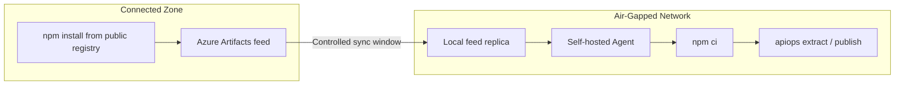

# Air-Gapped Setup: Azure DevOps — Local npm Registry

Deploy APIM configuration using apiops-cli on [self-hosted Azure Pipelines agents](https://learn.microsoft.com/en-us/azure/devops/pipelines/agents/agents?view=azure-devops#self-hosted-agents) with **no internet access** at runtime. This walkthrough uses an Azure Artifacts npm feed as the package source so agents never reach the public npm registry.

> Looking for the alternative that doesn't require a registry? See [Offline Tarball walkthrough](air-gapped-azure-devops-offline-tarball.md).

---

## When to Use This Guide

- Self-hosted agents in a private network with no outbound internet
- You can host (or already have) an Azure Artifacts npm feed reachable from the agent
- Corporate networks that block access to the public npm registry

---

## Architecture Overview



---

## Prerequisites

| Requirement | Details |
|-------------|---------|
| **Connected workstation** | A machine with internet access to seed the feed |
| **Node.js 22.x** | Installed on both the workstation and the agent (includes npm) |
| **[Self-hosted Azure Pipelines agent](https://learn.microsoft.com/en-us/azure/devops/pipelines/agents/agents?view=azure-devops#self-hosted-agents)** | Registered in your agent pool, running in the air-gapped network |
| **Azure connectivity from agent** | The agent must reach your APIM instance's ARM endpoint (network-level, not npm) |
| **Local npm registry** | An [Azure Artifacts npm feed](https://learn.microsoft.com/en-us/azure/devops/artifacts/npm/npmrc?view=azure-devops) accessible from the air-gapped network |

> **On-premises Azure DevOps:** If you run [Azure DevOps Server](https://learn.microsoft.com/en-us/azure/devops/server/install/get-started?view=azure-devops-2022) (formerly TFS), the same approach applies — Azure Artifacts is included in the server installation.

---

## Step 1 — Configure the Azure Artifacts npm Feed

Set up an Azure Artifacts npm feed that serves packages to your air-gapped agents without requiring internet access at install time.

1. **[Create a new feed](https://learn.microsoft.com/en-us/azure/devops/artifacts/get-started-npm?view=azure-devops#create-a-feed)** in your Azure DevOps organization.
2. **[Configure an upstream source](https://learn.microsoft.com/en-us/azure/devops/artifacts/how-to/set-up-upstream-sources?view=azure-devops)** pointing to `https://registry.npmjs.org`. The upstream is only used during controlled sync windows; once `@peterhauge/apiops-cli` and its dependencies are cached, the feed serves them locally.
3. **[Populate the feed](https://learn.microsoft.com/en-us/azure/devops/artifacts/npm/npmrc?view=azure-devops)** from a connected workstation by running `npm install @peterhauge/apiops-cli` against the feed registry URL. This pulls the package and its transitive dependencies into the feed cache.
4. **[Add a project `.npmrc`](https://learn.microsoft.com/en-us/azure/devops/artifacts/npm/npmrc?view=azure-devops)** that points `registry=` at your feed URL and sets `always-auth=true`. Commit this file so pipelines and developers resolve against the local feed.

> **Tip:** Use the **Connect to feed** button in the Azure Artifacts UI to get the exact registry URL and a ready-to-copy `.npmrc` snippet for your feed.

---

## Step 2 — Initialize the Repository

```bash
apiops init \
  --ci azure-devops \
  --environments dev,prod \
  --non-interactive
```

This generates:

| File | Purpose |
|------|---------|
| `package.json` | Declares the CLI as a dependency |
| `pipelines/run-extractor.yaml` | Extract pipeline |
| `pipelines/run-publisher.yaml` | Publish pipeline |
| `configuration.*.yaml` | Override templates |

---

## Step 3 — Generate the Lock File

```bash
npm install
```

This creates `package-lock.json`. Commit it — the lock file is **required** for `npm ci` to work.

---

## Step 4 — Configure the Self-Hosted Agent

Install and register the agent in the air-gapped network per the [self-hosted agent documentation](https://learn.microsoft.com/en-us/azure/devops/pipelines/agents/linux-agent?view=azure-devops):

Ensure:

1. **Node.js 22.x** is installed and on `PATH`
2. **Network access to the Azure Artifacts feed** — the agent can resolve packages from the local feed
3. **Network access to Azure ARM** — the agent must reach `management.azure.com` (or [sovereign cloud equivalent](https://learn.microsoft.com/en-us/azure/developer/identity/national-cloud))
4. **Network access to Azure DevOps** — the agent must reach your Azure DevOps org for job dispatch
5. **Git** is installed (required by the `checkout` step)

> **Agent pool:** Add your air-gapped agents to a [dedicated agent pool](https://learn.microsoft.com/en-us/azure/devops/pipelines/agents/pools-queues?view=azure-devops) (e.g., `air-gapped-pool`) so pipelines target them explicitly.

---

## Step 5 — Modify Pipelines for Air-Gapped Operation

The generated pipelines (`pipelines/run-extractor.yaml` and `pipelines/run-publisher.yaml`) need minimal edits:

| Edit | What to Change |
|------|----------------|
| **Agent pool** | Replace `pool: vmImage: ubuntu-latest` with `pool: name: air-gapped-pool` ([pool YAML schema](https://learn.microsoft.com/en-us/azure/devops/pipelines/yaml-schema/pool?view=azure-pipelines)) |
| **Remove NodeTool task** | Delete the `NodeTool@0` step (Node.js is pre-installed on the agent) |
| **Add feed auth** | Insert [`npmAuthenticate@0`](https://learn.microsoft.com/en-us/azure/devops/pipelines/tasks/reference/npm-authenticate-v0?view=azure-pipelines) before the `npm ci` step (see below) |

### Feed Authentication

Add this task before any `npm ci` step in both pipelines:

```yaml
- task: npmAuthenticate@0
  inputs:
    workingFile: .npmrc
```

`npmAuthenticate@0` reads the committed `.npmrc` and injects credentials for the Azure Artifacts feed using the pipeline's built-in build service identity — no service connection needed for feeds in the same organization. The `npm ci` step then works as-is.

> **Azure authentication:** The `AzureCLI@2` task handles Azure authentication separately, via the service connection. The service connection injects tokens for `DefaultAzureCredential`.

---

## Step 6 — Configure Variable Groups and Service Connections

Follow the standard [Azure DevOps integration guide](../ci-cd/azure-devops.md#variable-groups-configuration) to set up:

1. **Variable group `apim-common`** — variables shared across all environments (e.g., subscription ID, tenant ID, common tags)
2. **Variable groups `apim-dev`, `apim-prod`** — environment-specific variables (e.g., APIM instance name, resource group) that override values from `apim-common`
3. **Service connections** — Azure Resource Manager connections scoped to your APIM instances; they can be referenced from either variable group

These are configured in Azure DevOps and are injected at pipeline runtime.

---

## Step 7 — Commit and Validate

```bash
git add .
git commit -m "feat: air-gapped apiops setup with local registry"
git push
```

Trigger the extract pipeline manually from **Pipelines → Run pipeline** and verify:

1. `npm ci` resolves all packages from the local Azure Artifacts feed (no calls to npmjs.org)
2. `apiops extract` authenticates via the service connection and runs successfully

> **✅ Setup complete.** Your air-gapped apiops pipelines are now operational. The remaining sections cover ongoing maintenance and reference material — read them as needed.

---

## Upgrading the CLI Version

Sync the feed during a connectivity window to pull the new version, then update `package.json` and regenerate `package-lock.json`. Commit both.

---

## Troubleshooting

| Problem | Cause | Fix |
|---------|-------|-----|
| `npm ci` fails with `E404` | Package not in local feed | Sync the feed during a connectivity window |
| `npm ci` fails with "lockfile mismatch" | `package-lock.json` out of sync with `package.json` | Re-run `npm install` on connected workstation, commit updated lock file |
| `npx apiops` not found | `npm ci` didn't complete or `.bin` not in PATH | Verify `node_modules/.bin/apiops` exists after install |
| Azure auth fails | Agent can't reach Entra ID or ARM endpoint | Verify network allows traffic to `login.microsoftonline.com` and `management.azure.com` (or sovereign equivalents) |
| `AzureCLI@2` service connection error | Service connection not linked or misconfigured | Verify variable group is linked to pipeline and connection name matches |
| Agent not picking up jobs | Pool name mismatch or agent offline | Confirm pool name in YAML matches the registered agent pool |
| `npmAuthenticate@0` fails | Feed permissions or `.npmrc` path wrong | Ensure the build service identity has Reader access to the feed |

---

## Further Reading

- [Offline Tarball walkthrough](air-gapped-azure-devops-offline-tarball.md) — alternative for environments without a registry
- [apiops init reference](../commands/init.md)
- [Azure DevOps integration](../ci-cd/azure-devops.md) — standard (connected) setup
- [Authentication guide](../guides/authentication.md) — service principal and managed identity options
- [Azure Artifacts npm feeds](https://learn.microsoft.com/en-us/azure/devops/artifacts/npm/npmrc?view=azure-devops) — official feed setup docs
- [Self-hosted agents](https://learn.microsoft.com/en-us/azure/devops/pipelines/agents/agents?view=azure-devops#self-hosted-agents) — agent installation and configuration
- [Azure DevOps Server](https://learn.microsoft.com/en-us/azure/devops/server/install/get-started?view=azure-devops-2022) — on-premises installation
- [National cloud endpoints](https://learn.microsoft.com/en-us/azure/developer/identity/national-cloud) — sovereign cloud identity configuration
- [Entra ID authentication endpoints](https://learn.microsoft.com/en-us/azure/developer/identity/national-cloud#azure-ad-authentication-endpoints) — per-cloud token acquisition endpoints
