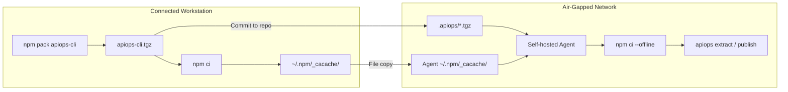

# Air-Gapped Setup: Azure DevOps — Offline Tarball

Deploy APIM configuration using apiops-cli on [self-hosted Azure Pipelines agents](https://learn.microsoft.com/en-us/azure/devops/pipelines/agents/agents?view=azure-devops#self-hosted-agents) with **no internet access** and **no internal npm registry**. The CLI is packaged as a `.tgz` and the npm cache is pre-staged on the agent so `npm ci --offline` resolves every dependency from disk.

> [!NOTE]
> If you can host an internal npm feed instead, prefer the [Local npm Registry walkthrough](air-gapped-azure-devops-local-registry.md) — it requires far less manual artifact transfer.

---

## When to Use This Guide

- Self-hosted agents in a private network with no outbound internet
- No Azure Artifacts feed (or any other internal npm registry) reachable from the agent
- You accept the operational cost of re-transferring the tarball and npm cache whenever dependencies change

---

## Architecture Overview



---

## Prerequisites

| Requirement | Details |
|-------------|---------|
| **Connected workstation** | A machine with internet access to download the CLI and its dependencies |
| **[Self-hosted Azure Pipelines agent](https://learn.microsoft.com/en-us/azure/devops/pipelines/agents/agents?view=azure-devops#self-hosted-agents)** | Registered in your agent pool, running in the air-gapped network |
| **Node.js 22.x** | Installed on both the workstation and the Azure Pipelines agent (includes npm). Download of Node.js available at <https://nodejs.org/download>. |
| **Azure connectivity from agent** | The agent must reach your APIM instance's ARM endpoint (network-level only) |
| **File transfer mechanism** | A way to copy the npm cache directory into the air-gapped network |

---

### 1. Pack the CLI

On the connected workstation:

```bash
npm pack @peterhauge/apiops-cli
```

This produces `peterhauge-apiops-cli-<version>.tgz` in the current directory.

---

## 2.  Add `apiops` related files to repository

### 2.1 Initialize your repository

Pass `--cli-package` so the generated `package.json` references the local tarball instead of the public registry:

```bash
apiops init \
  --ci azure-devops \
  --environments dev,prod \
  --cli-package <path-to-tarball>/peterhauge-apiops-cli-<version>.tgz 
```

This command generates:

| File | Purpose |
|------|---------|
| `package.json` | Declares the CLI as a `file:` dependency pointing at the tarball |
| `pipelines/run-extractor.yaml` | Extract pipeline |
| `pipelines/run-publisher.yaml` | Publish pipeline |
| `configuration.*.yaml` | Override templates |

Follow the remaining instructions listed in created `IDENTITY-SETUP-AZDO.md` or run `/apiops-setup-identity` prompt. This creates the necessary variable groups and and service connections.

### 2.2 Generate the Lock File and Pre-Stage the npm Cache

On the **connected workstation**, run:

```bash
npm install   # creates package-lock.json
npm ci        # populates ~/.npm/_cacache/ with every package the lock file references
```

> The command `npm ci --offline` requires a package lock file.

### 2.3 Modify Pipelines for Air-Gapped Operation

The generated pipelines (`pipelines/run-extractor.yaml` and `pipelines/run-publisher.yaml`) need the following edits:

| Edit | What to Change |
|------|----------------|
| 1. **Agent pool** | Update [pool YAML schema](https://learn.microsoft.com/en-us/azure/devops/pipelines/yaml-schema/pool?view=azure-pipelines). Replace `pool: vmImage: ubuntu-latest` with self-hosted agent pool (e.g. `pool: name: air-gapped-pool`). <br>  (See next step [Configure the Azure DevOps Self-Hosted Agent](#3-configure-the-azure-devops-self-hosted-agent) for setup details.) |
| 2. **Remove UseNode task** | Delete the `UseNode@1` step (Node.js is pre-installed on the agent).<br> No `npmAuthenticate@0` task is needed for offline mode. |
| 3. **Use offline `npm ci`** | Change `npm ci` to `npm ci --offline`. |

### 2.4 Commit `apiops` related files

For the offline-tarball workflow, commit the files that make the pipeline fully reproducible without npm registry access:

| File Name | Description |
|-----------|-------------|
| `.apiops/peterhauge-apiops-cli-<version>.tgz` | CLI package consumed by the pipelines. |
| `package.json` | Contains the `file:` dependency pointing to the tarball. |
| `package-lock.json` | Required for deterministic offline installs with `npm ci --offline`. |
| `pipelines/run-extractor.yaml` | Azure DevOps extract pipeline definition. |
| `pipelines/run-publisher.yaml` | Azure DevOps publish pipeline definition. |
| `configuration.*.yaml` | Generated environment override templates. |

```bash
git add \
    .apiops/peterhauge-apiops-cli-*.tgz \
    package.json \
    package-lock.json \
    pipelines/run-extractor.yaml \
    pipelines/run-publisher.yaml \
    configuration.*.yaml
git commit -m "chore: commit offline-tarball apiops bootstrap files"
git push
```
---

## 3. Configure the Azure DevOps Self-Hosted Agent

Install and register the agent in the air-gapped network per the [self-hosted agent documentation](https://learn.microsoft.com/en-us/azure/devops/pipelines/agents/linux-agent?view=azure-devops).

### 3.1 Verify rerequisites

Verify the following:

1. **Node.js 22.x** is installed and on `PATH`
3. **Network access to Azure ARM** — the agent must reach `management.azure.com` (or [sovereign cloud equivalent](https://learn.microsoft.com/en-us/azure/developer/identity/national-cloud))
4. **Network access to Azure DevOps** — the agent must reach your Azure DevOps org for job dispatch
5. **Git** is installed (required by the `checkout` step)

> **Agent pool:** Add your air-gapped agents to a [dedicated agent pool](https://learn.microsoft.com/en-us/azure/devops/pipelines/agents/pools-queues?view=azure-devops) (e.g., `air-gapped-pool`) so pipelines target them explicitly.


### 3.2 Transfer npm cache files for offline use

The command `npm ci --offline` requires package-lock.json and npm cache to be pre-populated.

Then transfer the npm cache to the agent:

```bash
# On the workstation
tar -czf npm-cacache.tar.gz -C ~/.npm _cacache

# Transfer npm-cacache.tar.gz into the air-gapped network, then on the agent:
mkdir -p ~/.npm
tar -xzf npm-cacache.tar.gz -C ~/.npm
```

## 4 - Finish `apiops init` for pipeline

If not already done, while on the air-gapped network, follow the remaining instructions listed in created `IDENTITY-SETUP-AZDO.md`. This creates the necessary variable groups and and service connections.

## 5 — Commit and Validate

Trigger the extract pipeline manually from **Pipelines → Run pipeline** and verify:

1. `npm ci --offline` completes with no network calls
2. `apiops extract` authenticates via the service connection and runs successfully

**✅ Setup complete.**  The remaining sections cover ongoing maintenance and troubleshooting.

---

## Upgrading the CLI Version

1. On a connected workstation, run `npm pack @peterhauge/apiops-cli` for the new version
2. Replace `.apiops/peterhauge-apiops-cli-*.tgz` with the new tarball and update the `file:` path in `package.json`
3. Regenerate `package-lock.json` 
    ```bash
    npm install
    ```
4. Re-populate and re-transfer the npm cache (`npm ci` on the workstation, then copy `~/.npm/_cacache/`)
    ```bash
    # On the workstation
    tar -czf npm-cacache.tar.gz -C ~/.npm _cacache

    # Transfer npm-cacache.tar.gz into the air-gapped network, then on the agent:
    mkdir -p ~/.npm
    tar -xzf npm-cacache.tar.gz -C ~/.npm
    ```
5. Commit the tarball and updated lock file
    ```bash
    git add \
        .apiops/peterhauge-apiops-cli-*.tgz \
        package.json \
        package-lock.json \
    git commit -m "chore: commit updated offline-tarball apiops bootstrap files"
    git push
    ```

---

## Troubleshooting

| Problem | Cause | Fix |
|---------|-------|-----|
| `npm ci` fails with `ENOTCACHED` | npm cache missing one or more packages | Re-run `npm ci` on the connected workstation and re-transfer `~/.npm/_cacache/` |
| `npm ci` fails with "lockfile mismatch" | `package-lock.json` out of sync with `package.json` | Re-run `npm install` on connected workstation, commit updated lock file, refresh cache |
| `npm install` complains about missing tarball | Path in `package.json` doesn't match the file on disk | Verify the `file:` reference matches the committed `.tgz` filename exactly |
| `npx apiops` not found | `npm ci --offline` didn't complete or `.bin` not in PATH | Verify `node_modules/.bin/apiops` exists after install |
| Azure auth fails | Agent can't reach Entra ID or ARM endpoint | Verify network allows traffic to `login.microsoftonline.com` and `management.azure.com` (or sovereign equivalents) |
| `AzureCLI@2` service connection error | Service connection not linked or misconfigured | Verify variable group is linked to pipeline and connection name matches |
| Agent not picking up jobs | Pool name mismatch or agent offline | Confirm pool name in YAML matches the registered agent pool |

---

## Further Reading

- [Local npm Registry walkthrough](air-gapped-azure-devops-local-registry.md) — recommended when an internal feed is available
- [apiops init reference](../commands/init.md) — full `--cli-package` documentation
- [Self-hosted agents](https://learn.microsoft.com/en-us/azure/devops/pipelines/agents/agents?view=azure-devops#self-hosted-agents) — agent installation and configuration
- [Azure DevOps Server](https://learn.microsoft.com/en-us/azure/devops/server/install/get-started?view=azure-devops-2022) — on-premises installation
- [National cloud endpoints](https://learn.microsoft.com/en-us/azure/developer/identity/national-cloud) — sovereign cloud identity configuration
- [Entra ID authentication endpoints](https://learn.microsoft.com/en-us/azure/developer/identity/national-cloud#azure-ad-authentication-endpoints) — per-cloud token acquisition endpoints
