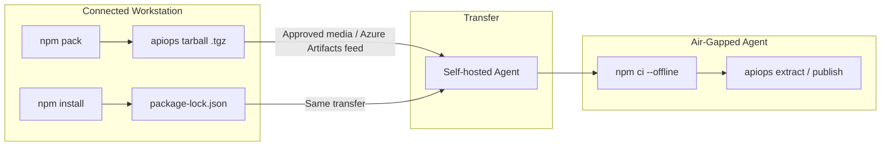

# Air-Gapped Setup: Azure DevOps

Deploy APIM configuration using apiops-cli on Azure DevOps agents with **no internet access** at runtime. This walkthrough covers preparing the npm tarball, lock file, and self-hosted agent configuration so that `npm ci` succeeds entirely offline.

---

## When to Use This Guide

- Self-hosted agents in a private network with no outbound internet
- Environments requiring artifact pre-staging for security compliance
- Corporate networks that block access to the npm registry

---

## Architecture Overview



---

## Prerequisites

| Requirement | Details |
|-------------|---------|
| **Connected workstation** | A machine with internet access to download packages |
| **Node.js 22.x** | Installed on both the workstation and the agent |
| **npm 10+** | Comes with Node.js 22 |
| **Self-hosted Azure Pipelines agent** | Registered in your agent pool, running in the air-gapped network |
| **Azure connectivity from agent** | The agent must reach your APIM instance's ARM endpoint (network-level, not npm) |
| **Transfer mechanism** | USB drive, Azure Artifacts upstream feed, or approved file share for moving packages into the restricted zone |

---

## Step 1 — Prepare the Tarball (Connected Workstation)

On a machine with internet access:

```bash
# Install the CLI globally to get access to the apiops command
npm install -g @peterhauge/apiops-cli

# Pack the installed package into a tarball
npm pack @peterhauge/apiops-cli
# Produces: peterhauge-apiops-cli-<version>.tgz
```

Keep the `.tgz` file — you'll transfer it to the air-gapped environment.

---

## Step 2 — Scaffold the Repository

Run `apiops init` with the `--cli-package` flag pointing to the tarball:

```bash
apiops init \
  --ci azure-devops \
  --cli-package ./peterhauge-apiops-cli-0.1.5-alpha.1.tgz \
  --environments dev,prod \
  --non-interactive
```

This generates:

| File | Purpose |
|------|---------|
| `package.json` | References the tarball as `"file:.apiops/peterhauge-apiops-cli-0.1.5-alpha.1.tgz"` |
| `.apiops/peterhauge-apiops-cli-0.1.5-alpha.1.tgz` | Local copy of the CLI package |
| `pipelines/run-extractor.yaml` | Extract pipeline |
| `pipelines/run-publisher.yaml` | Publish pipeline |
| `configuration.*.yaml` | Override templates |

---

## Step 3 — Generate the Lock File

The lock file pins every transitive dependency so `npm ci` can resolve them offline:

```bash
# In the scaffolded repo directory
npm install
```

This creates `package-lock.json`. Commit it — the lock file is **required** for `npm ci` to work.

---

## Step 4 — Cache Dependencies for Offline Install

`npm ci --offline` requires a populated npm cache. On your connected workstation, populate the cache:

```bash
# Clean the npm cache to start fresh (optional but recommended)
npm cache clean --force

# Install to populate the cache with all resolved packages
npm ci

# Locate the cache directory
npm config get cache
# Default: ~/.npm
```

Copy the entire npm cache directory (or the `_cacache` subfolder) to your transfer media.

> **Alternative — Azure Artifacts upstream feed:** If your air-gapped network has an Azure Artifacts feed with an upstream source configured (accessible during a controlled sync window), you can use it as a local npm registry instead of transferring the cache manually. Configure `.npmrc` to point to the feed.

> **Alternative — vendored `node_modules`:** If your transfer policy allows it, you can commit or transfer the entire `node_modules` directory. In that case, skip `npm ci` in the pipeline and run `npx apiops` directly.

---

## Step 5 — Transfer Artifacts to the Air-Gapped Zone

Move these items through your approved transfer channel:

| Artifact | Destination on Agent |
|----------|-----------------------|
| Repository clone (with `.apiops/` tarball, `package.json`, `package-lock.json`) | Agent's working directory (handled by `checkout`) |
| npm cache (`_cacache/`) | `~/.npm/_cacache/` on the agent (or `%AppData%\npm-cache\_cacache\` on Windows) |

If using Azure Artifacts, sync the feed during an approved window instead.

---

## Step 6 — Configure the Self-Hosted Agent

Install and register the agent in the air-gapped network:

```bash
# On the agent machine (Linux example)
mkdir myagent && cd myagent
# Transfer the agent package via approved media
tar xzf vsts-agent-linux-x64-*.tar.gz
./config.sh --url https://dev.azure.com/<org> --auth pat --token <PAT>
./svc.sh install && ./svc.sh start
```

Ensure:

1. **Node.js 22.x** is installed and on `PATH`
2. **npm cache is pre-populated** at `~/.npm` (from Step 4)
3. **Network access to Azure ARM** — the agent must reach `management.azure.com` (or sovereign equivalent)
4. **Network access to Azure DevOps** — the agent must reach your Azure DevOps org for job dispatch (or use GHES-style on-prem server)
5. **Git** is installed (required by the `checkout` step)

> **Agent pool:** Add your air-gapped agents to a dedicated agent pool (e.g., `air-gapped-pool`) so pipelines target them explicitly.

---

## Step 7 — Modify Pipelines for Offline Operation

Edit the generated pipelines to use offline npm and target your self-hosted agent pool.

### `pipelines/run-extractor.yaml`

```yaml
pool:
  name: 'air-gapped-pool'  # ← your self-hosted pool

steps:
  - checkout: self

  # Skip NodeTool@0 — Node.js is pre-installed on the agent

  - script: npm ci --offline
    displayName: 'Install dependencies (offline)'

  - task: AzureCLI@2
    displayName: 'Run APIM Extract'
    inputs:
      azureSubscription: '$(AZURE_SERVICE_CONNECTION)'
      scriptType: 'bash'
      scriptLocation: 'inlineScript'
      inlineScript: |
        npx apiops extract \
          --resource-group $(APIM_RESOURCE_GROUP) \
          --service-name $(APIM_SERVICE_NAME) \
          --subscription-id $(AZURE_SUBSCRIPTION_ID) \
          --output ./apim-artifacts
```

### `pipelines/run-publisher.yaml`

```yaml
pool:
  name: 'air-gapped-pool'

stages:
  - stage: Publish_dev
    variables:
      - group: apim-dev
    jobs:
      - deployment: Deploy
        environment: dev
        strategy:
          runOnce:
            deploy:
              steps:
                - checkout: self
                  fetchDepth: 2

                - script: npm ci --offline
                  displayName: 'Install dependencies (offline)'

                - task: AzureCLI@2
                  displayName: 'Publish to dev (incremental)'
                  inputs:
                    azureSubscription: '$(AZURE_SERVICE_CONNECTION_DEV)'
                    scriptType: 'bash'
                    scriptLocation: 'inlineScript'
                    inlineScript: |
                      npx apiops publish \
                        --resource-group $(APIM_RESOURCE_GROUP_DEV) \
                        --service-name $(APIM_SERVICE_NAME_DEV) \
                        --subscription-id $(AZURE_SUBSCRIPTION_ID) \
                        --source ./apim-artifacts \
                        --override configuration.dev.yaml \
                        --commit-id $(Build.SourceVersion)
```

> **Authentication:** The `AzureCLI@2` task handles Azure authentication via the service connection. No additional credential configuration is needed in the pipeline — the service connection injects tokens into the shell environment for `DefaultAzureCredential`.

---

## Step 8 — Configure Variable Groups and Service Connections

Follow the standard [Azure DevOps integration guide](../ci-cd/azure-devops.md#variable-groups-configuration) to set up:

1. **Variable group `apim-common`** — for the extract pipeline
2. **Variable groups `apim-dev`, `apim-prod`** — for the publish pipeline
3. **Service connections** — Azure Resource Manager connections scoped to your APIM instances

These are configured in Azure DevOps (not in the air-gapped agent) and are injected at pipeline runtime.

---

## Step 9 — Commit and Validate

```bash
git add .
git commit -m "feat: air-gapped apiops setup with local tarball"
git push
```

Trigger the extract pipeline manually from **Pipelines → Run pipeline** and verify:

1. `npm ci --offline` completes without network calls to npmjs.org
2. `apiops extract` authenticates via the service connection and runs successfully

---

## Using Azure Artifacts as a Local Registry

If your organization has an Azure Artifacts feed accessible from the air-gapped network (even via a controlled sync window), you can avoid manual cache transfers:

### Setup

1. Create an Azure Artifacts npm feed in your Azure DevOps project
2. Configure an upstream source to npmjs.org (used during sync windows only)
3. During a sync window, install all packages to populate the feed
4. After the sync window closes, the feed serves packages locally

### `.npmrc` Configuration

Create a `.npmrc` file in the repository root:

```ini
registry=https://pkgs.dev.azure.com/<org>/<project>/_packaging/<feed>/npm/registry/
always-auth=true
```

### Pipeline Authentication

Add the `npmAuthenticate@0` task before `npm ci`:

```yaml
- task: npmAuthenticate@0
  inputs:
    workingFile: .npmrc

- script: npm ci
  displayName: 'Install from Azure Artifacts feed'
```

This approach eliminates the need for `--offline` and manual cache management.

---

## Upgrading the CLI Version

When a new version is released:

1. On the connected workstation: `npm pack @peterhauge/apiops-cli` (new version)
2. Replace `.apiops/*.tgz` in the repository
3. Update `package.json` to reference the new tarball filename
4. Run `npm install` to regenerate `package-lock.json`
5. Rebuild the npm cache (`npm ci`) and transfer the updated cache (or sync your Azure Artifacts feed)
6. Commit and push

---

## Troubleshooting

| Problem | Cause | Fix |
|---------|-------|-----|
| `npm ci` fails with `ENOTCACHED` | npm cache doesn't contain required packages | Re-populate cache on connected workstation and transfer |
| `npm ci` fails with "lockfile mismatch" | `package-lock.json` out of sync with `package.json` | Re-run `npm install` on connected workstation, commit updated lock file |
| `npx apiops` not found | `npm ci` didn't complete or `.bin` not in PATH | Verify `node_modules/.bin/apiops` exists after install |
| Azure auth fails | Agent can't reach Entra ID or ARM endpoint | Verify network allows traffic to `login.microsoftonline.com` and `management.azure.com` |
| `AzureCLI@2` service connection error | Service connection not linked or misconfigured | Verify variable group is linked to pipeline and connection name matches |
| Agent not picking up jobs | Pool name mismatch or agent offline | Confirm pool name in YAML matches the registered agent pool |
| `npmAuthenticate@0` fails | Feed permissions or `.npmrc` path wrong | Ensure the build service identity has Reader access to the feed |

---

## Related

- [apiops init reference](../commands/init.md) — all `--cli-package` details
- [Azure DevOps integration](../ci-cd/azure-devops.md) — standard (connected) setup
- [Authentication guide](../guides/authentication.md) — service principal and managed identity options
- [Air-gapped setup: GitHub Actions](air-gapped-github-actions.md)
