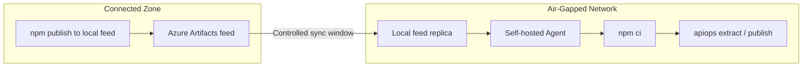

# Air-Gapped Setup: Azure DevOps

Deploy APIM configuration using apiops-cli on [self-hosted Azure Pipelines agents](https://learn.microsoft.com/en-us/azure/devops/pipelines/agents/agents?view=azure-devops#self-hosted-agents) with **no internet access** at runtime. This walkthrough uses a local npm registry (Azure Artifacts) as the primary package source, with a tarball-based fallback for environments without any registry infrastructure.

---

## When to Use This Guide

- Self-hosted agents in a private network with no outbound internet
- Environments requiring artifact pre-staging for security compliance
- Corporate networks that block access to the public npm registry

---

## Architecture Overview



---

## Prerequisites

| Requirement | Details |
|-------------|---------|
| **Connected workstation** | A machine with internet access to download packages |
| **Node.js 22.x** | Installed on both the workstation and the agent (includes npm) |
| **[Self-hosted Azure Pipelines agent](https://learn.microsoft.com/en-us/azure/devops/pipelines/agents/agents?view=azure-devops#self-hosted-agents)** | Registered in your agent pool, running in the air-gapped network |
| **Azure connectivity from agent** | The agent must reach your APIM instance's ARM endpoint (network-level, not npm) |
| **Local npm registry** | An [Azure Artifacts npm feed](https://learn.microsoft.com/en-us/azure/devops/artifacts/npm/npmrc?view=azure-devops) accessible from the air-gapped network |

> **On-premises Azure DevOps:** If you run [Azure DevOps Server](https://learn.microsoft.com/en-us/azure/devops/server/install/get-started?view=azure-devops-2022) (formerly TFS), the same approach applies — Azure Artifacts is included in the server installation.

---

## Step 1 — Configure the Local npm Registry

Set up an [Azure Artifacts npm feed](https://learn.microsoft.com/en-us/azure/devops/artifacts/npm/npmrc?view=azure-devops) that serves packages to your air-gapped agents without requiring internet access at install time.

### Create the Feed

1. In Azure DevOps, go to **Artifacts → Create Feed**
2. Name it (e.g., `npm-internal`) and set visibility to your project or organization
3. Add an **upstream source** pointing to `https://registry.npmjs.org` (used only during controlled sync windows)

### Populate During a Sync Window

On the connected workstation (or during a controlled connectivity window):

```bash
# Point npm at your Azure Artifacts feed
npm config set registry https://pkgs.dev.azure.com/<org>/<project>/_packaging/<feed>/npm/registry/

# Install the CLI — this caches the package and all dependencies in the feed
npm install @peterhauge/apiops-cli
```

Once the feed has cached the package, close the upstream connection. The feed now serves packages locally.

### Repository `.npmrc`

Create a `.npmrc` file in the repository root so all `npm` commands resolve against the local feed:

```ini
registry=https://pkgs.dev.azure.com/<org>/<project>/_packaging/<feed>/npm/registry/
always-auth=true
```

> See [Azure Artifacts npm feed documentation](https://learn.microsoft.com/en-us/azure/devops/artifacts/npm/npmrc?view=azure-devops) for detailed setup instructions including scoped registries and authentication.

---

## Step 2 — Initialize the Repository

```bash
apiops init \
  --ci azure-devops \
  --environments dev,prod \
  --non-interactive
```

This generates:

| File | Purpose |
|------|---------|
| `package.json` | Declares the CLI as a dependency |
| `pipelines/run-extractor.yaml` | Extract pipeline |
| `pipelines/run-publisher.yaml` | Publish pipeline |
| `configuration.*.yaml` | Override templates |

---

## Step 3 — Generate the Lock File

```bash
npm install
```

This creates `package-lock.json`. Commit it — the lock file is **required** for `npm ci` to work.

---

## Step 4 — Configure the Self-Hosted Agent

Install and register the agent in the air-gapped network per the [self-hosted agent documentation](https://learn.microsoft.com/en-us/azure/devops/pipelines/agents/linux-agent?view=azure-devops):

Ensure:

1. **Node.js 22.x** is installed and on `PATH`
2. **Network access to the Azure Artifacts feed** — the agent can resolve packages from the local feed
3. **Network access to Azure ARM** — the agent must reach `management.azure.com` (or [sovereign cloud equivalent](https://learn.microsoft.com/en-us/azure/developer/identity/national-cloud))
4. **Network access to Azure DevOps** — the agent must reach your Azure DevOps org for job dispatch
5. **Git** is installed (required by the `checkout` step)

> **Agent pool:** Add your air-gapped agents to a dedicated pool (e.g., `air-gapped-pool`) so pipelines target them explicitly.

---

## Step 5 — Modify Pipelines for Air-Gapped Operation

The generated pipelines (`pipelines/run-extractor.yaml` and `pipelines/run-publisher.yaml`) need minimal edits for air-gapped operation:

| Edit | What to Change |
|------|----------------|
| **Agent pool** | Replace `pool: vmImage: ubuntu-latest` with `pool: name: air-gapped-pool` |
| **Remove NodeTool task** | Delete the `NodeTool@0` step (Node.js is pre-installed on the agent) |
| **Add feed auth** | Insert `npmAuthenticate@0` before the `npm ci` step |

### Feed Authentication

Add this task before any `npm ci` step in both pipelines:

```yaml
- task: npmAuthenticate@0
  inputs:
    workingFile: .npmrc
```

The `npm ci` step in the generated pipelines works as-is — it resolves packages from the local feed configured in `.npmrc`.

> **Authentication:** The `AzureCLI@2` task handles Azure authentication via the service connection. The service connection injects tokens for `DefaultAzureCredential`.

---

## Step 6 — Configure Variable Groups and Service Connections

Follow the standard [Azure DevOps integration guide](../ci-cd/azure-devops.md#variable-groups-configuration) to set up:

1. **Variable group `apim-common`** — for the extract pipeline
2. **Variable groups `apim-dev`, `apim-prod`** — for the publish pipeline
3. **Service connections** — Azure Resource Manager connections scoped to your APIM instances

These are configured in Azure DevOps and are injected at pipeline runtime.

---

## Step 7 — Commit and Validate

```bash
git add .
git commit -m "feat: air-gapped apiops setup with local registry"
git push
```

Trigger the extract pipeline manually from **Pipelines → Run pipeline** and verify:

1. `npm ci` resolves all packages from the local Azure Artifacts feed (no calls to npmjs.org)
2. `apiops extract` authenticates via the service connection and runs successfully

---

## Fallback: Tarball with Offline Cache

If your environment has no local registry infrastructure, you can use a tarball-based approach instead. This replaces Steps 1–3 above:

1. **Pack the CLI** on a connected workstation: `npm pack @peterhauge/apiops-cli`
2. **Initialize with `--cli-package`** (instead of the standard init shown in Step 2):
   `apiops init --ci azure-devops --cli-package ./peterhauge-apiops-cli-<version>.tgz`
3. **Generate the lock file**: `npm install`
4. **Populate the npm cache**: Run `npm ci` on the connected workstation, then copy `~/.npm/_cacache/` to the agent
5. **Use `npm ci --offline`** in the pipeline instead of `npm ci` (no `npmAuthenticate@0` needed)

This approach requires manual cache transfers whenever dependencies change. Use the local registry method above when possible.

---

## Upgrading the CLI Version

**With local registry:** Sync the feed during a connectivity window to pull the new version, then update `package.json` and regenerate `package-lock.json`.

**With tarball fallback:** Pack the new version, replace `.apiops/*.tgz`, update `package.json`, regenerate the lock file, rebuild the cache, and transfer.

---

## Sovereign Clouds and On-Premises

| Scenario | Documentation |
|----------|---------------|
| Azure Government, Azure China, other sovereign clouds | [National cloud identity endpoints](https://learn.microsoft.com/en-us/azure/developer/identity/national-cloud) |
| Azure DevOps Server (on-premises) | [Install Azure DevOps Server](https://learn.microsoft.com/en-us/azure/devops/server/install/get-started?view=azure-devops-2022) |
| Self-hosted agents on-prem | [Self-hosted agent setup](https://learn.microsoft.com/en-us/azure/devops/pipelines/agents/agents?view=azure-devops#self-hosted-agents) |

For sovereign clouds, ensure your service connection targets the correct ARM endpoint and that your agent can reach the corresponding [Entra ID (Azure AD) endpoint](https://learn.microsoft.com/en-us/azure/developer/identity/national-cloud#azure-ad-authentication-endpoints) for token acquisition.

---

## Troubleshooting

| Problem | Cause | Fix |
|---------|-------|-----|
| `npm ci` fails with `ENOTCACHED` | npm cache missing packages (tarball flow) | Re-populate cache on connected workstation and transfer |
| `npm ci` fails with `E404` | Package not in local feed | Sync the feed during a connectivity window |
| `npm ci` fails with "lockfile mismatch" | `package-lock.json` out of sync with `package.json` | Re-run `npm install` on connected workstation, commit updated lock file |
| `npx apiops` not found | `npm ci` didn't complete or `.bin` not in PATH | Verify `node_modules/.bin/apiops` exists after install |
| Azure auth fails | Agent can't reach Entra ID or ARM endpoint | Verify network allows traffic to `login.microsoftonline.com` and `management.azure.com` (or sovereign equivalents) |
| `AzureCLI@2` service connection error | Service connection not linked or misconfigured | Verify variable group is linked to pipeline and connection name matches |
| Agent not picking up jobs | Pool name mismatch or agent offline | Confirm pool name in YAML matches the registered agent pool |
| `npmAuthenticate@0` fails | Feed permissions or `.npmrc` path wrong | Ensure the build service identity has Reader access to the feed |

---

## Related

- [apiops init reference](../commands/init.md) — all `--cli-package` details
- [Azure DevOps integration](../ci-cd/azure-devops.md) — standard (connected) setup
- [Authentication guide](../guides/authentication.md) — service principal and managed identity options
- [Air-gapped setup: GitHub Actions](air-gapped-github-actions.md)
- [Azure Artifacts npm feeds](https://learn.microsoft.com/en-us/azure/devops/artifacts/npm/npmrc?view=azure-devops) — official feed setup docs
- [Self-hosted agents](https://learn.microsoft.com/en-us/azure/devops/pipelines/agents/agents?view=azure-devops#self-hosted-agents) — agent installation and configuration
- [Azure DevOps Server](https://learn.microsoft.com/en-us/azure/devops/server/install/get-started?view=azure-devops-2022) — on-premises installation
- [National cloud endpoints](https://learn.microsoft.com/en-us/azure/developer/identity/national-cloud) — sovereign cloud identity configuration
