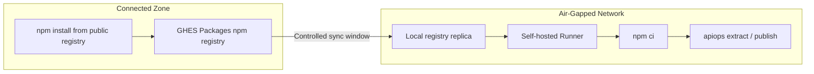

# Air-Gapped Setup: GitHub Actions — Local npm Registry

Deploy APIM configuration using apiops-cli on [self-hosted GitHub Actions runners](https://docs.github.com/en/actions/hosting-your-own-runners/managing-self-hosted-runners/about-self-hosted-runners) with **no internet access** at runtime. This walkthrough uses [GitHub Packages on GitHub Enterprise Server](https://docs.github.com/en/enterprise-server@latest/packages/working-with-a-github-packages-registry/working-with-the-npm-registry) as the npm registry so runners never reach the public npm registry.

> Looking for the alternative that doesn't require a registry? See [Offline Tarball walkthrough](air-gapped-github-actions-offline-tarball.md).

> **GitHub.com vs. GitHub Enterprise Server:** GitHub.com's hosted GitHub Packages registry (`npm.pkg.github.com`) is an internet service and cannot serve as an air-gapped registry. This walkthrough assumes [GitHub Enterprise Server (GHES)](https://docs.github.com/en/enterprise-server@latest/admin/overview/about-github-enterprise-server) running inside your network, which can host [GitHub Packages](https://docs.github.com/en/enterprise-server@latest/admin/packages/getting-started-with-github-packages-for-your-enterprise) including the npm registry.

---

## When to Use This Guide

- Self-hosted runners in a private network with no outbound internet
- You run GHES with GitHub Packages enabled
- Corporate network that blocks access to the public npm registry

---

## Architecture Overview



---

## Prerequisites

| Requirement | Details |
|-------------|---------|
| **Connected workstation** | A machine with internet access to seed the registry |
| **Node.js 22.x** | Installed on both the workstation and the runner (includes npm) |
| **[Self-hosted GitHub Actions runner](https://docs.github.com/en/actions/hosting-your-own-runners/managing-self-hosted-runners/about-self-hosted-runners)** | Registered in your repository or organization, running in the air-gapped network |
| **Azure connectivity from runner** | The runner must reach your APIM instance's ARM endpoint (network-level, not npm) |
| **Internal npm registry** | A [GitHub Packages npm registry](https://docs.github.com/en/enterprise-server@latest/packages/working-with-a-github-packages-registry/working-with-the-npm-registry) on your GHES instance, reachable from the air-gapped network. |

> **GHES on-premises:** If you run [GitHub Enterprise Server](https://docs.github.com/en/enterprise-server@latest/admin/overview/about-github-enterprise-server), the runner, the npm registry, and job dispatch can all live entirely inside your network with no internet egress. GHES is a self-contained appliance "governed by access and security controls that you define, such as firewalls, network policies, IAM, monitoring, and VPNs" ([About GitHub Enterprise Server](https://docs.github.com/en/enterprise-server@latest/admin/overview/about-github-enterprise-server)), and outbound connectivity to GitHub.com is only required if you opt in to [GitHub Connect](https://docs.github.com/en/enterprise-server@latest/admin/configuring-settings/configuring-github-connect/enabling-github-connect-for-githubcom).

---

## Step 1 — Configure the GHES Packages npm Registry

Set up the [GitHub Packages](https://docs.github.com/en/enterprise-server@latest/admin/packages/getting-started-with-github-packages-for-your-enterprise) npm registry on your GHES instance so it serves packages to your air-gapped runners without requiring internet access at install time.

1. **[Enable GitHub Packages on GHES](https://docs.github.com/en/enterprise-server@latest/admin/packages/getting-started-with-github-packages-for-your-enterprise)** — turn on the Packages service for your enterprise and configure the storage backend. The npm registry endpoint is `https://npm.<ghes-host>/`.
2. **Populate the registry** from a connected workstation by running `npm install @peterhauge/apiops-cli` against the GHES npm registry URL. This pulls the package and its transitive dependencies into the registry cache.
3. **Add a project `.npmrc`** that points `registry=` at your GHES npm endpoint and sets `//npm.<ghes-host>/:_authToken=${NODE_AUTH_TOKEN}` so authentication is read from an environment variable injected at workflow runtime. Commit `.npmrc` so workflows and developers resolve against the local registry.

> **Tip:** Follow [Authenticating to GitHub Packages](https://docs.github.com/en/enterprise-server@latest/packages/working-with-a-github-packages-registry/working-with-the-npm-registry#authenticating-to-github-packages) for the exact `.npmrc` format your GHES version expects.

---

## Step 2 — Initialize the Repository

```bash
apiops init \
  --ci github-actions \
  --environments dev,prod \
  --non-interactive
```

This generates:

| File | Purpose |
|------|---------|
| `package.json` | Declares the CLI as a dependency |
| `.github/workflows/run-extractor.yaml` | Extract workflow |
| `.github/workflows/run-publisher.yaml` | Publish workflow |
| `configuration.*.yaml` | Override templates |

---

## Step 3 — Generate the Lock File

```bash
npm install
```

This creates `package-lock.json`. Commit it — the lock file is **required** for `npm ci` to work and pins every transitive dependency to a registry-resolved tarball URL.

---

## Step 4 — Configure the Self-Hosted Runner

Install and register the runner in the air-gapped network per the [self-hosted runner documentation](https://docs.github.com/en/actions/hosting-your-own-runners/managing-self-hosted-runners/adding-self-hosted-runners).

Verify the following:

1. **Node.js 22.x** is installed and on `PATH`
2. **Network access to the GHES Packages npm registry** — the runner can resolve packages from `https://npm.<ghes-host>/`
3. **Network access to Azure ARM** — the runner must reach `management.azure.com` (or [sovereign cloud equivalent](https://learn.microsoft.com/en-us/azure/developer/identity/national-cloud))
4. **Network access to GHES** — the runner must reach your GHES instance for job dispatch, `actions/checkout`, and secret injection
5. **Git** is installed (required by `actions/checkout`)

> **Runner labels:** Add a custom label (e.g., `air-gapped`) when registering the runner so workflows can target it via `runs-on: [self-hosted, air-gapped]`.

---

## Step 5 — Modify Workflows for Air-Gapped Operation

The generated workflows need a few edits per job:

| Edit | What to Change |
|------|----------------|
| **Runner target** | Replace `runs-on: ubuntu-latest` with `runs-on: [self-hosted, air-gapped]` |
| **`setup-node` registry** | Configure `actions/setup-node@v4` with `registry-url:` pointing at your GHES npm endpoint, and pass `NODE_AUTH_TOKEN` as an env var on the `npm ci` step (see below) |
| **Keep `npm ci`** | `.npmrc` already points at the GHES registry; no `--offline` flag is needed |

### Registry Authentication

```yaml
jobs:
  extract:
    runs-on: [self-hosted, air-gapped]
    steps:
      - uses: actions/checkout@v4

      - uses: actions/setup-node@v4
        with:
          node-version: '22'
          registry-url: 'https://npm.<ghes-host>/'   # your GHES Packages npm endpoint

      - name: Install dependencies
        env:
          NODE_AUTH_TOKEN: ${{ secrets.GHES_PACKAGES_TOKEN }}
        run: npm ci

      - name: Run extract
        env:
          AZURE_CLIENT_ID: ${{ secrets.AZURE_CLIENT_ID }}
          AZURE_CLIENT_SECRET: ${{ secrets.AZURE_CLIENT_SECRET }}
          AZURE_TENANT_ID: ${{ secrets.AZURE_TENANT_ID }}
        run: |
          npx apiops extract \
            --resource-group ${{ secrets.APIM_RESOURCE_GROUP }} \
            --service-name ${{ secrets.APIM_SERVICE_NAME }} \
            --subscription-id ${{ secrets.AZURE_SUBSCRIPTION_ID }} \
            --output ./apim-artifacts
```

`actions/setup-node@v4` writes the `registry-url` and an auth-token placeholder into a runner-local `.npmrc`; `NODE_AUTH_TOKEN` is substituted in at install time.

> **Authentication to Azure:**
>
> 1. **Managed identity (preferred)** — if your self-hosted runner is an Azure VM, attach a [user-assigned or system-assigned managed identity](https://learn.microsoft.com/en-us/entra/identity/managed-identities-azure-resources/overview), grant it APIM roles, and call `azure/login@v3` with `auth-type: IDENTITY`. No secrets to store, no internet egress required, and the token request stays inside the Azure backbone. See [Login With User-assigned Managed Identity](https://github.com/Azure/login#login-with-user-assigned-managed-identity) in the `azure/login` README.
> 2. **OIDC federation** — requires the runner to reach the GitHub Actions OIDC issuer at `token.actions.githubusercontent.com` to request the JWT that Entra ID validates ([GitHub OIDC overview](https://docs.github.com/en/actions/concepts/security/openid-connect#understanding-the-oidc-token), [Configuring OIDC in Azure](https://docs.github.com/en/actions/deployment/security-hardening-your-deployments/configuring-openid-connect-in-azure)). Use this when the runner is not on Azure compute but can still reach that endpoint.
> 3. **Service principal secret (fallback)** — when neither managed identity nor OIDC is viable, supply `AZURE_CLIENT_ID`/`AZURE_CLIENT_SECRET`/`AZURE_TENANT_ID` from repository secrets.
>
> See the [authentication guide](../guides/authentication.md) for full details.

---

## Step 6 — Configure Repository Secrets

Configure the secrets your workflows reference under **Settings → Secrets and variables → Actions**:

| Secret | Purpose |
|--------|---------|
| `GHES_PACKAGES_TOKEN` | Personal access token / service token with `read:packages` scope on your GHES Packages registry |
| `AZURE_SUBSCRIPTION_ID` | Target subscription |
| `AZURE_TENANT_ID` | Entra ID tenant |
| `AZURE_CLIENT_ID` | Service principal app ID (if not using OIDC) |
| `AZURE_CLIENT_SECRET` | Service principal secret (if not using OIDC) |
| `APIM_RESOURCE_GROUP`, `APIM_SERVICE_NAME` | Per-environment APIM identifiers |

Use [environment-scoped secrets](https://docs.github.com/en/actions/deployment/targeting-different-environments/managing-environments-for-deployment) for per-environment values (`dev`, `prod`).

---

## Step 7 — Commit and Validate

```bash
git add .
git commit -m "feat: air-gapped apiops setup with local registry"
git push
```

Trigger the extract workflow manually from **Actions → Run workflow** and verify:

1. `npm ci` resolves all packages from the GHES Packages registry (no calls to `registry.npmjs.org`)
2. `apiops extract` authenticates and runs successfully

> **✅ Setup complete.** Your air-gapped apiops workflows are now operational. The remaining sections cover ongoing maintenance and reference material — read them as needed.

---

## Upgrading the CLI Version

Sync the GHES Packages registry during a connectivity window to pull the new version, then update `package.json` and regenerate `package-lock.json`. Commit both.

---

## Troubleshooting

| Problem | Cause | Fix |
|---------|-------|-----|
| `npm ci` fails with `E404` | Package not in the GHES Packages registry | Sync the registry during a connectivity window |
| `npm ci` fails with `E401` / `E403` | `NODE_AUTH_TOKEN` missing, expired, or lacks `read:packages` | Re-create the PAT / service token and update the repository secret |
| `npm ci` fails with "lockfile mismatch" | `package-lock.json` out of sync with `package.json` | Re-run `npm install` on connected workstation, commit updated lock file |
| `npx apiops` not found | `npm ci` didn't complete or `.bin` not in PATH | Verify `node_modules/.bin/apiops` exists after install |
| Azure auth fails | Runner can't reach Entra ID or ARM endpoint | Verify network allows traffic to `login.microsoftonline.com` and `management.azure.com` (or sovereign equivalents) |
| OIDC token request fails | Runner blocked from `token.actions.githubusercontent.com` | Switch to service principal credentials in repository secrets |
| `actions/checkout` fails | Runner can't reach GHES API | Ensure runner has network path to your GHES instance |
| Runner not picking up jobs | Label mismatch or runner offline | Confirm `runs-on` labels match the registered runner |

---

## Further Reading

- [Offline Tarball walkthrough](air-gapped-github-actions-offline-tarball.md) — alternative for environments without a registry
- [apiops init reference](../commands/init.md)
- [GitHub Actions integration](../ci-cd/github-actions.md) — standard (connected) setup
- [Authentication guide](../guides/authentication.md) — service principal and managed identity options
- [GitHub Packages npm registry](https://docs.github.com/en/enterprise-server@latest/packages/working-with-a-github-packages-registry/working-with-the-npm-registry) — official GHES npm registry docs
- [Self-hosted runners](https://docs.github.com/en/actions/hosting-your-own-runners/managing-self-hosted-runners/about-self-hosted-runners) — runner installation and configuration
- [GitHub Enterprise Server](https://docs.github.com/en/enterprise-server@latest/admin/overview/about-github-enterprise-server) — on-premises GitHub
- [National cloud endpoints](https://learn.microsoft.com/en-us/azure/developer/identity/national-cloud) — sovereign cloud identity configuration
- [Entra ID authentication endpoints](https://learn.microsoft.com/en-us/azure/developer/identity/national-cloud#azure-ad-authentication-endpoints) — per-cloud token acquisition endpoints
