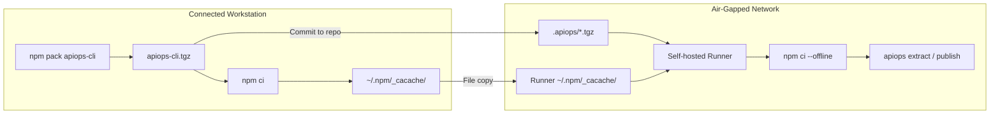

# Air-Gapped Setup: GitHub Actions — Offline Tarball

Deploy APIM configuration using apiops-cli on [self-hosted GitHub Actions runners](https://docs.github.com/en/actions/hosting-your-own-runners/managing-self-hosted-runners/about-self-hosted-runners) with **no internet access** and **no internal npm registry**. The CLI is packaged as a `.tgz` and the npm cache is pre-staged on the runner so `npm ci --offline` resolves every dependency from disk.

> If you can host an internal npm feed instead (e.g., [GitHub Packages on GitHub Enterprise Server](https://docs.github.com/en/enterprise-server@latest/packages/working-with-a-github-packages-registry/working-with-the-npm-registry)), prefer the [Local npm Registry walkthrough](air-gapped-github-actions-local-registry.md) — it requires far less manual artifact transfer.

---

## When to Use This Guide

- Self-hosted runners in a private network with no outbound internet
- No GitHub Packages / GitHub Enterprise Server / other internal npm registry reachable from the runner
- You accept the operational cost of re-transferring the tarball and npm cache whenever dependencies change

---

## Architecture Overview



---

## Prerequisites

| Requirement | Details |
|-------------|---------|
| **Connected workstation** | A machine with internet access to download the CLI and its dependencies |
| **Node.js 22.x** | Installed on both the workstation and the runner (includes npm) |
| **[Self-hosted GitHub Actions runner](https://docs.github.com/en/actions/hosting-your-own-runners/managing-self-hosted-runners/about-self-hosted-runners)** | Registered in your repository or organization, running in the air-gapped network |
| **Azure connectivity from runner** | The runner must reach your APIM instance's ARM endpoint (network-level only) |
| **GitHub connectivity from runner** | The runner must reach `github.com` (or your [GitHub Enterprise Server](https://docs.github.com/en/enterprise-server@latest/admin/overview/about-github-enterprise-server)) for job dispatch, checkout, and secret injection |
| **File transfer mechanism** | A way to copy the npm cache directory into the air-gapped network |

---

## Step 1 — Pack the CLI

On the connected workstation:

```bash
npm pack @peterhauge/apiops-cli
```

This produces `peterhauge-apiops-cli-<version>.tgz` in the current directory.

Commit the tarball into your repository (e.g., under `.apiops/`) so the workflow can reference it by path:

```bash
mkdir -p .apiops
mv peterhauge-apiops-cli-*.tgz .apiops/
git add .apiops/peterhauge-apiops-cli-*.tgz
```

---

## Step 2 — Initialize the Repository

Pass `--cli-package` so the generated `package.json` references the local tarball instead of the public registry:

```bash
apiops init \
  --ci github-actions \
  --environments dev,prod \
  --cli-package ./.apiops/peterhauge-apiops-cli-<version>.tgz \
  --non-interactive
```

This command generates:

| File | Purpose |
|------|---------|
| `package.json` | Declares the CLI as a `file:` dependency pointing at the tarball |
| `.github/workflows/run-extractor.yaml` | Extract workflow |
| `.github/workflows/run-publisher.yaml` | Publish workflow |
| `configuration.*.yaml` | Override templates |

---

## Step 3 — Generate the Lock File and Pre-Stage the npm Cache

On the **connected workstation**, run:

```bash
npm install   # creates package-lock.json
npm ci        # populates ~/.npm/_cacache/ with every package the lock file references
```

Commit `package-lock.json` to the repository. The command `npm ci --offline` requires it.

Then transfer the npm cache to the runner:

```bash
# On the workstation
tar -czf npm-cacache.tar.gz -C ~/.npm _cacache

# Transfer npm-cacache.tar.gz into the air-gapped network, then on the runner:
mkdir -p ~/.npm
tar -xzf npm-cacache.tar.gz -C ~/.npm
```

> Repeat this cache transfer every time dependencies change (CLI upgrade, new package, etc.).

---

## Step 4 — Configure the Self-Hosted Runner

Install and register the runner in the air-gapped network per the [self-hosted runner documentation](https://docs.github.com/en/actions/hosting-your-own-runners/managing-self-hosted-runners/adding-self-hosted-runners).

Verify the following:

1. **Node.js 22.x** is installed and on `PATH`
2. **npm cache is pre-staged** at the runner service account's `~/.npm/_cacache/` (see Step 3)
3. **Network access to Azure ARM** — the runner must reach `management.azure.com` (or [sovereign cloud equivalent](https://learn.microsoft.com/en-us/azure/developer/identity/national-cloud))
4. **Network access to GitHub** — the runner must reach `github.com` (or your GHES instance) for job dispatch, `actions/checkout`, and secret injection
5. **Git** is installed (required by `actions/checkout`)

> **Runner labels:** Add a custom label (e.g., `air-gapped`) when registering the runner so workflows can target it via `runs-on: [self-hosted, air-gapped]`.

---

## Step 5 — Modify Workflows for Air-Gapped Operation

The generated workflows need three edits per job:

| Edit | What to Change |
|------|----------------|
| **Runner target** | Replace `runs-on: ubuntu-latest` with `runs-on: [self-hosted, air-gapped]` |
| **Remove `setup-node`** | Delete the `actions/setup-node@v4` step (Node.js is pre-installed on the runner) |
| **Use offline `npm ci`** | Change `npm ci` to `npm ci --offline` so npm resolves entirely from the pre-staged cache |

Example `.github/workflows/run-extractor.yaml`:

```yaml
jobs:
  extract:
    runs-on: [self-hosted, air-gapped]
    steps:
      - uses: actions/checkout@v4

      - name: Install dependencies (offline)
        run: npm ci --offline

      - name: Run extract
        env:
          AZURE_CLIENT_ID: ${{ secrets.AZURE_CLIENT_ID }}
          AZURE_CLIENT_SECRET: ${{ secrets.AZURE_CLIENT_SECRET }}
          AZURE_TENANT_ID: ${{ secrets.AZURE_TENANT_ID }}
        run: |
          npx apiops extract \
            --resource-group ${{ secrets.APIM_RESOURCE_GROUP }} \
            --service-name ${{ secrets.APIM_SERVICE_NAME }} \
            --subscription-id ${{ secrets.AZURE_SUBSCRIPTION_ID }} \
            --output ./apim-artifacts
```

The `--offline` flag makes npm fail fast if any package is missing from the cache instead of attempting a network call.

> **Authentication to Azure (recommended order):**
>
> 1. **Managed identity (preferred)** — if your self-hosted runner is an Azure VM, attach a [user-assigned or system-assigned managed identity](https://learn.microsoft.com/en-us/entra/identity/managed-identities-azure-resources/overview), grant it APIM roles, and call `azure/login@v3` with `auth-type: IDENTITY`. No secrets to store, no internet egress required. See [Login With User-assigned Managed Identity](https://github.com/Azure/login#login-with-user-assigned-managed-identity) in the `azure/login` README.
> 2. **OIDC federation** — requires the runner to reach `token.actions.githubusercontent.com`. Use this when the runner is not on Azure compute but can still reach that endpoint.
> 3. **Service principal secret (fallback)** — when neither managed identity nor OIDC is viable, supply `AZURE_CLIENT_ID`/`AZURE_CLIENT_SECRET`/`AZURE_TENANT_ID` from repository secrets.
>
> See the [authentication guide](../guides/authentication.md) for full details.

---

## Step 6 — Configure Repository Secrets

Configure the secrets your workflows reference under **Settings → Secrets and variables → Actions**:

| Secret | Purpose |
|--------|---------|
| `AZURE_SUBSCRIPTION_ID` | Target subscription |
| `AZURE_TENANT_ID` | Entra ID tenant |
| `AZURE_CLIENT_ID` | Service principal app ID (if not using OIDC) |
| `AZURE_CLIENT_SECRET` | Service principal secret (if not using OIDC) |
| `APIM_RESOURCE_GROUP`, `APIM_SERVICE_NAME` | Per-environment APIM identifiers |

Use [environment-scoped secrets](https://docs.github.com/en/actions/deployment/targeting-different-environments/managing-environments-for-deployment) for per-environment values (`dev`, `prod`).

---

## Step 7 — Commit and Validate

```bash
git add .
git commit -m "feat: air-gapped apiops setup with offline tarball"
git push
```

Trigger the extract workflow manually from **Actions → Run workflow** and verify:

1. `npm ci --offline` completes with no network calls
2. `apiops extract` authenticates and runs successfully

> **✅ Setup complete.** Your air-gapped apiops workflows are now operational. The remaining sections cover ongoing maintenance and reference material — read them as needed.

---

## Upgrading the CLI Version

1. On a connected workstation, run `npm pack @peterhauge/apiops-cli` for the new version
2. Replace `.apiops/peterhauge-apiops-cli-*.tgz` with the new tarball and update the `file:` path in `package.json`
3. Regenerate `package-lock.json` (`npm install`)
4. Re-populate and re-transfer the npm cache (`npm ci` on the workstation, then copy `~/.npm/_cacache/`)
5. Commit the tarball and updated lock file

---

## Troubleshooting

| Problem | Cause | Fix |
|---------|-------|-----|
| `npm ci` fails with `ENOTCACHED` | npm cache missing one or more packages | Re-run `npm ci` on the connected workstation and re-transfer `~/.npm/_cacache/` |
| `npm ci` fails with "lockfile mismatch" | `package-lock.json` out of sync with `package.json` | Re-run `npm install` on connected workstation, commit updated lock file, refresh cache |
| `npm install` complains about missing tarball | Path in `package.json` doesn't match the file on disk | Verify the `file:` reference matches the committed `.tgz` filename exactly |
| `npx apiops` not found | `npm ci --offline` didn't complete or `.bin` not in PATH | Verify `node_modules/.bin/apiops` exists after install |
| Azure auth fails | Runner can't reach Entra ID or ARM endpoint | Verify network allows traffic to `login.microsoftonline.com` and `management.azure.com` (or sovereign equivalents) |
| `actions/checkout` fails | Runner can't reach GitHub API | Ensure runner has network path to `github.com` (or your GHES instance) |
| OIDC token request fails | Runner blocked from `token.actions.githubusercontent.com` | Switch to service principal credentials in repository secrets |
| Runner not picking up jobs | Label mismatch or runner offline | Confirm `runs-on` labels match the registered runner |

---

## Further Reading

- [Local npm Registry walkthrough](air-gapped-github-actions-local-registry.md) — recommended when GitHub Packages on GHES (or another internal feed) is available
- [apiops init reference](../commands/init.md) — full `--cli-package` documentation
- [GitHub Actions integration](../ci-cd/github-actions.md) — standard (connected) setup
- [Authentication guide](../guides/authentication.md) — service principal and managed identity options
- [Air-gapped setup: Azure DevOps](air-gapped-azure-devops.md)
- [Self-hosted runners](https://docs.github.com/en/actions/hosting-your-own-runners/managing-self-hosted-runners/about-self-hosted-runners) — runner installation and configuration
- [GitHub Enterprise Server](https://docs.github.com/en/enterprise-server@latest/admin/overview/about-github-enterprise-server) — on-premises GitHub
- [National cloud endpoints](https://learn.microsoft.com/en-us/azure/developer/identity/national-cloud) — sovereign cloud identity configuration
- [Entra ID authentication endpoints](https://learn.microsoft.com/en-us/azure/developer/identity/national-cloud#azure-ad-authentication-endpoints) — per-cloud token acquisition endpoints
