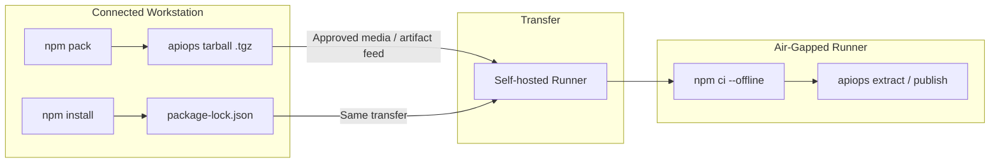

# Air-Gapped Setup: GitHub Actions

Deploy APIM configuration using apiops-cli on GitHub Actions runners with **no internet access** at runtime. This walkthrough covers preparing the npm tarball, lock file, and self-hosted runner configuration so that `npm ci` succeeds entirely offline.

---

## When to Use This Guide

- Self-hosted runners in a private network with no outbound internet
- Environments requiring artifact pre-staging for security compliance
- Corporate networks that block access to the npm registry

---

## Architecture Overview



---

## Prerequisites

| Requirement | Details |
|-------------|---------|
| **Connected workstation** | A machine with internet access to download packages |
| **Node.js 22.x** | Installed on both the workstation and the runner |
| **npm 10+** | Comes with Node.js 22 |
| **Self-hosted GitHub Actions runner** | Registered in your repository, running in the air-gapped network |
| **Azure connectivity from runner** | The runner must reach your APIM instance's ARM endpoint (network-level, not npm) |
| **Transfer mechanism** | USB drive, internal artifact feed, or approved file share for moving packages into the restricted zone |

---

## Step 1 — Prepare the Tarball (Connected Workstation)

On a machine with internet access:

```bash
# Install the CLI globally to get access to the apiops command
npm install -g @peterhauge/apiops-cli

# Pack the installed package into a tarball
npm pack @peterhauge/apiops-cli
# Produces: peterhauge-apiops-cli-<version>.tgz
```

Keep the `.tgz` file — you'll transfer it to the air-gapped environment.

---

## Step 2 — Scaffold the Repository

Run `apiops init` with the `--cli-package` flag pointing to the tarball:

```bash
apiops init \
  --ci github-actions \
  --cli-package ./peterhauge-apiops-cli-0.1.5-alpha.1.tgz \
  --environments dev,prod \
  --non-interactive
```

This generates:

| File | Purpose |
|------|---------|
| `package.json` | References the tarball as `"file:.apiops/peterhauge-apiops-cli-0.1.5-alpha.1.tgz"` |
| `.apiops/peterhauge-apiops-cli-0.1.5-alpha.1.tgz` | Local copy of the CLI package |
| `.github/workflows/run-extractor.yaml` | Extract workflow |
| `.github/workflows/run-publisher.yaml` | Publish workflow |
| `configuration.*.yaml` | Override templates |

---

## Step 3 — Generate the Lock File

The lock file pins every transitive dependency so `npm ci` can resolve them offline:

```bash
# In the scaffolded repo directory
npm install
```

This creates `package-lock.json`. Commit it — the lock file is **required** for `npm ci` to work.

---

## Step 4 — Cache Dependencies for Offline Install

`npm ci --offline` requires a populated npm cache. On your connected workstation, populate the cache:

```bash
# Clean the npm cache to start fresh (optional but recommended)
npm cache clean --force

# Install to populate the cache with all resolved packages
npm ci

# Export the cache directory
npm config get cache
# Default: ~/.npm
```

Copy the entire npm cache directory (or the `_cacache` subfolder) to your transfer media.

> **Alternative — vendored `node_modules`:** If your transfer policy allows it, you can commit or transfer the entire `node_modules` directory. In that case, skip `npm ci` in the workflow and run `npx apiops` directly.

---

## Step 5 — Transfer Artifacts to the Air-Gapped Zone

Move these items through your approved transfer channel:

| Artifact | Destination on Runner |
|----------|-----------------------|
| Repository clone (with `.apiops/` tarball, `package.json`, `package-lock.json`) | Runner's `$GITHUB_WORKSPACE` (handled by `actions/checkout`) |
| npm cache (`_cacache/`) | `~/.npm/_cacache/` on the runner |

If using a vendored `node_modules`, transfer it as part of the repository.

---

## Step 6 — Configure the Self-Hosted Runner

Install and register the runner in the air-gapped network:

```bash
# On the runner machine
mkdir actions-runner && cd actions-runner
# Transfer the runner package via approved media
tar xzf actions-runner-linux-x64-*.tar.gz
./config.sh --url https://github.com/<owner>/<repo> --token <registration-token>
./svc.sh install && ./svc.sh start
```

Ensure:

1. **Node.js 22.x** is installed and on `PATH`
2. **npm cache is pre-populated** at `~/.npm` (from Step 4)
3. **Network access to Azure ARM** — the runner must reach `management.azure.com` (or sovereign equivalent) for APIM API calls
4. **Git** is installed (required by `actions/checkout`)

---

## Step 7 — Modify Workflows for Offline Operation

Edit the generated workflows to use offline npm and target your self-hosted runner.

### `.github/workflows/run-extractor.yaml`

```yaml
jobs:
  extract:
    runs-on: [self-hosted, air-gapped]  # ← target your runner labels
    steps:
      - uses: actions/checkout@v4

      # Skip actions/setup-node — Node.js is pre-installed on the runner
      
      - name: Install dependencies (offline)
        run: npm ci --offline

      - name: Run extract
        run: |
          npx apiops extract \
            --resource-group ${{ secrets.APIM_RESOURCE_GROUP }} \
            --service-name ${{ secrets.APIM_SERVICE_NAME }} \
            --subscription-id ${{ secrets.AZURE_SUBSCRIPTION_ID }} \
            --output ./apim-artifacts
```

### `.github/workflows/run-publisher.yaml`

```yaml
jobs:
  publish-dev:
    runs-on: [self-hosted, air-gapped]
    steps:
      - uses: actions/checkout@v4
        with:
          fetch-depth: 2  # needed for incremental publish

      - name: Install dependencies (offline)
        run: npm ci --offline

      - name: Publish (incremental)
        run: |
          npx apiops publish \
            --resource-group ${{ secrets.APIM_RESOURCE_GROUP_DEV }} \
            --service-name ${{ secrets.APIM_SERVICE_NAME_DEV }} \
            --subscription-id ${{ secrets.AZURE_SUBSCRIPTION_ID }} \
            --source ./apim-artifacts \
            --commit-id ${{ github.sha }}
```

> **Authentication:** In air-gapped environments, OIDC federation may not be available if the runner can't reach `token.actions.githubusercontent.com`. Use a service principal with `--client-id`, `--client-secret`, and `--tenant-id` flags (or equivalent environment variables) instead. Credentials can be stored in GitHub repository secrets — the runner only needs to reach GitHub's API for secret injection during job startup.

---

## Step 8 — Commit and Validate

```bash
git add .
git commit -m "feat: air-gapped apiops setup with local tarball"
git push
```

Trigger the workflow manually from **Actions → Run workflow** and verify:

1. `npm ci --offline` completes without network calls
2. `apiops extract` or `apiops publish` authenticates and runs successfully

---

## Upgrading the CLI Version

When a new version is released:

1. On the connected workstation: `npm pack @peterhauge/apiops-cli` (new version)
2. Replace `.apiops/*.tgz` in the repository
3. Update `package.json` to reference the new tarball filename
4. Run `npm install` to regenerate `package-lock.json`
5. Rebuild the npm cache (`npm ci`) and transfer the updated cache
6. Commit and push

---

## Troubleshooting

| Problem | Cause | Fix |
|---------|-------|-----|
| `npm ci` fails with `ENOTCACHED` | npm cache doesn't contain required packages | Re-populate cache on connected workstation and transfer |
| `npm ci` fails with "lockfile mismatch" | `package-lock.json` out of sync with `package.json` | Re-run `npm install` on connected workstation, commit updated lock file |
| `npx apiops` not found | `npm ci` didn't complete or `.bin` not in PATH | Verify `node_modules/.bin/apiops` exists after install |
| Azure auth fails | Runner can't reach Entra ID or ARM endpoint | Verify network allows traffic to `login.microsoftonline.com` and `management.azure.com` |
| `actions/checkout` fails | Runner can't reach GitHub API | Ensure runner has network path to `github.com` (or use GHES with local clone) |

---

## Related

- [apiops init reference](../commands/init.md) — all `--cli-package` details
- [GitHub Actions integration](../ci-cd/github-actions.md) — standard (connected) setup
- [Authentication guide](../guides/authentication.md) — service principal and managed identity options
- [Air-gapped setup: Azure DevOps](air-gapped-azure-devops.md)
